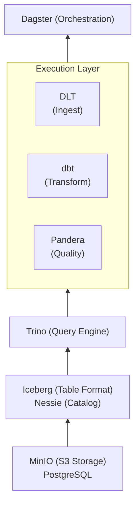
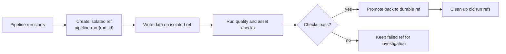
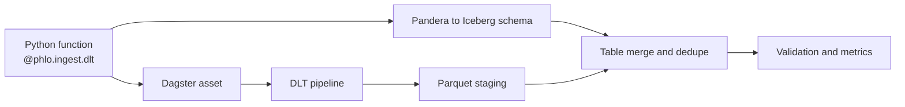
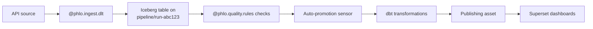

# Core Concepts

Understanding the fundamental concepts and patterns that make Phlo a modern data lakehouse platform.

## What is Phlo?

Phlo is a data lakehouse framework that combines best-in-class tools into a cohesive, low-boilerplate platform for data engineering. It provides:

- **74% less code** compared to manual integration
- **Git-like workflows** for data versioning and branching
- **Type-safe data quality** with automatic validation
- **Production-ready patterns** out of the box

## Architecture Overview

### The Stack



**Storage**: MinIO provides S3-compatible object storage for data files and Iceberg metadata.

**Catalog**: Nessie acts as a Git-like catalog for versioning table metadata with branches and tags.

**Table Format**: Apache Iceberg provides ACID transactions, schema evolution, and time travel.

**Query Engine**: Trino executes distributed SQL queries across Iceberg tables.

**Transformation**: dbt handles SQL-based transformations following bronze/silver/gold architecture.

**Ingestion**: DLT (Data Load Tool) handles loading data from external sources.

**Quality**: Pandera provides DataFrame validation with type-safe schemas.

**Orchestration**: Dagster manages the entire workflow with asset-based orchestration.

## Key Concepts

### 1. Write-Audit-Publish (WAP) Pattern

Phlo implements an automated Write-Audit-Publish pattern when the active profile
includes a versioned catalog capability.



**Write Phase**

- Data lands on isolated ref: `pipeline-run-&#123;run_id&#125;`
- No impact on the durable target ref
- Multiple pipelines can run concurrently

**Audit Phase**

- Quality checks validate data
- Dagster asset checks execute automatically
- Failures prevent promotion

**Publish Phase**

- Auto-promotion sensor merges back to the durable target ref when checks pass
- Atomic commit of all tables
- Old branches cleaned up after retention period

**Implementation**

```python
# Automatic ref creation on job start
# packages/phlo-dagster/src/phlo_dagster/wap_sensors.py
@sensor(name="branch_creation_sensor")
def branch_creation_sensor(context):
    # Creates isolated run ref when a VersionedCatalog is available

# Automatic promotion when checks pass
@sensor(name="auto_promotion_sensor")
def auto_promotion_sensor(context):
    # Promotes to the durable target ref if all checks pass

# Cleanup old branches
@sensor(name="branch_cleanup_sensor")
def branch_cleanup_sensor(context):
    # Deletes stale run refs older than retention period
```

In the default bundled stack, Nessie is the versioned catalog provider for this flow.
Profiles without a versioned catalog still work, but they do not get branch/promotion
semantics.

### 2. Decorator-Driven Development

Phlo reduces boilerplate through powerful decorators that auto-generate Dagster assets.

#### Ingestion Decorators

Transforms a simple function or replication declaration into a complete ingestion pipeline:



```python
@phlo.ingest.dlt(
    table_name="events",
    unique_key="id",
    validation_schema=EventSchema,  # Pandera schema
    group="api",
    cron="0 */1 * * *",
    freshness_hours=(1, 24),
    merge_strategy="merge"
)
def api_events(partition_date: str):
    return rest_api(...)  # DLT source
```

```python
@phlo.ingest.sling(
    stream_name="public.users",
    table_name="users",
    source_conn="PHLO_POSTGRES",
    group="raw",
    mode="incremental",
    primary_key="id",
    update_key="updated_at",
)
def users_replication(context):
    return {"where": f"updated_at >= '{context.partition_key}'"}
```

DLT and Sling are ingestion providers. Phlo owns the asset contract, metadata,
lineage, scheduling, and quality handoff; providers own how data is extracted or
replicated.

**What it does**:

1. Creates Dagster asset with partitioning
2. Sets up DLT pipeline with filesystem destination
3. Stages data to Parquet files
4. Auto-generates Iceberg schema from Pandera schema
5. Merges to Iceberg table with deduplication
6. Validates with Pandera schema
7. Handles retries and timeouts
8. Tracks metrics and timing

**Without decorator (manual)**:

```python
# Would require ~270 lines of boilerplate:
# - DLT pipeline setup (~50 lines)
# - Iceberg schema definition (~40 lines)
# - Merge logic (~60 lines)
# - Error handling (~40 lines)
# - Timing/logging (~30 lines)
# - Dagster asset wrapper (~50 lines)
```

#### Quality Decorators

Creates data quality checks:

```python
@phlo.quality.rules(
    table="bronze.events",
    rules=[
        phlo.not_null("id", "timestamp"),
        phlo.range_between("value", min_value=0, max_value=100),
        phlo.unique("id"),
        phlo.freshness("timestamp", hours=24),
    ],
)
def events_quality():
    pass
```

Use `phlo.quality.rules(...)` for Phlo's neutral quality vocabulary. Use
`phlo.quality.pandera(...)` when you need Pandera-native schemas or check
classes.

**Built-in check types**:

- `NullCheck`: No null values in columns
- `RangeCheck`: Numeric values within bounds
- `FreshnessCheck`: Data recency validation
- `UniqueCheck`: No duplicate values
- `CountCheck`: Row count validation
- `SchemaCheck`: Full Pandera schema validation
- `CustomSQLCheck`: Arbitrary SQL validation

**Quality check contract (for Observatory)**:

- Pandera schema contract checks use the name `pandera_contract`
- dbt test checks use the name `dbt__&lt;test_type>__&lt;target>`
- Checks should emit metadata keys: `source`, `partition_key` (if applicable), `failed_count`, `total_count` (if available), `query_or_sql` (if applicable), `sample` (&lt;= 20 rows/ids)
- Checks may also emit `repro_sql` (a safe SQL snippet, e.g. with `LIMIT`, for Trino reproduction).
- Partitioned runs scope checks to the run partition by default (using `_phlo_partition_date` unless overridden).

### 3. Schema-First Development

Pandera schemas serve as the source of truth for data structure and quality.

**Two approaches for defining schemas**:

1. **Manual Definition**: Write Pandera classes directly (full control)
2. **dbt YAML Generation**: Auto-generate from dbt model YAML (single source of truth)

#### Manual Schema Definition

```python
import pandera as pa
from pandera.typing import Series

class EventSchema(pa.DataFrameModel):
    """Event data schema."""

    id: Series[str] = pa.Field(
        description="Unique event ID",
        nullable=False,
        unique=True
    )

    timestamp: Series[datetime] = pa.Field(
        description="Event timestamp",
        nullable=False
    )

    value: Series[float] = pa.Field(
        description="Event value",
        ge=0,
        le=100
    )

    category: Series[str] = pa.Field(
        description="Event category",
        isin=["A", "B", "C"]
    )

    class Config:
        strict = True
        coerce = True
```

#### Schema Generation from dbt YAML

**Reduce schema duplication** by generating Pandera schemas from dbt model YAML:

```python
from phlo_dbt.dbt_schema import dbt_model_to_pandera

# Define schema once in dbt YAML, auto-generate Pandera
FactEvents = dbt_model_to_pandera(
    "workflows/transforms/dbt/models/silver/fct_events.yml",
    "fct_events"
)
```

**How it works**:

1. Define schema with dbt `data_tests` in YAML
2. Call `dbt_model_to_pandera` to generate Pandera class
3. dbt tests automatically become Pandera Field constraints:
   - `not_null` → `nullable=False`
   - `unique` → `unique=True`
   - `accepted_values` → `isin=[...]`

**When to use each approach**:

- **Manual**: Raw layer schemas, complex validators, multi-column checks
- **Generated**: Silver/gold layer schemas with dbt models (avoid duplication)

**Benefits**:

- Type safety at runtime
- Auto-generated Iceberg schemas
- Validation enforced automatically
- Self-documenting data contracts
- IDE autocomplete support
- **50% less code** when using dbt YAML generation

**Schema Conversion** (Pandera → Iceberg):

```python
# packages/phlo-iceberg/src/phlo_iceberg/schema_conversion.py
str → StringType()
int → LongType()
float → DoubleType()
datetime → TimestamptzType()
bool → BooleanType()
```

### 4. Merge Strategies

Phlo supports flexible merge strategies for handling updates:

**Append Strategy**

```python
merge_strategy="append"
```

- Insert-only, no deduplication
- Fastest performance
- Use for immutable event streams

**Merge Strategy**

```python
merge_strategy="merge"
merge_config={"deduplication_method": "last"}  # or "first" or "hash"
```

- Upsert based on `unique_key`
- Deduplication strategies:
  - `first`: Keep first occurrence
  - `last`: Keep last occurrence (default)
  - `hash`: Keep based on content hash

**Implementation**:

```python
# packages/phlo-dlt/src/phlo_dlt/dlt_helpers.py
def merge_to_iceberg(
    table: Table,
    new_data: DataFrame,
    unique_key: str,
    strategy: str = "merge"
):
    if strategy == "append":
        # Fast path - just append
        table.append(new_data)
    else:
        # Upsert with deduplication
        table.merge(
            new_data,
            on=unique_key,
            action="upsert"
        )
```

### 5. Partition Management

Daily partitioning for efficient querying:

```python
from dagster import daily_partitioned_config

@daily_partitioned_config(start_date="2024-01-01")
def partition_config(start, end):
    return {
        "partition_date": start.strftime("%Y-%m-%d")
    }
```

**Benefits**:

- Partition pruning for faster queries
- Incremental processing
- Time-based data management
- Backfill support

### 6. Bronze/Silver/Gold Architecture

Phlo follows medallion architecture for data transformation:

**Bronze Layer** (Raw)

- Ingested data from sources
- Minimal transformation
- Schema validated with Pandera
- Tables: `bronze.&#123;table_name&#125;`

**Silver Layer** (Cleaned)

- Cleaned and conformed data
- Type conversions, deduplication
- Business logic applied
- Tables: `silver.&#123;table_name&#125;`

**Gold Layer** (Marts)

- Aggregated, business-ready data
- Optimized for BI tools
- Published to PostgreSQL
- Tables: `marts.&#123;table_name&#125;`

**dbt Implementation**:

```sql
-- models/bronze/stg_events.sql
{{ config(
    materialized='incremental',
    unique_key='id',
    on_schema_change='append_new_columns'
) }}

SELECT
    id,
    timestamp,
    value,
    category
FROM {{ source('raw', 'events') }}

-- models/silver/events_cleaned.sql
SELECT
    id,
    timestamp,
    COALESCE(value, 0) as value,
    UPPER(category) as category
FROM {{ ref('stg_events') }}

-- models/gold/daily_aggregates.sql
SELECT
    DATE(timestamp) as date,
    category,
    COUNT(*) as event_count,
    AVG(value) as avg_value
FROM {{ ref('events_cleaned') }}
GROUP BY 1, 2
```

### 7. Branch-Aware Operations

All operations are branch-aware through Nessie:

```python
# Get current branch from Dagster context
branch = get_branch_from_context(context)

# Write to branch-specific reference
table.write(
    data,
    override_ref=branch  # e.g., "pipeline/run-abc123"
)

# Query from specific branch
df = trino.execute(
    "SELECT * FROM events",
    catalog_options={"ref": branch}
)
```

### 8. Asset-Based Orchestration

Dagster assets represent data products:

```python
@asset(
    partitions_def=daily_partition,
    freshness_policy=FreshnessPolicy(
        maximum_lag_minutes=120
    ),
    auto_materialize_policy=AutoMaterializePolicy.eager()
)
def my_asset(context):
    # Asset implementation
    pass
```

**Benefits**:

- Automatic lineage tracking
- Partition-aware dependencies
- Freshness monitoring
- Smart materialization

### 9. Quality Gates

Quality checks act as gates in the pipeline:

```python
# Quality check blocks downstream assets
@asset_check(asset=bronze_events)
def events_quality_check():
    # Run validation
    if not valid:
        raise Exception("Quality check failed")
    return CheckResult(passed=True)

# Downstream asset only runs if check passes
@asset(deps=[bronze_events])
def silver_events():
    # Only executes if events_quality_check passed
    pass
```

### 10. Publishing Pattern

Automatic publishing of marts to PostgreSQL for BI:

```python
# Publishing asset example using phlo_trino.publishing
from phlo_trino.publishing import publish_marts_to_postgres

@asset(deps=[marts.daily_aggregates])
def publish_daily_aggregates(context, trino, postgres):
    publish_marts_to_postgres(
        context, trino,
        tables_to_publish={
            "daily_aggregates": "marts.daily_aggregates"
        },
        data_source="events"
    )
```

**Process**:

1. Query Iceberg table via Trino
2. Drop existing PostgreSQL table
3. Create new table with inferred schema
4. Batch insert with transactions
5. Return statistics

## Data Flow Example

Complete end-to-end flow:



## Key Files & Locations

**Ingestion workflows**: `workflows/ingestion/&#123;domain&#125;/&#123;workflow&#125;.py`

**Schemas**: `workflows/schemas/&#123;domain&#125;.py`

**Quality checks**: `workflows/quality/&#123;domain&#125;.py`

**dbt models**: `workflows/transforms/dbt/models/&#123;layer&#125;/&#123;model&#125;.sql`

**Configuration**: `.phlo/.env.local`, `phlo.yaml`, package settings (e.g., `phlo_postgres.settings`)

**Sensors**: `packages/phlo-dagster/src/phlo_dagster/wap_sensors.py`

## Next Steps

- [Quickstart Guide](quickstart.md) - Build your first pipeline
- [Developer Guide](../guides/developer-guide.md) - Deep dive into decorators
- [Architecture Reference](../reference/architecture.md) - Technical details
- [CLI Reference](../reference/cli-reference.md) - Command-line tools
