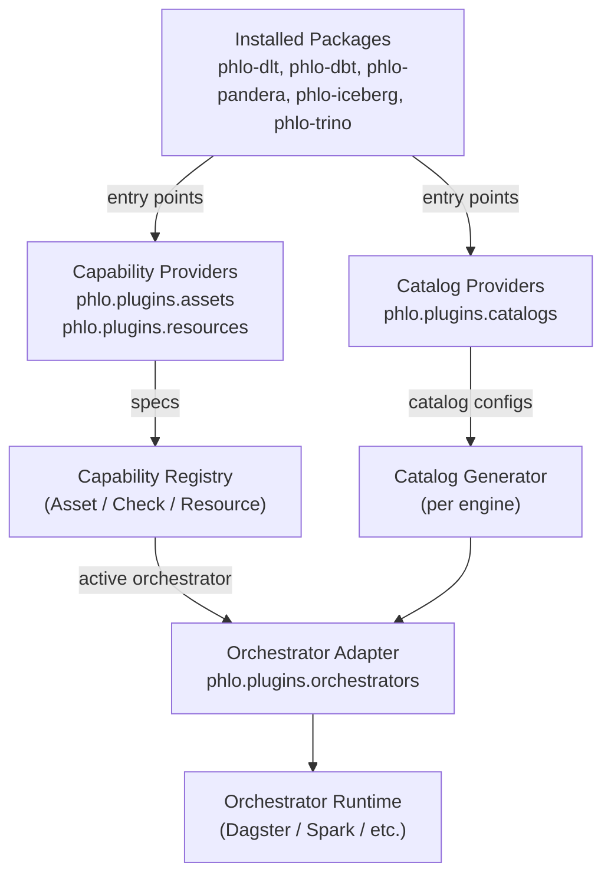

# Capability Primitives and Orchestrator Adapters

Phlo packages are plug-and-play. Packages publish orchestrator-agnostic specs, and an
orchestrator adapter (for example `phlo-dagster`) translates those specs into runtime
assets, checks, and resources.

This guide explains the primitives, how discovery works, and how to build new packages
without importing any orchestrator libraries.

## System diagram



## Why capability primitives

- Packages stay decoupled from specific orchestrators.
- The active orchestrator can change without rewriting package code.
- Packages can be installed in any order; adapters only activate when present.
- Specs are easy to test and document without runtime dependencies.

## Core primitives (specs)

These live in `phlo.capabilities.specs` and are the stable protocol between packages
and orchestrators.

- `AssetSpec`: Core asset definition. Includes `key`, `group`, `description`, `kinds`,
  `tags`, `metadata`, `deps`, `resources`, `partitions`, `run`, and `checks`.
- `AssetCheckSpec`: Describes a check attached to an asset. The `fn` is optional so
  adapters can wire checks separately from assets.
- `ResourceSpec`: Register a resource by name for adapters to inject.
- `RunSpec`: Execution details for an asset, including the `fn` that runs it and
  execution metadata (cron, retries, freshness).
- `PartitionSpec`: Partitioning metadata (currently `kind` plus optional bounds).
- `MaterializeResult` and `CheckResult`: Uniform outputs from asset/check functions.

## Runtime context

Asset and check functions receive a `RuntimeContext`, which is implemented by the active
orchestrator adapter. It provides:

- `run_id`, `partition_key`, `tags`
- `logger`
- `resources` and `get_resource(name)`
- `routing`, a canonical `RuntimeRouting` payload derived from the orchestrator context

Do not rely on orchestrator-native context objects inside packages.

### Runtime routing

`RuntimeRouting` is the shared execution contract across capabilities. It carries:

- `environment`
- `ref`
- `partition_key`
- `run_id`
- `resources`
- `feature_flags`

Helpers such as `routing_from_context()` and `resolve_runtime_ref()` let packages derive
ref-aware behavior without importing concrete provider packages.

## Runtime capability interfaces

Provider implementations use runtime protocols from `phlo.capabilities.interfaces`.
These are the contracts discovered and wired by capability providers.

- `TableStore`: required methods are `ensure_table`, `append_parquet`, and
  `merge_parquet`. Optional extended operations include `overwrite_parquet`,
  `delete_rows`, `compact`, `list_snapshots`, `rollback_to_snapshot`, and
  `vacuum`.
- `VersionedCatalog`: optional branch-aware catalog contract used for refs,
  promotion, and branch cleanup. Dagster WAP flows should depend on this
  interface rather than concrete Nessie types.
- `GovernanceBackend`: policy APIs (`list_policies`, `apply_policy`,
  `revoke_policy`, `check_access`).
- `SecretBackend`: secret retrieval/listing APIs (`get_secret`, `list_secrets`).
- `SchemaExtractor`: converts provider-native schema objects into
  `NormalizedSchema`.
- `SchemaMigrator`: storage-native schema migration hooks (`diff_schema`,
  `apply_plan`, `get_schema_history`) with provider-specific change
  classification.
- `AccessPolicy`: value object used by governance providers.

The capability registry also supports higher-level specs such as:

- `QueryEngineSpec`
- `PublishTargetSpec`

That lets packages declare what they provide without encoding stack-specific
assumptions into consumers.

These interfaces let providers opt into richer behavior incrementally while
keeping a single core contract surface for discovery and runtime resolution.

## Providers and adapters

### Asset providers

Asset providers return a list of `AssetSpec` objects.

```python
from phlo.capabilities import AssetSpec, PartitionSpec, RunSpec
from phlo.plugins import AssetProviderPlugin, PluginMetadata


class MyAssetProvider(AssetProviderPlugin):
    @property
    def metadata(self) -> PluginMetadata:
        return PluginMetadata(
            name="my-assets",
            version="0.1.0",
            description="Asset specs for my domain",
        )

    def get_assets(self):
        return [
            AssetSpec(
                key="my_asset",
                group="demo",
                description="Demo asset",
                partitions=PartitionSpec(kind="daily"),
                run=RunSpec(fn=self.run_asset),
            )
        ]

    def run_asset(self, context):
        return []
```

Register via entry points:

```toml
[project.entry-points."phlo.plugins.assets"]
my_assets = "my_pkg.plugin:MyAssetProvider"
```

### Resource providers

Resource providers return `ResourceSpec` objects.

```python
from phlo.capabilities import ResourceSpec
from phlo.plugins import ResourceProviderPlugin, PluginMetadata


class MyResourceProvider(ResourceProviderPlugin):
    @property
    def metadata(self) -> PluginMetadata:
        return PluginMetadata(
            name="my-resources",
            version="0.1.0",
            description="Resources for my assets",
        )

    def get_resources(self):
        return [
            ResourceSpec(name="warehouse", resource=object()),
        ]
```

Register via entry points:

```toml
[project.entry-points."phlo.plugins.resources"]
my_resources = "my_pkg.plugin:MyResourceProvider"
```

### Catalog providers

Catalog providers define catalog configuration for engines that need explicit
catalog setup (files or programmatic settings).

```python
from phlo.plugins.base import CatalogPlugin, PluginMetadata


class IcebergCatalog(CatalogPlugin):
    @property
    def metadata(self) -> PluginMetadata:
        return PluginMetadata(
            name="iceberg",
            version="0.1.0",
            description="Iceberg catalog configuration",
        )

    @property
    def targets(self) -> list[str]:
        return ["trino"]

    @property
    def catalog_name(self) -> str:
        return "iceberg"

    def get_properties(self) -> dict[str, str]:
        return {"connector.name": "iceberg"}
```

Register via entry points:

```toml
[project.entry-points."phlo.plugins.catalogs"]
iceberg = "my_pkg.catalog:IcebergCatalog"
```

### Orchestrator adapters

Adapters translate specs into orchestrator-native definitions.

```python
from phlo.plugins import OrchestratorAdapterPlugin, PluginMetadata


class MyOrchestrator(OrchestratorAdapterPlugin):
    @property
    def metadata(self) -> PluginMetadata:
        return PluginMetadata(
            name="my-orchestrator",
            version="0.1.0",
            description="Adapter for My Orchestrator",
        )

    def build_definitions(self, *, assets, checks, resources):
        return MyDefinitions(...)
```

Register via entry points:

```toml
[project.entry-points."phlo.plugins.orchestrators"]
my_orchestrator = "my_pkg.adapter:MyOrchestrator"
```

## Orchestrator selection

The active orchestrator is selected via `phlo_orchestrator` in configuration. The default
is `dagster` when `phlo-dagster` is installed. Only one orchestrator is active per
environment.

## What belongs in packages

Packages should only:

- Emit `AssetSpec`, `AssetCheckSpec`, and `ResourceSpec`.
- Provide `CatalogPlugin` entries when an engine needs static catalog files.
- Use `RuntimeContext` only.
- Avoid importing orchestrator libraries.

Orchestrator-specific utilities belong in the adapter package (for example
`packages/phlo-dagster/`).

## Catalog entry points (how engines consume them)

Catalog providers supply a **logical catalog config**. Each engine adapter is
responsible for serializing that config into its native format (files or
programmatic settings).

How it works:

1) A package registers a catalog provider in `phlo.plugins.catalogs`.
2) The provider declares `targets` (for example: `["trino"]`, `["spark"]`).
3) The engine's service process calls a generator that filters catalogs by target.
4) The generator serializes the config into the engine's native format.

Example (Iceberg for Trino):

```toml
[project.entry-points."phlo.plugins.catalogs"]
iceberg = "phlo_iceberg.catalog_plugin:IcebergCatalogPlugin"
```

The Trino service calls `phlo_trino.catalog_generator.generate_catalog_files(...)`,
which loads `phlo.plugins.catalogs`, filters `targets=["trino"]`, and writes
`.properties` files into Trino's catalog directory.
