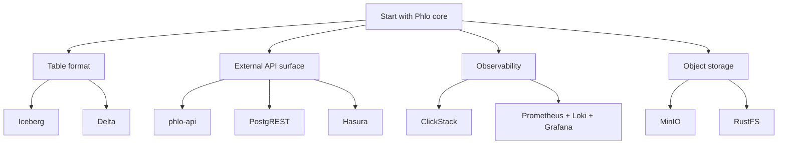

# Choosing Components

Phlo is modular by design. This page explains the main choice points in the stack and when to pick each option.

## Decision Map

## Core Choices

### API surfaces

- `phlo-api`: use for Phlo-native behavior, capability-backed endpoints, and Observatory backend needs.
- `PostgREST`: use when you want a database-native REST surface with minimal custom application code.
- `Hasura`: use when you want GraphQL, metadata-driven schema exposure, and subscriptions.

### Table formats

- `Iceberg`: default Phlo path. Best fit with Nessie, Trino, and the current Write-Audit-Publish story.
- `Delta`: use when your wider ecosystem already standardizes on Delta Lake or Delta-compatible tooling.

### Object storage

- `MinIO`: default local and general-purpose S3-compatible storage.
- `RustFS`: consider when you want a higher-performance S3-compatible alternative and accept a less common path.

### Observability

- `ClickStack`: preferred all-in-one backend. Best default when you want the fewest moving parts.
- `Prometheus + Loki + Grafana`: use when you want a more traditional split stack or need deeper compatibility with existing operator tooling.

## Packaging Guidance

### Recommended baseline

- `phlo`
- `phlo-dagster`
- `phlo-postgres`
- `phlo-trino`
- `phlo-minio`
- `phlo-nessie`
- `phlo-iceberg`
- `phlo-dlt`
- `phlo-dbt`
- `phlo-pandera`

### Add by concern

- external REST/GraphQL access: `phlo-api`, `phlo-postgrest`, `phlo-hasura`
- metadata/catalog: `phlo-openmetadata`
- observability: `phlo-otel`, `phlo-clickstack` or the split observability packages
- extension development: `phlo-testing`, `phlo-core-plugins`

## Related Pages

- [Integration Profiles](integration-profiles.md)
- [Service Packages](service-packages.md)
- [Setup](../setup/index.md)
- [Packages](../packages/index.md)
