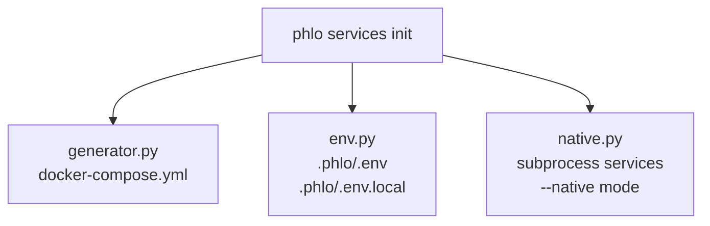

# Compose Generation

`phlo services init` generates Docker Compose files, environment files, and supporting
configuration from installed service plugins. This guide covers the three modules that
power this process: `env.py`, `generator.py`, and `native.py`.

## Module roles



### env.py — environment variable materialization

Renders `.env` (non-secret defaults) and `.env.local` (secrets and local overrides) from
discovered `ServiceDefinition` objects.

Key functions:

| Function             | Output          | Description                                      |
|----------------------|-----------------|--------------------------------------------------|
| `generate_env`       | `.phlo/.env`    | Non-secret defaults; grouped by service category |
| `generate_env_local` | `.phlo/.env.local` | Secrets only; preserves existing local values |
| `render_env`         | (internal)      | Shared renderer with `include_secrets` / `include_non_secrets` flags |

Variables are grouped by category (`core`, `orchestration`, `bi`, `admin`, `api`,
`observability`) with section headers. Overrides from `phlo.yaml` (`env:` section)
take precedence over package defaults. Existing `.env.local` values are preserved
on regeneration.

### generator.py — compose YAML generation

`ComposeGenerator` builds `docker-compose.yml` from service definitions.

```python
class ComposeGenerator:
    def __init__(self, discovery: ServiceDiscovery): ...

    def generate_compose(
        self,
        services: list[ServiceDefinition],
        output_dir: Path,
        dev_mode: bool = False,
        phlo_src_path: str | None = None,
        user_overrides: dict[str, Any] | None = None,
    ) -> str: ...
```

The generator:


1. Sorts services by dependency order via `discovery.resolve_dependencies()`.
2. Builds per-service configs — image/build, ports, volumes, healthchecks, env_file.
3. Resolves `depends_on` conditions (`service_healthy`, `service_started`,
   `service_completed_successfully` for setup containers).
4. Applies dev mode overrides (source mounts, `PHLO_DEV_MODE=true`).
5. Applies user overrides from `phlo.yaml` (last, highest precedence).
6. Emits YAML with a header comment.

Additional methods:

- `generate_env` / `generate_env_local` — delegate to `env.py`.
- `copy_service_files` — copies extra files required by services to `.phlo/`.
- `generate_gitignore` — generates `.phlo/.gitignore` (env files, volumes, service data).

### native.py — native subprocess services

`NativeProcessManager` runs services as local subprocesses instead of Docker containers.

```python
class NativeProcessManager:
    def __init__(self, project_root: Path, log_dir: Path | None = None): ...

    async def start_service(self, service, env_overrides=None) -> NativeProcess | None: ...
    async def stop_service(self, name, timeout=10) -> bool: ...
    async def stop_all(self, timeout=10) -> None: ...
```

Features:


- Expands `$&#123;VAR&#125;` and `$&#123;VAR:-default&#125;` placeholders in commands and environment.
- Runs optional build steps (`requires_build`, `build_command`, `build_if_missing`).
- Starts processes in new sessions for clean signal handling.
- Logs output to per-service files in `log_dir`.
- Polls health check URLs with `httpx` (30s timeout).
- Graceful shutdown via `SIGTERM` → `SIGKILL` fallback.

## Service plugin contributions

Each service package includes a `service.yaml` that declares:

- Docker image or build context
- Environment variables (with defaults, secrets, descriptions)
- Compose config (ports, volumes, healthcheck, command)
- Dependencies on other services
- Dev mode overrides
- Additional files to copy

The `ServiceDiscovery` system collects these into `ServiceDefinition` objects that
`ComposeGenerator` and `NativeProcessManager` consume.

## ServiceDiscovery cache APIs

`ServiceDiscovery` caches discovered service definitions per instance.

| API | Behavior |
| --- | --- |
| `discover()` | Return cached definitions if already loaded. |
| `discover(refresh=True)` | Clear cache, then rediscover and return new definitions. |
| `clear_cache()` | Invalidate cached definitions; next `discover()` reloads. |
| `refresh()` | Alias for `discover(refresh=True)`. |

```python
from phlo.plugins.discovery import ServiceDiscovery

discovery = ServiceDiscovery()

first = discovery.discover()   # loads and caches
cached = discovery.discover()  # same in-memory map
assert cached is first

# Option 1: force reload inline
reloaded = discovery.discover(refresh=True)
assert reloaded is not first

# Option 2: explicit cache invalidation
discovery.clear_cache()
reloaded_again = discovery.discover()

# Option 3: refresh alias
latest = discovery.refresh()
```

## Environment file generation

Generated files in `.phlo/`:

| File         | Contents                                    | Git-tracked |
|--------------|---------------------------------------------|-------------|
| `.env`       | Non-secret defaults from all services       | No          |
| `.env.local` | Secrets and local overrides (preserved)     | No          |

Override precedence (highest to lowest):

1. Existing `.env.local` values (secrets preserved on regeneration)
2. `phlo.yaml` `env:` section overrides
3. Package `service.yaml` defaults

## Native mode

Use `--native` flag for services that support subprocess execution (e.g., phlo-api,
Observatory). A service supports native mode when its `service.yaml` includes a `dev`
section with a `command` list.

```bash
phlo services start --native
```

Native and Docker services can run side by side — Docker handles infrastructure
(Postgres, MinIO) while native mode runs application services for faster iteration.

## Customization via phlo.yaml

Service overrides in `phlo.yaml` use the `ServiceOverride` model:

```yaml
services:
  observatory:
    enabled: true
    ports:
      - "8080:3000"
    environment:
      DEBUG: "true"
  superset:
    enabled: false
```

Override behavior:

| Field         | Behavior                              |
|---------------|---------------------------------------|
| `enabled`     | Include/exclude service entirely      |
| `ports`       | Replaces package defaults             |
| `environment` | Merges with package defaults          |
| `volumes`     | Appends to package defaults           |
| `depends_on`  | Replaces package defaults             |
| `command`     | Replaces package default              |
| `healthcheck` | Replaces package default              |

Inline custom services (`type: inline`) can define `image`, `build`, and `healthcheck`
directly in `phlo.yaml` without a service package.

## See also

- [Service Packages](service-packages.md) — writing `service.yaml`
- [Plugin Development](plugin-development.md) — service plugin lifecycle
- [Configuration Reference](../reference/configuration-reference.md) — phlo.yaml schema
