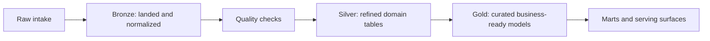

# Data Lifecycle

Phlo is meant to make the data lifecycle explicit, not implicit.

## Lifecycle

## How Phlo Maps To It

- ingestion packages move source data into raw and bronze layers
- quality packages enforce contracts before promotion
- dbt transforms move data through silver, gold, and marts
- catalogs and metadata surfaces expose the resulting assets to humans and tools

## Why This Matters

- reproducibility: rebuild downstream from upstream layers
- debugability: isolate issues by stage
- governance: make promotion and quality gates explicit
- serving flexibility: expose marts through APIs and BI tools without conflating them with ingestion

## Related Pages

- [Core Concepts](../getting-started/core-concepts.md)
- [Data Modeling](data-modeling.md)
- [Operations Contracts](operations-contracts.md)
