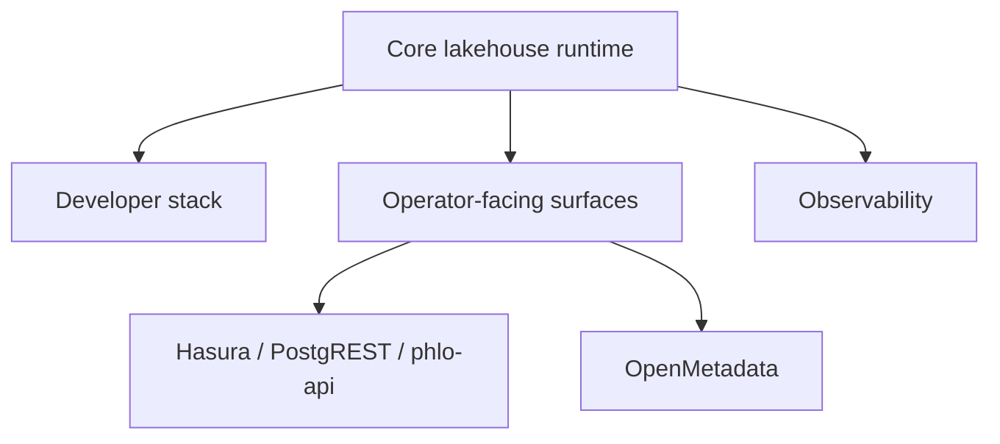

# Deployment Profiles

Phlo does not have one required topology. It has a core runtime plus optional surfaces.

## Profile Layers

## Suggested Profiles

### Core developer profile

- orchestration: `phlo-dagster`
- metadata/state: `phlo-postgres`
- storage: `phlo-minio`
- catalog: `phlo-nessie`
- query: `phlo-trino`
- table format: `phlo-iceberg`
- workflow packages: `phlo-dlt`, `phlo-dbt`, `phlo-pandera`

### External-surface profile

Add when other teams need direct access:

- `phlo-api`
- `phlo-postgrest`
- `phlo-hasura`
- `phlo-openmetadata`

### Observability profile

- emission: `phlo-otel`
- collector/router: `phlo-alloy`
- backend: `phlo-clickstack` or `phlo-prometheus` + `phlo-loki` + `phlo-grafana`

## Selection Guidance

- local development: start with the core developer profile
- platform demos and self-service access: add external surfaces
- production diagnostics: add observability before adding more user-facing surfaces

## Related Pages

- [Choosing Components](choosing-components.md)
- [Integration Profiles](integration-profiles.md)
- [Production Readiness](../operations/production-readiness.md)
