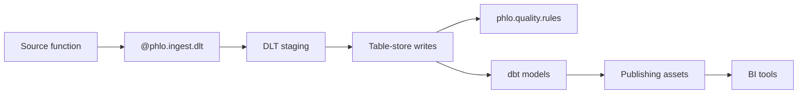

# Developer Guide

Complete guide to building data pipelines with Phlo's decorator-driven framework.

## Overview

Phlo provides powerful decorators that transform simple functions into complete data pipelines. This guide covers:

- Using `@phlo.ingest.dlt` for data ingestion
- Using `phlo.quality.rules(...)` and provider-native quality checks
- Schema definition with Pandera
- Integration with dbt
- Publishing to BI tools
- Advanced patterns and best practices



## Quick Example

A complete ingestion pipeline in ~30 lines:

```python
# workflows/schemas/api.py
import pandera as pa
from pandera.typing import Series

class EventSchema(pa.DataFrameModel):
    id: Series[str] = pa.Field(nullable=False, unique=True)
    timestamp: Series[datetime] = pa.Field(nullable=False)
    value: Series[float] = pa.Field(ge=0, le=100)

# workflows/ingestion/api/events.py
from dlt.sources.rest_api import rest_api
import phlo
from workflows.schemas.api import EventSchema

@phlo.ingest.dlt(
    table_name="events",
    unique_key="id",
    validation_schema=EventSchema,
    group="api",
    cron="0 */1 * * *",
    freshness_hours=(1, 24),
)
def api_events(partition_date: str):
    return rest_api(
        client={"base_url": "https://api.example.com"},
        resources=[
            {
                "name": "events",
                "endpoint": {"path": f"/events?date={partition_date}"},
            }
        ],
    )

# workflows/quality/api.py
import phlo

@phlo.quality.rules(
    table="bronze.events",
    rules=[
        phlo.not_null("id", "timestamp"),
        phlo.range_between("value", min_value=0, max_value=100),
        phlo.unique("id"),
    ],
)
def events_quality():
    pass
```

That's it! You get:

- Automatic DLT pipeline setup
- Iceberg table creation from Pandera schema
- Merge with deduplication
- Validation enforcement
- Quality checks with detailed reporting
- Branch-aware writes
- Retry handling
- Metrics tracking

## @phlo.ingest.dlt Decorator

### Basic Usage

```python
import phlo
from dlt.sources.rest_api import rest_api

@phlo.ingest.dlt(
    table_name="my_table",
    unique_key="id",
    validation_schema=MySchema,
    group="my_group",
)
def my_ingestion(partition_date: str):
    # Return a DLT source
    return rest_api(...)
```

### Parameters

**Required**:

`table_name` (str): Name of target Iceberg table

```python
table_name="events"  # Creates bronze.events
```

`unique_key` (str): Column used for deduplication

```python
unique_key="id"  # Primary key column
```

`validation_schema` (pa.DataFrameModel): Pandera schema for validation

```python
validation_schema=EventSchema  # Must be a Pandera DataFrameModel
```

`group` (str): Logical grouping for organization

```python
group="api"  # Groups assets in Dagster UI
```

**Optional**:

`cron` (str): Cron schedule expression

```python
cron="0 */1 * * *"  # Every hour
cron="0 0 * * *"    # Daily at midnight
```

`freshness_hours` (tuple): Freshness policy (warn, error)

```python
freshness_hours=(1, 24)  # Warn after 1h, error after 24h
```

`merge_strategy` (str): How to handle updates

```python
merge_strategy="merge"   # Upsert (default)
merge_strategy="append"  # Insert-only
```

`merge_config` (dict): Merge and deduplication configuration

```python
merge_config={"deduplication_method": "last"}   # Keep last occurrence (default)
merge_config={"deduplication_method": "first"}  # Keep first occurrence
merge_config={"deduplication_method": "hash"}   # Keep based on content hash
```

`max_retries` (int): Number of retry attempts (default: 3)

```python
max_retries=3
```

`retry_delay_seconds` (int): Delay between retries in seconds (default: 30)

```python
retry_delay_seconds=30
```

`max_runtime_seconds` (int): Execution timeout in seconds (default: 300)

```python
max_runtime_seconds=3600  # 1 hour
```

`validate` (bool): Enable validation (default: True)

```python
validate=True
```

`strict_validation` (bool): Fail on validation errors (default: True)

```python
strict_validation=True
```

`add_metadata_columns` (bool): Add `_phlo_*` metadata columns (default: True)

```python
add_metadata_columns=True
```

### DLT Source Integration

Phlo works with any DLT source. Common patterns:

**REST API Source**:

```python
from dlt.sources.rest_api import rest_api
import phlo

@phlo.ingest.dlt(
    table_name="api_events",
    unique_key="id",
    group="api",
)
def api_data(partition_date: str):
    return rest_api(
        client={
            "base_url": "https://api.example.com",
            "auth": {
                "type": "bearer",
                "token": os.getenv("API_TOKEN"),
            },
        },
        resources=[
            {
                "name": "events",
                "endpoint": {
                    "path": "events",
                    "params": {
                        "date": partition_date,
                        "limit": 1000,
                    },
                },
                "write_disposition": "replace",
            }
        ],
    )
```

**Custom Python Source**:

```python
import dlt
import phlo

@dlt.source
def my_source(start_date: str):
    @dlt.resource(write_disposition="append")
    def events():
        # Custom logic to yield records
        for record in fetch_data(start_date):
            yield record
    return events

@phlo.ingest.dlt(
    table_name="custom_events",
    unique_key="id",
    group="api",
)
def custom_data(partition_date: str):
    return my_source(start_date=partition_date)
```

**File Source**:

```python
from dlt.sources.filesystem import filesystem
import phlo

@phlo.ingest.dlt(
    table_name="file_events",
    unique_key="id",
    group="files",
)
def file_data(partition_date: str):
    return filesystem(
        bucket_url=f"s3://bucket/data/{partition_date}",
        file_glob="*.csv"
    )
```

**SQL Source**:

```python
import dlt
import phlo
from sqlalchemy import create_engine

@phlo.ingest.dlt(
    table_name="sql_events",
    unique_key="id",
    group="sql",
)
def sql_data(partition_date: str):
    @dlt.resource
    def query():
        engine = create_engine(os.getenv("DATABASE_URL"))
        return pd.read_sql(
            f"SELECT * FROM events WHERE date = '{partition_date}'",
            engine
        ).to_dict('records')
    return query
```

### Merge Strategies

**Append Strategy** (fastest, no deduplication):

```python
@phlo.ingest.dlt(
    table_name="logs",
    unique_key="id",
    group="observability",
    merge_strategy="append",  # Insert-only
)
def logs(partition_date: str):
    # Good for: immutable event streams, logs
    return source
```

**Merge Strategy** (upsert with deduplication):

```python
@phlo.ingest.dlt(
    table_name="users",
    unique_key="user_id",
    group="identity",
    merge_strategy="merge",
    merge_config={"deduplication_method": "last"},  # Keep most recent
)
def users(partition_date: str):
    # Good for: dimension tables, user profiles
    return source
```

**Deduplication Strategies**:

`last` (default): Keep last occurrence by partition

```python
merge_config={"deduplication_method": "last"}
# If same ID appears twice, keep the one with latest timestamp
```

`first`: Keep first occurrence

```python
merge_config={"deduplication_method": "first"}
# If same ID appears twice, keep the one with earliest timestamp
```

`hash`: Keep based on content hash

```python
merge_config={"deduplication_method": "hash"}
# If same ID appears twice, keep the one with different content
```

### Partition Handling

Phlo uses daily partitioning by default:

```python
import phlo
from dlt.sources.rest_api import rest_api

@phlo.ingest.dlt(
    table_name="events",
    unique_key="id",
    group="api",
)
def my_data(partition_date: str):
    # partition_date is automatically provided by Dagster
    # Format: "YYYY-MM-DD"
    start_time = f"{partition_date}T00:00:00Z"
    end_time = f"{partition_date}T23:59:59Z"

    return rest_api(
        client={"base_url": "https://api.example.com"},
        resources=[
            {
                "endpoint": {
                    "params": {
                        "start": start_time,
                        "end": end_time,
                    }
                }
            }
        ]
    )
```

**Backfills**:

```bash
# Backfill specific date
phlo materialize dlt_my_data --partition 2025-01-15

# Backfill date range (in Dagster UI)
# Select partitions → 2025-01-01 to 2025-01-31 → Materialize
```

## Pandera Schemas

Schemas serve as the source of truth for data structure and validation.

### Schema Definition Approaches

Phlo supports two approaches for defining Pandera schemas:

1. **Manual Definition**: Write Pandera classes directly (full control, more verbose)
2. **dbt YAML Generation**: Define schema in dbt model YAML, auto-generate Pandera (single source of truth)

Choose the approach that best fits your use case (see decision guide below).

### Approach 1: Manual Schema Definition

Define Pandera schemas directly in Python for full control:

```python
import pandera as pa
from pandera.typing import Series
from datetime import datetime

class MySchema(pa.DataFrameModel):
    """My data schema."""

    # Basic types
    id: Series[str]
    count: Series[int]
    amount: Series[float]
    timestamp: Series[datetime]
    is_active: Series[bool]

    class Config:
        strict = True  # Reject unknown columns
        coerce = True  # Coerce types automatically
```

### Field Constraints

```python
class AdvancedSchema(pa.DataFrameModel):
    # Not null
    id: Series[str] = pa.Field(nullable=False)

    # Unique values
    email: Series[str] = pa.Field(unique=True)

    # Range validation
    age: Series[int] = pa.Field(ge=0, le=150)
    temperature: Series[float] = pa.Field(ge=-50.0, le=50.0)

    # String patterns
    postal_code: Series[str] = pa.Field(regex=r"^\d{5}$")

    # Allowed values
    status: Series[str] = pa.Field(isin=["active", "inactive", "pending"])

    # String length
    name: Series[str] = pa.Field(str_length={"min_value": 1, "max_value": 100})

    # Custom checks
    email: Series[str] = pa.Field(str_contains="@")

    # Descriptions (for documentation)
    user_id: Series[str] = pa.Field(
        description="Unique user identifier",
        nullable=False
    )
```

### Optional Fields

```python
class SchemaWithOptional(pa.DataFrameModel):
    # Required field
    id: Series[str] = pa.Field(nullable=False)

    # Optional field (allows None)
    notes: Series[str] | None = pa.Field(nullable=True)

    # Optional with default
    status: Series[str] = pa.Field(
        nullable=True,
        default="pending"
    )
```

### Custom Validators

```python
import pandera as pa
from pandera import check

class CustomSchema(pa.DataFrameModel):
    value: Series[float]

    @check("value")
    def value_is_positive(cls, value):
        return value > 0

    @check("value")
    def value_is_reasonable(cls, value):
        return value < 1000000

# Multi-column check
class MultiColumnSchema(pa.DataFrameModel):
    start_date: Series[datetime]
    end_date: Series[datetime]

    @pa.check("end_date")
    def end_after_start(cls, series):
        return series >= cls.start_date
```

### Approach 2: Generate Schemas from dbt YAML

**Reduce schema duplication by 50%** - define your schema once in dbt YAML, auto-generate the Pandera schema.

#### Why Use dbt YAML Generation?

**Problem**: Manually writing both dbt schema tests AND Pandera schemas creates duplication and drift:

```yaml
# dbt model YAML - defines schema tests
columns:
  - name: event_value
    data_tests:
      - not_null
      - accepted_values:
          values: [0, 25, 50, 75, 100]
```

```python
# Pandera schema - duplicates the same validation logic
class FactEvents(PhloSchema):
    event_value: Series[int] = pa.Field(nullable=False, isin=[0, 25, 50, 75, 100])
```

**Solution**: Use `dbt_model_to_pandera` to generate Pandera schemas from dbt YAML:

```python
from pathlib import Path
from phlo_dbt.dbt_schema import dbt_model_to_pandera

# Point to your dbt model YAML
_dbt_model_path = Path(__file__).parent.parent / "transforms/dbt/models/silver/fct_events.yml"

# Auto-generate Pandera schema from dbt YAML
FactEvents = dbt_model_to_pandera(_dbt_model_path, "fct_events")
```

**Benefits**:
- Single source of truth (dbt YAML)
- 50% less code to maintain
- No schema drift between dbt and Pandera
- dbt data_tests automatically become Pandera Field constraints
- Works seamlessly with `phlo.quality.pandera(...)` decorator

#### Step 1: Define Schema in dbt YAML

Use dbt `data_tests` to define your validation rules:

```yaml
# workflows/transforms/dbt/models/silver/fct_events.yml
version: 2

models:
  - name: fct_events
    description: "Silver layer fact table for enriched events"
    columns:
      - name: event_id
        description: "Unique identifier for the event"
        data_tests:
          - not_null
          - unique

      - name: event_value
        description: "Normalized event value"
        data_tests:
          - not_null

      - name: event_category
        description: "Categorized event value"
        data_tests:
          - not_null
          - accepted_values:
              arguments:
                values:
                  - "low"
                  - "normal"
                  - "high"

      - name: hour_of_day
        description: "Hour when the event occurred"
        data_tests:
          - not_null
          - accepted_values:
              arguments:
                values: [0, 1, 2, 3, 4, 5, 6, 7, 8, 9, 10, 11, 12, 13, 14, 15, 16, 17, 18, 19, 20, 21, 22, 23]
                quote: false
```

**Supported dbt data_tests**:

- `not_null` → `nullable=False`
- `unique` → `unique=True`
- `accepted_values` → `isin=[...]`
- `dbt_expectations.expect_column_values_to_be_between` → `ge=`, `le=`
- `dbt_utils.accepted_range` → `ge=`, `le=`

#### Step 2: Generate Pandera Schema

In your schemas file, generate the Pandera class:

```python
# workflows/schemas/events.py
from pathlib import Path
from phlo_dbt.dbt_schema import dbt_model_to_pandera

# Define path to dbt model YAML
_dbt_model_path = (
    Path(__file__).parent.parent
    / "transforms"
    / "dbt"
    / "models"
    / "silver"
    / "fct_events.yml"
)

# Generate Pandera schema from dbt YAML
FactEvents = dbt_model_to_pandera(
    _dbt_model_path,
    "fct_events"  # Model name in YAML
)

# Optional: specify custom class name
# FactEvents = dbt_model_to_pandera(
#     _dbt_model_path,
#     "fct_events",
#     class_name="CustomClassName"
# )
```

The generated schema automatically inherits from `PhloSchema` and includes all constraints from dbt tests.

#### Step 3: Use with phlo.quality.pandera(...)

The generated schema works seamlessly with quality checks:

```python
# workflows/quality/events.py
import phlo
from phlo.quality import SchemaCheck
from workflows.schemas.events import FactEvents

@phlo.quality.pandera(
    table="silver.fct_events",
    checks=[
        SchemaCheck(schema=FactEvents)  # Uses auto-generated schema
    ]
)
def events_quality():
    pass
```

#### Type Inference

Since dbt YAML doesn't specify types (they're in the SQL), `dbt_model_to_pandera` infers types using heuristics:

**Column name patterns**:
- `*_timestamp`, `*_date`, `*_at` → `datetime`
- `*_id`, `id` → `str`
- `*_count`, `*_amount`, `*_num`, `*_qty` → `int`
- `*_pct`, `*_percent` → `float`

**Test value patterns**:
- `accepted_values` with all integers → `int`
- `accepted_values` with all strings → `str`
- `expect_column_values_to_be_between` with integers → `int`
- `expect_column_values_to_be_between` with floats → `float`

**Default**: `str` if no pattern matches

#### When to Use dbt YAML Generation vs Manual Schemas

**Use dbt YAML generation when**:
- ✅ You have dbt transformations defining the schema
- ✅ Schema is relatively simple (standard data_tests)
- ✅ You want single source of truth in dbt
- ✅ You want to reduce maintenance burden

**Use manual Pandera schemas when**:
- ✅ No dbt models (raw layer ingestion)
- ✅ Complex custom validators needed
- ✅ Multi-column checks required
- ✅ Advanced Pandera features needed (custom checks, coercion strategies)

**Common pattern**:
```python
# Raw layer - manual schema (no dbt model)
class RawEvents(PhloSchema):
    event_id: str = Field(unique=True)
    event_value: int = Field(ge=0, le=100)
    # ... manual definition

# Silver layer - generated from dbt YAML (single source of truth)
FactEvents = dbt_model_to_pandera(_dbt_model_path, "fct_events")

# Gold layer - manual schema (complex aggregations)
class FactDailyEventMetrics(PhloSchema):
    event_date: datetime = Field(unique=True)
    # ... manual definition with custom logic
```

#### Complete Example

Use the same layout in a project generated from the CSV batch template:

- dbt YAML: `workflows/transforms/dbt/models/silver/fct_events.yml`
- Schema generation: `workflows/schemas/events.py`

```python
"""Pandera schemas for event data validation.

Raw layer schemas are defined manually.
Fact layer schema is GENERATED from dbt model YAML (single source of truth).
"""

from pathlib import Path
from phlo_dbt.dbt_schema import dbt_model_to_pandera
from phlo_pandera.schemas import PhloSchema

# =============================================================================
# RAW LAYER - Manual schemas (internal, not published)
# =============================================================================

class RawEvents(PhloSchema):
    """Schema for raw event records."""
    event_id: str = Field(unique=True)
    event_value: int = Field(ge=0, le=100)
    # ... more fields

# =============================================================================
# FACT LAYER - Generated from dbt model YAML (single source of truth)
# =============================================================================

_dbt_model_path = (
    Path(__file__).parent.parent
    / "transforms"
    / "dbt"
    / "models"
    / "silver"
    / "fct_events.yml"
)
FactEvents = dbt_model_to_pandera(_dbt_model_path, "fct_events")

# =============================================================================
# GOLD LAYER - Manual schema (complex aggregations)
# =============================================================================

class FactDailyEventMetrics(PhloSchema):
    """Schema for the fct_daily_event_metrics table (gold layer)."""
    event_date: datetime = Field(unique=True)
    # ... complex aggregation fields
```

### Schema Conversion to Iceberg

Pandera types automatically convert to Iceberg types:

```text
# Pandera → Iceberg mapping:
str → StringType()
int → LongType()
float → DoubleType()
datetime → TimestamptzType()
bool → BooleanType()

# Example:
class MySchema(pa.DataFrameModel):
    id: Series[str]         # → StringType()
    count: Series[int]      # → LongType()
    amount: Series[float]   # → DoubleType()
    timestamp: Series[datetime]  # → TimestamptzType()

# Results in Iceberg schema:
Schema(
    NestedField(1, "id", StringType(), required=True),
    NestedField(2, "count", LongType(), required=True),
    NestedField(3, "amount", DoubleType(), required=True),
    NestedField(4, "timestamp", TimestamptzType(), required=True),
    # DLT metadata fields added automatically:
    NestedField(100, "_dlt_load_id", StringType(), required=False),
    NestedField(101, "_dlt_id", StringType(), required=False),
    NestedField(102, "_cascade_ingested_at", TimestamptzType(), required=False),
)
```

## Quality Decorators

### Basic Usage

```python
import phlo

@phlo.quality.rules(
    table="bronze.events",
    rules=[
        phlo.not_null("id", "timestamp"),
        phlo.range_between("value", min_value=0, max_value=100),
        phlo.unique("id"),
        phlo.freshness("timestamp", hours=24),
    ],
)
def events_quality():
    pass
```

Use `phlo.quality.rules(...)` when checks can be expressed in Phlo's neutral
quality vocabulary. Use `phlo.quality.pandera(...)` when you need Pandera-native
schemas or checks.

## Flow Authoring Decorators

Use these decorators when you want to describe the rest of the flow without
hand-writing orchestration metadata. They register provider-neutral asset specs
that adapters can turn into Dagster assets, lineage nodes, catalog entries, or
operational jobs.

### SQL Transform

```python
import phlo

@phlo.transform.sql(
    table="silver.orders",
    depends_on=["bronze.orders"],
    materialized="incremental",
)
def orders_sql():
    return """
    select *
    from bronze.orders
    where status != 'cancelled'
    """
```

### Publish Surface

```python
@phlo.publish(
    table="gold.customer_health",
    audience=["cs", "sales"],
    owner="data-platform",
    freshness_hours=6,
)
def customer_health():
    return "gold.customer_health"
```

### Operational Observability

```python
@phlo.observe(
    table="bronze.events",
    freshness_hours=2,
    row_count_change={"warn": 0.3, "fail": 0.6},
)
def events_observability():
    pass
```

### Repeatable Backfills

```python
@phlo.backfill(
    target="silver.orders",
    partitions={"start": "2026-01-01", "end": "2026-03-31"},
    mode="replace-partitions",
)
def orders_q1_backfill():
    return orders_sql
```

### Governance Contracts

Use `@phlo.contract` when the ownership, consumer, SLA, PII, or lifecycle
metadata belongs to the data product rather than one ingestion or quality
adapter.

```python
@phlo.contract(
    table="gold.customer_health",
    owner="data-platform",
    consumers=["cs", phlo.Consumer(name="sales", contact="sales@example.com")],
    pii=True,
    freshness_hours=6,
    lifecycle="production",
)
def customer_health_contract():
    pass
```

### Access Policies

Use `@phlo.access` to declare intended access controls in one place. Catalog,
warehouse, and policy-engine adapters can translate the same declaration into
their native grants or policy objects.

```python
@phlo.access(
    table="gold.customer_health",
    roles=["cs_read", "sales_read"],
    pii_columns=["email"],
    policy="read",
)
def customer_health_access():
    pass
```

### Schedules

Use `@phlo.schedule` to declare when a set of static targets should run. The
`targets` list is the durable contract: it names the assets or jobs an adapter
should launch. The decorated function is optional dynamic run configuration; it
can return partition values, tags, or other parameters for that specific run.

```python
@phlo.schedule(
    name="daily_customer_health",
    cron="0 6 * * *",
    targets=["transform_silver_orders", "publish_gold_customer_health"],
    timezone="Europe/London",
)
def daily_customer_health():
    return {"partition_date": "2026-05-18"}
```

### Built-in Checks

**NullCheck**: Ensure no null values

```python
NullCheck(columns=["id", "email", "timestamp"])
```

**RangeCheck**: Numeric values within bounds

```python
RangeCheck(column="age", min_value=0, max_value=150)
RangeCheck(column="temperature", min_value=-50.0, max_value=50.0)
```

**FreshnessCheck**: Data recency

```python
FreshnessCheck(
    column="timestamp",
    max_age_hours=24  # Error if data older than 24h
)
```

**UniqueCheck**: No duplicate values

```python
UniqueCheck(columns=["id"])
UniqueCheck(columns=["user_id", "timestamp"])  # Composite key
```

**CountCheck**: Row count validation

```python
CountCheck(min_count=1)  # At least 1 row
CountCheck(max_count=1000000)  # At most 1M rows
CountCheck(min_count=100, max_count=10000)  # Between 100-10k
```

**SchemaCheck**: Full Pandera schema validation

```python
from workflows.schemas.api import EventSchema

SchemaCheck(schema=EventSchema)
```

**CustomSQLCheck**: Arbitrary SQL validation

```python
CustomSQLCheck(
    query="SELECT COUNT(*) FROM bronze.events WHERE value < 0",
    expected_result=0,
    description="No negative values"
)
```

### Reconciliation Checks (Cross-table)

Reconciliation checks live in `phlo_pandera.reconciliation` and use the Trino resource
from the Dagster context to query source tables.

**ReconciliationCheck**: Row count parity / coverage between source and target

- `check_type="rowcount_parity"`: target and source counts must match (within tolerance)
- `check_type="rowcount_gte"`: target must be >= source (within tolerance)

```python
from phlo_pandera.reconciliation import ReconciliationCheck

ReconciliationCheck(
    source_table="silver.stg_github_events",
    partition_column="_phlo_partition_date",
    check_type="rowcount_parity",
    tolerance=0.02,  # 2% allowed difference
    absolute_tolerance=50,  # Optional absolute row difference
)
```

**AggregateConsistencyCheck**: Compare target aggregates to source aggregates

```python
from phlo_pandera.reconciliation import AggregateConsistencyCheck

AggregateConsistencyCheck(
    source_table="silver.stg_github_events",
    aggregate_column="total_events",
    source_expression="COUNT(*)",
    group_by=["activity_date"],
    partition_column="_phlo_partition_date",
    tolerance=0.0,
    absolute_tolerance=5,
)
```

**KeyParityCheck**: Ensure keys match between source and target

```python
from phlo_pandera.reconciliation import KeyParityCheck

KeyParityCheck(
    source_table="silver.stg_github_events",
    key_columns=["event_id"],
    partition_column="_phlo_partition_date",
    tolerance=0.0,
)
```

**MultiAggregateConsistencyCheck**: Compare multiple aggregates in one check

```python
from phlo_pandera.reconciliation import AggregateSpec, MultiAggregateConsistencyCheck

MultiAggregateConsistencyCheck(
    source_table="silver.stg_github_events",
    aggregates=[
        AggregateSpec(name="row_count", expression="COUNT(*)", target_column="total_events"),
        AggregateSpec(name="total_amount", expression="SUM(amount)", target_column="amount_total"),
    ],
    group_by=["activity_date"],
    partition_column="_phlo_partition_date",
    tolerance=0.0,
    absolute_tolerance=5,
)
```

**ChecksumReconciliationCheck**: Compare row-level hashes across tables

```python
from phlo_pandera.reconciliation import ChecksumReconciliationCheck

ChecksumReconciliationCheck(
    source_table="silver.stg_github_events",
    target_table="gold.fct_github_events",
    key_columns=["event_id"],
    columns=["event_type", "actor_id", "repo_id"],
    partition_column="_phlo_partition_date",
    tolerance=0.0,
    absolute_tolerance=10,
    hash_algorithm="xxhash64",
)
```

**Common reconciliation gaps (use CustomSQLCheck or @asset_check):**

- Multi-source or multi-target reconciliation in one check
- Distribution drift checks (percentiles/histograms vs source)
- Row-level checksum with engine-specific normalization rules

### Advanced Quality Checks

**Multiple tables**:

```python
import phlo
@phlo.quality.pandera(
    table="bronze.events",
    checks=[
        CustomSQLCheck(
            query="""
                SELECT COUNT(*)
                FROM bronze.events e
                LEFT JOIN bronze.users u ON e.user_id = u.id
                WHERE u.id IS NULL
            """,
            expected_result=0,
            description="All events have valid user_id"
        )
    ]
)
def referential_integrity():
    pass
```

**Conditional checks**:

```python
import phlo
import pandas as pd
from datetime import datetime
from phlo_pandera.checks import QualityCheck, QualityCheckResult

class ConditionalCheck(QualityCheck):
    def execute(self, df: pd.DataFrame, context) -> QualityCheckResult:
        # Only run check on weekdays
        if datetime.now().weekday() >= 5:
            return QualityCheckResult(
                passed=True,
                failed=False,
                message="Skipped on weekend"
            )

        # Run validation
        passed = len(df) > 0  # Example validation
        return QualityCheckResult(
            passed=passed,
            failed=not passed,
            message=f"Validated {len(df)} rows"
        )

@phlo.quality.pandera(
    table="bronze.events",
    checks=[ConditionalCheck()]
)
def conditional_quality():
    pass
```

### Quality Check Results

Check results include rich metadata:

```python
{
    "passed": True,
    "check_name": "NullCheck",
    "table": "bronze.events",
    "columns": ["id", "timestamp"],
    "row_count": 1000,
    "null_count": 0,
    "execution_time_seconds": 0.5
}
```

Displayed in Dagster UI with:

- Pass/fail status
- Detailed metrics table
- Execution timing
- Error messages (if failed)

## dbt Integration

Phlo automatically integrates with dbt for transformations.

### Setup

```bash
# dbt project structure
workflows/transforms/dbt/
├── dbt_project.yml
├── models/
│   ├── bronze/      # Staging models
│   ├── silver/      # Cleaned models
│   └── gold/        # Marts
├── tests/
└── macros/
```

### Source Configuration

Define Iceberg tables as dbt sources:

```yaml
# models/bronze/sources.yml
version: 2

sources:
  - name: raw
    description: Raw ingested data
    tables:
      - name: events
        description: Event data from API
        meta:
          dagster_asset_key: "dlt_events"
```

### Model Development

**Bronze (staging)**:

```sql
-- models/bronze/stg_events.sql
{{
    config(
        materialized='incremental',
        unique_key='id',
        on_schema_change='append_new_columns'
    )
}}

SELECT
    id,
    timestamp,
    value,
    category,
    _dlt_load_id,
    CURRENT_TIMESTAMP() as _transformed_at
FROM {{ source('raw', 'events') }}


WHERE timestamp > (SELECT MAX(timestamp) FROM {{ this }})

```

**Silver (cleaned)**:

```sql
-- models/silver/events_cleaned.sql
{{
    config(
        materialized='incremental',
        unique_key='id'
    )
}}

SELECT
    id,
    timestamp,
    COALESCE(value, 0) as value,
    UPPER(category) as category,
    _dlt_load_id
FROM {{ ref('stg_events') }}
WHERE value IS NOT NULL


AND timestamp > (SELECT MAX(timestamp) FROM {{ this }})

```

**Gold (marts)**:

```sql
-- models/gold/daily_aggregates.sql
{{
    config(
        materialized='table'
    )
}}

SELECT
    DATE(timestamp) as date,
    category,
    COUNT(*) as event_count,
    AVG(value) as avg_value,
    MIN(value) as min_value,
    MAX(value) as max_value,
    STDDEV(value) as stddev_value
FROM {{ ref('events_cleaned') }}
GROUP BY 1, 2
```

### Dagster Integration

dbt models automatically become Dagster assets:

```python
# workflows/transform/dbt.py
from dagster_dbt import DbtCliResource, dbt_assets
from phlo_dbt.translator import CustomDbtTranslator

@dbt_assets(
    manifest=DBT_PROJECT_DIR / "target" / "manifest.json",
    dagster_dbt_translator=CustomDbtTranslator(),
    partitions_def=daily_partition,
)
def all_dbt_assets(context, dbt: DbtCliResource):
    yield from dbt.cli(["build"], context=context).stream()
```

**Custom Translator** maps dbt sources to Dagster assets:

- `dlt_&#123;table&#125;` convention for ingestion assets
- Group inference from folder structure
- Partition support

### Running dbt

**Via Dagster UI**:

- Navigate to asset in UI
- Click "Materialize"

**Via CLI**:

```bash
# Materialize specific model
phlo materialize stg_events

# Materialize with dependencies
phlo materialize stg_events+

# All dbt models
phlo materialize --select "tag:dbt"
```

## Publishing to BI Tools

Automatically publish Iceberg marts to PostgreSQL for BI tools.

### Publishing Asset

```python
# workflows/publishing/events.py
from dagster import asset
from phlo_trino.publishing import publish_marts_to_postgres

@asset(
    deps=["marts__daily_aggregates"],  # Depends on dbt mart
    group="publishing"
)
def publish_daily_aggregates(context, trino, postgres):
    """Publish daily aggregates to PostgreSQL."""
    return publish_marts_to_postgres(
        context=context,
        trino=trino,
        postgres=postgres,
        tables_to_publish={
            "daily_aggregates": "marts.daily_aggregates"
        },
        data_source="events"
    )
```

### Generic Publisher

The `publish_marts_to_postgres` function:

1. Queries Iceberg table via Trino
2. Drops existing PostgreSQL table
3. Creates new table with inferred schema
4. Batch inserts with transactions
5. Returns statistics

```python
# Usage example:
publish_marts_to_postgres(
    context=context,
    trino=trino,
    postgres=postgres,
    tables_to_publish={
        "table1": "marts.fct_table1",
        "table2": "marts.dim_table2",
    },
    data_source="my_domain"
)
```

### Superset Integration

Connect Superset to PostgreSQL:

1. Add database connection
2. Create datasets from published tables
3. Build dashboards

## Advanced Patterns

### Custom Resource

Create custom Dagster resources:

```python
# workflows/resources/custom.py
from dagster import ConfigurableResource
import phlo

class MyAPIResource(ConfigurableResource):
    api_key: str
    base_url: str

    def fetch_data(self, endpoint: str):
        # Custom logic
        pass

# Usage in asset:
@phlo.ingest.dlt(
    table_name="resource_events",
    unique_key="id",
    group="api",
)
def my_data(context, my_api: MyAPIResource):
    data = my_api.fetch_data("/events")
    return data
```

### Sensors

Create custom sensors for automation:

```python
# workflows/sensors/custom.py
from dagster import sensor, RunRequest

@sensor(job=my_job)
def file_sensor(context):
    # Check for new files
    new_files = check_for_files()

    for file in new_files:
        yield RunRequest(
            run_key=file,
            run_config={"file_path": file}
        )
```

### Conditional Execution

```python
from datetime import datetime

import phlo
from dlt.sources.rest_api import rest_api

@phlo.ingest.dlt(
    table_name="conditional_events",
    unique_key="id",
    group="api",
)
def conditional_data(context):
    # Skip on weekends
    if datetime.now().weekday() >= 5:
        context.log.info("Skipping weekend execution")
        return None

    return rest_api(...)
```

## Best Practices

### 1. Schema-First Development

Always define Pandera schemas before writing ingestion code.

### 2. Incremental Loading

Use partition-aware queries to load only new data:

```python
def my_data(partition_date: str):
    return rest_api(
        client={"base_url": "https://api.example.com"},
        resources=[{"endpoint": {"path": "events", "params": {"date": partition_date}}}],
    )  # Only fetch partition data
```

### 3. Error Handling

Let Phlo handle retries, but add custom handling where needed:

```python
import phlo

@phlo.ingest.dlt(
    table_name="robust_events",
    unique_key="id",
    group="api",
    max_retries=3,
    retry_delay_seconds=30,
    max_runtime_seconds=3600
)
def robust_data(partition_date: str):
    try:
        return fetch_data(partition_date)
    except SpecificError as e:
        context.log.error(f"Custom handling: {e}")
        raise  # Re-raise for Dagster retry
```

### 4. Testing

Write tests for schemas and workflows:

```python
# tests/test_schemas.py
def test_event_schema():
    df = pd.DataFrame({
        "id": ["1", "2"],
        "value": [10.0, 20.0]
    })
    EventSchema.validate(df)  # Should not raise

# tests/test_ingestion.py
def test_api_events():
    result = api_events("2025-01-15")
    assert result is not None
```

### 5. Documentation

Document schemas and workflows:

```python
class EventSchema(pa.DataFrameModel):
    """Event data from API.

    This schema validates incoming event data from the external API.
    All events must have a unique ID and valid timestamp.
    """

    id: Series[str] = pa.Field(
        description="Unique event identifier from source system",
        nullable=False
    )
```

## Next Steps

- [CLI Reference](../reference/cli-reference.md) - Command-line tools
- [Configuration Reference](../reference/configuration-reference.md) - Advanced configuration
- [Testing Guide](../operations/testing.md) - Testing strategies
- [Best Practices](../operations/best-practices.md) - Production patterns
