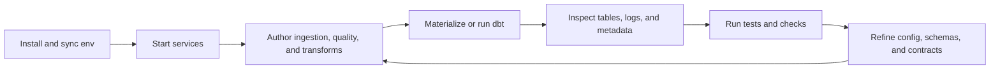

# Developer Workflow

This page is the day-to-day developer loop for Phlo.

## The Loop



## Typical Flow

### 1. Install

```bash
uv pip install -e .
```

### 2. Start the runtime

```bash
phlo services init
phlo services start
```

### 3. Build workflows

- define ingestion with package-backed decorators such as `phlo_dlt.phlo_ingestion` or `phlo_sling.phlo_sling_replication`
- define validation with `phlo_pandera.phlo_pandera` or the lazy `phlo.quality` public API when `phlo-pandera` is installed
- define transforms with dbt
- keep schemas under `workflows/schemas/`

For the full command-by-command authoring loop with `phlo workflow check`, see
[Workflow Development](workflow-development.md#authoring-loop).

### 4. Run the pipeline

```bash
phlo materialize <asset_name>
phlo dbt run
phlo dbt test
```

### 5. Inspect results

- Trino for data shape and query validation
- Dagster for orchestration state
- Observatory for Phlo-facing UI flows
- OpenMetadata, Hasura, or PostgREST when those surfaces are part of your stack

### 6. Verify

```bash
uv run pytest
uv run ruff check .
uv run ty check
```

## When To Leave This Lane

- package responsibilities: [Packages](../packages/index.md)
- platform topology and surfaces: [Platform Topology](../reference/platform-topology.md)
- setup of optional external systems: [Setup](../setup/index.md)
- production operation: [Operations](../operations/index.md)
