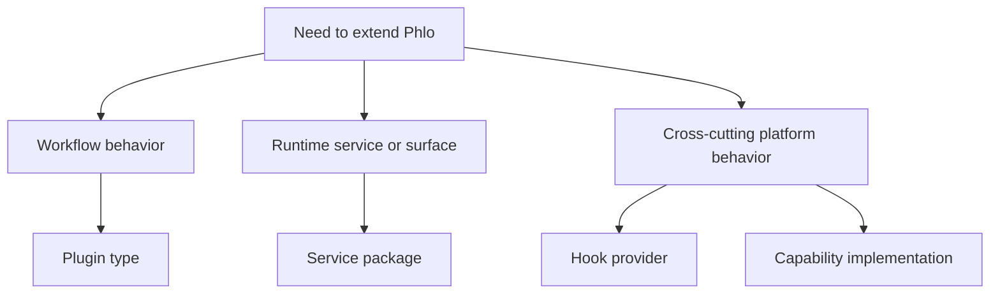

# Extension Model

Phlo is extended through capabilities, plugins, hooks, and service packages. This page explains when to use each one.

## Extension Map

## Use The Right Mechanism

- plugin type: when you are adding sources, quality checks, transformations, catalogs, asset providers, or CLI extensions
- service package: when you are shipping a runtime component with compose/config behavior
- hook provider: when you need event-driven reactions across the pipeline lifecycle
- capability implementation: when you are filling an abstract platform contract behind a stable interface

## Where To Go Next

- [Plugin Development](plugin-development.md)
- [Plugin API](../reference/plugin-api.md)
- [Capability Primitives](capability-primitives.md)
- [Hook Event Bus](hook-event-bus.md)
- [Packages](../packages/index.md)
