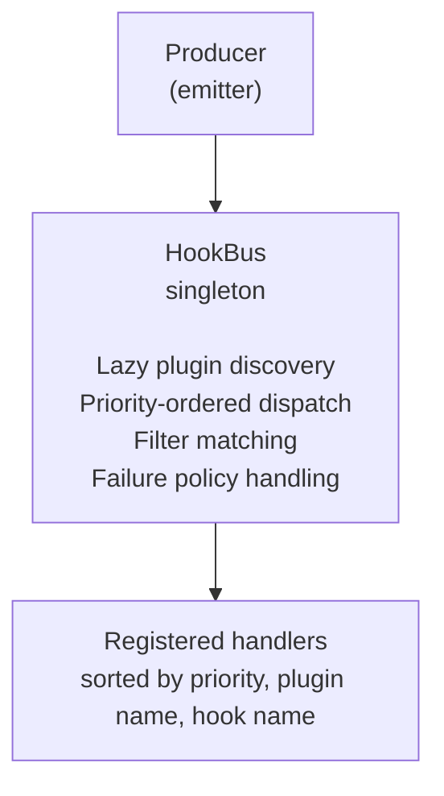

# Hook Event Bus Guide

Event-driven extension system for Phlo plugins.

## Overview

The hook event bus lets plugins subscribe to lifecycle events — ingestion runs, transform
completions, quality check results, and more — without direct coupling between components.
Plugins register handlers that the bus dispatches in priority order whenever an event is
emitted.

## Architecture



Key behaviours:

- **Lazy discovery** — `HookBus` discovers and registers `HookProvider` plugins on first
  `emit()`, so there is no upfront cost if no events are fired.
- **Priority ordering** — handlers are dispatched in ascending `priority` order (lower
  numbers run first). Default priority is `100`.
- **Filter matching** — handlers can declare filters on `event_types`, `asset_keys`, and
  `tags`; unmatched events are skipped.

## Event Types

All events inherit from `HookEvent` and share these base fields:

| Field        | Type              | Default          |
| ------------ | ----------------- | ---------------- |
| `event_type` | `str`             | *(required)*     |
| `version`    | `str`             | `"1.0"`          |
| `timestamp`  | `datetime`        | UTC now          |
| `tags`       | `dict[str, str]`  | `&#123;&#125;`             |

### ServiceLifecycleEvent

Emitted around service start/stop phases.

| Field            | Type                  |
| ---------------- | --------------------- |
| `service_name`   | `str`                 |
| `project_name`   | `str \| None`         |
| `project_root`   | `str \| None`         |
| `container_name` | `str \| None`         |
| `phase`          | `str \| None`         |
| `status`         | `str \| None`         |
| `metadata`       | `dict[str, Any]`      |

### IngestionEvent

Emitted for ingestion lifecycle stages.

| Field           | Type                  |
| --------------- | --------------------- |
| `asset_key`     | `str`                 |
| `table_name`    | `str`                 |
| `group_name`    | `str`                 |
| `partition_key` | `str \| None`         |
| `run_id`        | `str \| None`         |
| `branch_name`   | `str \| None`         |
| `status`        | `str \| None`         |
| `metrics`       | `dict[str, Any]`      |
| `error`         | `str \| None`         |

### TransformEvent

Emitted for transformation lifecycle stages.

| Field           | Type                  |
| --------------- | --------------------- |
| `tool`          | `str`                 |
| `project_dir`   | `str \| None`         |
| `target`        | `str \| None`         |
| `partition_key` | `str \| None`         |
| `asset_key`     | `str \| None`         |
| `model_names`   | `list[str]`           |
| `status`        | `str \| None`         |
| `metrics`       | `dict[str, Any]`      |
| `error`         | `str \| None`         |

### PublishEvent

Emitted when publishing data to downstream targets.

| Field           | Type                  |
| --------------- | --------------------- |
| `asset_key`     | `str \| None`         |
| `target_system` | `str \| None`         |
| `tables`        | `dict[str, str]`      |
| `status`        | `str \| None`         |
| `metrics`       | `dict[str, Any]`      |
| `error`         | `str \| None`         |

### QualityResultEvent

Emitted with quality check outcomes.

| Field           | Type                  |
| --------------- | --------------------- |
| `asset_key`     | `str`                 |
| `check_name`    | `str`                 |
| `passed`        | `bool`                |
| `severity`      | `str \| None`         |
| `check_type`    | `str \| None`         |
| `partition_key` | `str \| None`         |
| `metadata`      | `dict[str, Any]`      |

### LineageEvent

Emitted for lineage edges between assets.

| Field        | Type                      |
| ------------ | ------------------------- |
| `edges`      | `list[tuple[str, str]]`   |
| `asset_keys` | `list[str]`               |
| `metadata`   | `dict[str, Any]`          |

### TelemetryEvent

Emitted for telemetry metrics and logs.

| Field     | Type                  |
| --------- | --------------------- |
| `name`    | `str`                 |
| `value`   | `Any \| None`         |
| `level`   | `str \| None`         |
| `unit`    | `str \| None`         |
| `payload` | `dict[str, Any]`      |

### LogEvent

Emitted for structured log records (see [Logging Guide](logging.md)).

| Field           | Type                  |
| --------------- | --------------------- |
| `logger`        | `str`                 |
| `level`         | `str`                 |
| `message`       | `str`                 |
| `service`       | `str \| None`         |
| `run_id`        | `str \| None`         |
| `asset_key`     | `str \| None`         |
| `job_name`      | `str \| None`         |
| `partition_key` | `str \| None`         |
| `check_name`    | `str \| None`         |
| `metadata`      | `dict[str, Any]`      |

## Emitter Helpers

Each domain provides an emitter class paired with a frozen context dataclass. The emitter
wraps `HookBus.emit()` and fills in shared fields from the context.

### IngestionEventEmitter

```python
from phlo.hooks.emitters import IngestionEventEmitter, IngestionEventContext

ctx = IngestionEventContext(
    asset_key="dlt_orders",
    table_name="orders",
    group_name="sales",
    run_id="abc-123",
)
emitter = IngestionEventEmitter(ctx)

emitter.emit_start()
# ... perform ingestion ...
emitter.emit_end(status="completed", metrics={"rows": 1500})
```

### TransformEventEmitter

```python
from phlo.hooks.emitters import TransformEventEmitter, TransformEventContext

ctx = TransformEventContext(tool="dbt", project_dir="workflows/transforms/dbt")
emitter = TransformEventEmitter(ctx)

emitter.emit_start()
emitter.emit_end(status="completed", metrics={"models": 5})
```

### PublishEventEmitter

```python
from phlo.hooks.emitters import PublishEventEmitter, PublishEventContext

ctx = PublishEventContext(asset_key="orders_gold", target_system="trino")
emitter = PublishEventEmitter(ctx)

emitter.emit_start()
emitter.emit_end(status="completed")
```

### QualityResultEventEmitter

```python
from phlo.hooks.emitters import QualityResultEventEmitter, QualityResultEventContext

ctx = QualityResultEventContext(asset_key="dlt_orders")
emitter = QualityResultEventEmitter(ctx)

emitter.emit_result(check_name="row_count", passed=True, check_type="metric")
emitter.emit_result(check_name="schema_valid", passed=False, severity="error")
```

### LineageEventEmitter

```python
from phlo.hooks.emitters import LineageEventEmitter, LineageEventContext

ctx = LineageEventContext()
emitter = LineageEventEmitter(ctx)

emitter.emit_edges(
    edges=[("raw_orders", "stg_orders"), ("stg_orders", "orders_gold")],
    asset_keys=["raw_orders", "stg_orders", "orders_gold"],
)
```

### TelemetryEventEmitter

```python
from phlo.hooks.emitters import TelemetryEventEmitter, TelemetryEventContext

ctx = TelemetryEventContext()
emitter = TelemetryEventEmitter(ctx)

emitter.emit_metric(name="ingestion.duration_ms", value=1234, unit="ms")
emitter.emit_log(name="checkpoint", level="info", value="snapshot saved")
```

### ServiceLifecycleEventEmitter

```python
from phlo.hooks.emitters import ServiceLifecycleEventEmitter, ServiceLifecycleEventContext

ctx = ServiceLifecycleEventContext(service_name="trino", project_name="my_project")
emitter = ServiceLifecycleEventEmitter(ctx)

emitter.emit(phase="start", status="running")
emitter.emit(phase="stop", status="stopped")
```

## Subscribing to Events

### HookProvider Protocol

Any object that implements `get_hooks() -> Iterable[HookRegistration]` satisfies the
`HookProvider` protocol and can be registered with the bus:

```python
from phlo.hooks.events import HookEvent
from phlo.plugins.hooks import HookProvider, HookRegistration

class MyProvider:
    def get_hooks(self) -> list[HookRegistration]:
        return [
            HookRegistration(
                hook_name="on_ingestion",
                handler=self._handle_ingestion,
                priority=50,
            ),
        ]

    def _handle_ingestion(self, event: HookEvent) -> None:
        print(f"Ingestion event: {event.event_type}")
```

### HookPlugin Base Class

For convenience, `HookPlugin` extends `Plugin` and `HookProvider`. Override `get_hooks()`
to provide registrations:

```python
from phlo.plugins.hooks import HookPlugin, HookRegistration

class NotificationPlugin(HookPlugin):
    def get_hooks(self) -> list[HookRegistration]:
        return [
            HookRegistration(hook_name="notify", handler=self._notify),
        ]

    def _notify(self, event):
        ...
```

Register the plugin via the `phlo.plugins.hooks` entry point group in `pyproject.toml`:

```toml
[project.entry-points."phlo.plugins.hooks"]
my-notification = "my_package.plugin:NotificationPlugin"
```

### HookHandler Protocol

Alternatively, implement the `HookHandler` protocol (a class with a `handle_event` method):

```python
from phlo.hooks.events import HookEvent
from phlo.plugins.hooks import HookHandler

class MyHandler:
    def handle_event(self, event: HookEvent) -> None:
        ...
```

Pass a `HookHandler` instance as the `handler` in a `HookRegistration`.

### HookFilter

Narrow which events reach a handler:

```python
from phlo.plugins.hooks import HookFilter, HookRegistration

HookRegistration(
    hook_name="ingestion_only",
    handler=my_handler,
    filters=HookFilter(
        event_types={"ingestion.start", "ingestion.end"},
        asset_keys={"dlt_orders", "dlt_customers"},
        tags={"env": "production"},
    ),
)
```

| Field         | Type                   | Behaviour                                    |
| ------------- | ---------------------- | -------------------------------------------- |
| `event_types` | `set[str] \| None`     | Match events whose `event_type` is in the set |
| `asset_keys`  | `set[str] \| None`     | Match events containing any listed asset key  |
| `tags`        | `dict[str, str] \| None` | All specified tags must match exactly       |

All filter fields default to `None` (no filtering).

### FailurePolicy

Control what happens when a handler raises:

| Policy   | Behaviour                                    |
| -------- | -------------------------------------------- |
| `IGNORE` | Silently skip the failed handler             |
| `LOG`    | Log the exception and continue *(default)*   |
| `RAISE`  | Re-raise the exception, halting dispatch     |

```python
from phlo.plugins.hooks import FailurePolicy, HookRegistration

HookRegistration(
    hook_name="critical_handler",
    handler=my_handler,
    failure_policy=FailurePolicy.RAISE,
)
```

### Priority Ordering

Handlers are dispatched in ascending order of `(priority, plugin_name, hook_name)`.
Lower priority values run first. The default priority is `100`.

## Direct Bus Usage

For ad-hoc usage outside of the plugin system:

```python
from phlo.hooks.bus import get_hook_bus
from phlo.hooks.events import TelemetryEvent

bus = get_hook_bus()

# Emit an event directly
bus.emit(TelemetryEvent(event_type="telemetry.metric", name="custom.counter", value=1))

# Register a one-off handler
from phlo.plugins.hooks import HookRegistration

bus.register(
    HookRegistration(hook_name="inline", handler=lambda e: print(e)),
    plugin_name="ad-hoc",
)

# Register a full provider
bus.register_provider(my_provider, plugin_name="my-provider")
```

## Example: Ingestion Notification Plugin

A minimal plugin that sends a notification whenever an ingestion run completes:

```python
from phlo.hooks.events import HookEvent, IngestionEvent
from phlo.plugins.hooks import (
    FailurePolicy,
    HookFilter,
    HookPlugin,
    HookRegistration,
)


class IngestionNotifier(HookPlugin):
    """Send a notification when ingestion completes."""

    def get_hooks(self) -> list[HookRegistration]:
        return [
            HookRegistration(
                hook_name="ingestion_complete",
                handler=self._on_complete,
                priority=200,
                filters=HookFilter(event_types={"ingestion.end"}),
                failure_policy=FailurePolicy.LOG,
            ),
        ]

    def _on_complete(self, event: HookEvent) -> None:
        assert isinstance(event, IngestionEvent)
        status = event.status or "unknown"
        msg = f"Ingestion {event.asset_key} finished: {status}"
        if event.error:
            msg += f" (error: {event.error})"
        _send_notification(msg)


def _send_notification(message: str) -> None:
    # Replace with your notification backend (Slack, email, webhook, etc.)
    print(message)
```

Register it in `pyproject.toml`:

```toml
[project.entry-points."phlo.plugins.hooks"]
ingestion-notifier = "my_package.notifier:IngestionNotifier"
```
