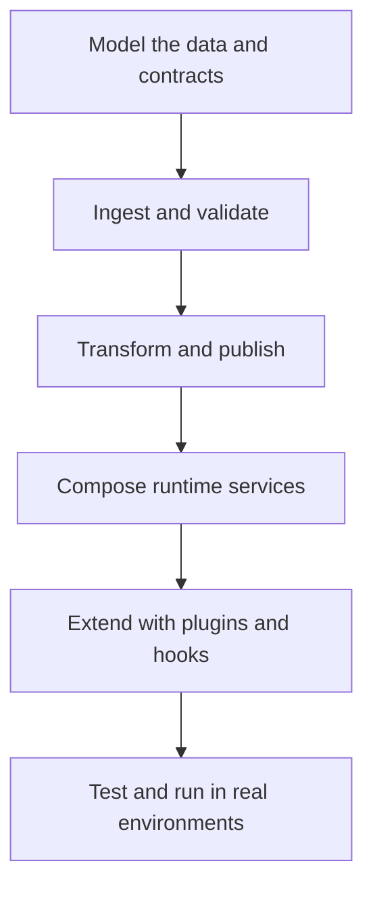

# Guides

Use these guides to build pipelines, compose services, choose components, and extend the platform.

## Developer Story

## Recommended Reading Order

1. [Developer Guide](developer-guide.md)
2. [Workflow Development](workflow-development.md)
3. [Lakehouse Helper Utilities](lakehouse-helpers.md)
4. [Data Modeling](data-modeling.md)
5. [Service Packages](service-packages.md)
6. [Integration Profiles](integration-profiles.md)
7. [Testing Strategy](testing-strategy.md)

## Guide Categories

- Workflow authoring: [Developer Guide](developer-guide.md), [Workflow Development](workflow-development.md), [Lakehouse Helper Utilities](lakehouse-helpers.md), [dbt Development](dbt-development.md)
- Platform composition: [Service Packages](service-packages.md), [Compose Generation](compose-generation.md), [Integration Profiles](integration-profiles.md)
- Extension points: [Plugin Development](plugin-development.md), [Capability Primitives](capability-primitives.md), [Hook Event Bus](hook-event-bus.md)
- Operations-aware design: [Testing Strategy](testing-strategy.md), [Logging](logging.md), [Operations Contracts](operations-contracts.md)
