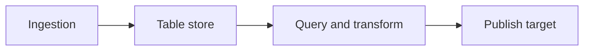
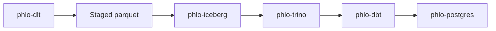
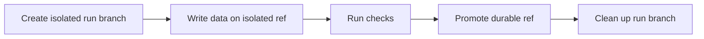
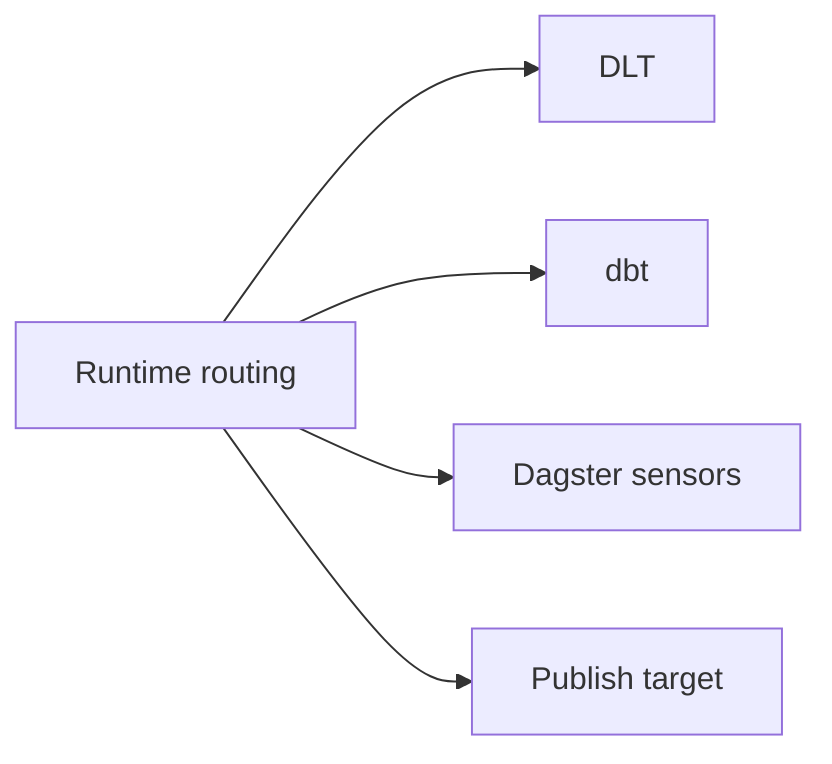

# Integration Profiles

Phlo is capability-driven. It does not require one fixed stack.

The core runtime contract is:

`ingestion -> table store -> query/transform -> publish`

Optional capabilities refine that contract:

- `versioned catalog`: refs, branch isolation, promotion
- `publish target`: downstream serving/export target
- `governance backend`: policy enforcement

This guide defines the supported profiles on this branch and what each one guarantees.

## Core rules

All supported profiles follow the same rules:

- runtime routing is canonical and shared across capabilities
- refs come from runtime routing, not package-specific flags
- transforms consume generated runtime config, not hand-wired package imports
- required capability setup fails closed
- optional capability absence degrades explicitly

## Profile: Bundled Stack

Default bundled stack:

- ingestion: `phlo-dlt`
- table store: `phlo-iceberg`
- versioned catalog: `phlo-nessie`
- query engine: `phlo-trino`
- transforms: `phlo-dbt`
- orchestrator: `phlo-dagster`
- publish target: `phlo-postgres`

Data plane:

`DLT -> staged parquet -> Iceberg -> Trino/dbt -> Postgres publish`

Control plane:

`Dagster + capability registry + runtime routing`

### Guarantees

- DLT consumes all staged parquet files, not just the first shard
- strict Pandera validation runs before visible table-store writes
- when a versioned catalog is available, strict writes can use isolated refs
- dbt target selection is derived from canonical runtime routing
- Dagster only enables WAP sensors when a versioned catalog capability is available
- Postgres is modeled as a publish target, not a parallel transform plane

### Versioned flow

When the active catalog supports refs and promotion, the normal Dagster WAP flow is:

1. create isolated run branch
2. write data on the isolated ref
3. run checks
4. promote back to durable ref on success
5. clean up the run branch

In the default stack, Nessie provides that versioned catalog capability.

### Alternative: Delta Table Store

The bundled stack can use `phlo-delta` instead of `phlo-iceberg` as the table-store capability:

- table store: `phlo-delta`

The rest of the stack remains the same. Delta does not support versioned catalog refs, so WAP sensors are not enabled in this configuration.

## Profile: Non-Versioned Local Profile

Local non-versioned profile:

- ingestion/test data: in-process or file-backed helpers
- table store/query engine: DuckDB
- transforms: dbt
- no versioned catalog
- no publish target required

This profile is for fast local verification of transform and workflow wiring without Docker.

### Guarantees

- dbt still uses generated runtime config
- runtime routing still resolves the active environment
- no branch/WAP semantics are assumed
- tests can run without the bundled service stack

## Runtime routing

Runtime routing is the shared contract that ties profiles together.

The main fields are:

- `environment`
- `ref`
- `partition_key`
- `run_id`
- `resources`
- `feature_flags`

Providers read from this routing surface instead of inventing package-local selectors.

Examples:

- DLT resolves the target ref from runtime routing
- dbt derives its target and ref-aware catalog from runtime routing
- Dagster WAP sensors tag runs with the isolated branch and promotion state

## Choosing a profile

Use the bundled stack when you need:

- Iceberg storage
- versioned branch/promotion workflows
- end-to-end publish to Postgres
- real service integration coverage

Use the non-versioned local profile when you need:

- fast local transform tests
- no Docker dependency
- no branch lifecycle semantics

## Contract tests

Supported profiles should have contract-level tests, not only unit tests.

Current coverage on this branch:

- bundled stack harness
- bundled stack ingest/transform contract
- bundled stack publish contract
- bundled stack versioned WAP contract
- non-versioned local profile harness/contract

See also:

- [Capability Primitives](capability-primitives.md)
- [Operations Testing](../operations/testing.md)
- [phlo-testing](../packages/phlo-testing.md)
