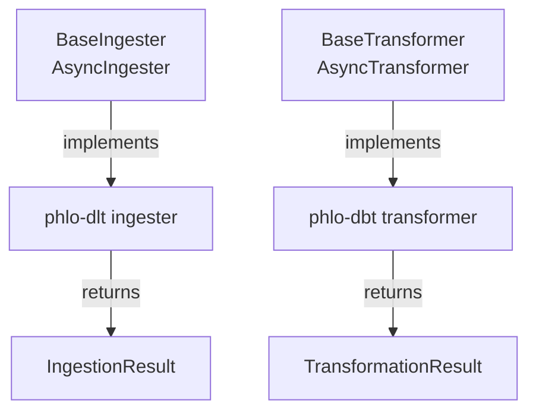

# Operations Contracts

Phlo defines abstract contracts for ingestion and transformation engines. Orchestrator
adapters consume these contracts, allowing different backends (DLT, Airbyte, dbt, custom)
to plug in without coupling to a specific orchestrator.

Both synchronous and asynchronous variants are available. Existing packages can stay on
sync contracts while new implementations opt into async contracts incrementally.

## Architecture



## BaseIngester

**Module:** `phlo.operations.ingestion`

Abstract base class for ingestion engines.

### Constructor

```python
class BaseIngester(ABC):
    def __init__(self, context: Any, logger: Any):
```

| Parameter | Type  | Description                              |
|-----------|-------|------------------------------------------|
| `context` | `Any` | Orchestrator-provided execution context  |
| `logger`  | `Any` | Logger for ingestion diagnostics         |

Both are stored as instance attributes (`self.context`, `self.logger`).

### run_ingestion

```python
@abstractmethod
def run_ingestion(
    self,
    partition_key: str | None,
    parameters: Dict[str, Any],
) -> IngestionResult:
```

Execute ingestion logic for a partition. `partition_key` is `None` for unpartitioned runs.
`parameters` carries backend-specific configuration (source credentials, table filters, etc.).

## IngestionResult

Dataclass returned by `run_ingestion`.

```python
@dataclass
class IngestionResult:
    status: str              # "success", "partial", "failed"
    rows_inserted: int       # rows written to destination
    rows_deleted: int        # rows removed (e.g. replace loads)
    metadata: Dict[str, Any] # arbitrary backend-specific details
```

## BaseTransformer

**Module:** `phlo.operations.transformation`

Generic ABC parameterized on context type.

### Constructor

```python
class BaseTransformer(Generic[ContextT], ABC):
    def __init__(self, context: ContextT, logger: Logger):
```

| Parameter | Type       | Description                          |
|-----------|------------|--------------------------------------|
| `context` | `ContextT` | Engine-specific execution context    |
| `logger`  | `Logger`   | Logger conforming to `Logger` protocol |

The `Logger` protocol requires `info()`, `warning()`, and `error()` methods.

### run_transform

```python
@abstractmethod
def run_transform(
    self,
    partition_key: str | None = None,
    parameters: dict[str, Any] | None = None,
) -> TransformationResult:
```

Run transformations for an optional partition. Both arguments default to `None` for
full, unparameterized runs.

## Async Contracts

**Modules:** `phlo.operations.ingestion`, `phlo.operations.transformation`

Async operation contracts mirror the sync interfaces:

```python
class AsyncIngester(ABC):
    @abstractmethod
    async def run_ingestion(
        self,
        partition_key: str | None,
        parameters: dict[str, Any],
    ) -> IngestionResult:
        ...

class AsyncTransformer(Generic[ContextT], ABC):
    @abstractmethod
    async def run_transform(
        self,
        partition_key: str | None = None,
        parameters: dict[str, Any] | None = None,
    ) -> TransformationResult:
        ...
```

Use these contracts for network-bound ingestion/transform operations where concurrent I/O
improves runtime.

## Compatibility Adapters

**Module:** `phlo.operations.adapters`

Phlo provides adapters for gradual migration between sync and async engines:

- `SyncToAsyncIngesterAdapter`
- `AsyncToSyncIngesterAdapter`
- `SyncToAsyncTransformerAdapter`
- `AsyncToSyncTransformerAdapter`

These adapters allow orchestrator code to adopt async execution paths without forcing
all existing engine implementations to migrate at once.

## TransformationResult

Dataclass returned by `run_transform`.

```python
@dataclass
class TransformationResult:
    status: str                            # "success", "partial", "failed"
    models_built: int                      # models successfully materialized
    models_failed: int                     # models that errored
    tests_passed: int                      # passing test assertions
    tests_failed: int                      # failing test assertions
    metadata: dict[str, Any] = field(...)  # backend-specific details
    error: str | None = None               # error message on failure
```

## Example: custom ingester

```python
from phlo.operations.ingestion import BaseIngester, IngestionResult

class CsvIngester(BaseIngester):
    def run_ingestion(self, partition_key, parameters):
        path = parameters["path"]
        self.logger.info("Loading CSV from %s", path)
        # ... read CSV and write to destination ...
        return IngestionResult(
            status="success",
            rows_inserted=1000,
            rows_deleted=0,
            metadata={"source": path},
        )
```

## Package implementations

### phlo-dlt

The `phlo-dlt` package provides a DLT-based ingester that wraps DLT pipelines behind
`BaseIngester`. The `phlo.ingest.dlt(...)` decorator constructs a `BaseIngester` subclass
and wires it to the orchestrator via capability specs.

### phlo-dbt

The `phlo-dbt` package provides a dbt-based transformer that subclasses
`BaseTransformer`. It invokes `dbt run` and `dbt test`, then maps CLI output into
a `TransformationResult` with model/test counts and error details.

## See also

- [Capability Primitives](capability-primitives.md) — orchestrator-agnostic specs
- [Orchestrator Adapters](orchestrator-adapters.md) — how adapters consume these contracts
- [Plugin Development](plugin-development.md) — writing packages that implement contracts
