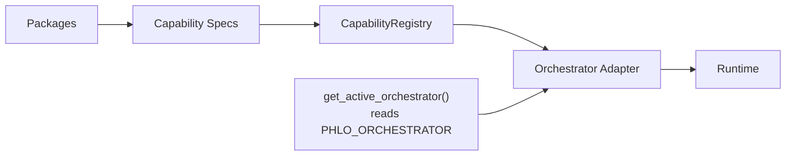

# Orchestrator Adapters

Phlo is orchestrator-agnostic. Packages publish capability specs — `AssetSpec`,
`AssetCheckSpec`, `ResourceSpec` — and an orchestrator adapter translates those into
runtime definitions. This guide covers selection, the adapter interface, capability specs,
runtime context, the registry, and discovery.

## Design overview



Packages never import orchestrator libraries. They declare specs; the active adapter
consumes them.

## Selecting the active orchestrator

**Module:** `phlo.orchestrators.selection`

```python
def get_active_orchestrator(name: str | None = None) -> OrchestratorAdapterPlugin:
```

Resolution order:

1. Explicit `name` argument (if provided).
2. `PHLO_ORCHESTRATOR` setting (alias `PHLO_ORCHESTRATOR_NAME`).
3. Default: `"dagster"`.

The function discovers orchestrator plugins via entry points, looks up the adapter by
name in the global plugin registry, and raises `PhloConfigError` if not found.

## OrchestratorAdapterPlugin interface

**Module:** `phlo.plugins.base.orchestrator`

```python
class OrchestratorAdapterPlugin(Plugin, ABC):
    @abstractmethod
    def build_definitions(
        self,
        *,
        assets: Iterable[AssetSpec],
        checks: Iterable[AssetCheckSpec],
        resources: Iterable[ResourceSpec],
    ) -> Any:
        """Build orchestrator-native definitions from capability specs."""
```

An adapter receives the full set of registered specs and returns whatever the orchestrator
runtime expects (e.g., a Dagster `Definitions` object).

## Capability specs

**Module:** `phlo.capabilities.specs`

All specs are frozen, slotted dataclasses.

### AssetSpec

| Field        | Type                    | Description                            |
|--------------|-------------------------|----------------------------------------|
| `key`        | `str`                   | Unique asset identifier                |
| `group`      | `str \| None`           | Logical grouping                       |
| `description`| `str \| None`           | Human-readable description             |
| `kinds`      | `set[str]`              | Asset kinds (e.g. `&#123;"dlt", "iceberg"&#125;`) |
| `tags`       | `dict[str, str]`        | Arbitrary tags                         |
| `metadata`   | `dict[str, Any]`        | Arbitrary metadata                     |
| `partitions` | `PartitionSpec \| None` | Partitioning config                    |
| `deps`       | `list[str]`             | Upstream asset keys                    |
| `resources`  | `set[str]`              | Required resource names                |
| `run`        | `RunSpec \| None`       | Execution function and schedule        |
| `checks`     | `list[AssetCheckSpec]`  | Inline check specs                     |

### PartitionSpec

| Field        | Type            | Description                  |
|--------------|-----------------|------------------------------|
| `kind`       | `str`           | Partition kind (e.g. `daily`) |
| `start_date` | `date \| None`  | Partition start date         |
| `timezone`   | `str \| None`   | Partition timezone           |

### RunSpec

| Field                  | Type                                              | Description                    |
|------------------------|----------------------------------------------------|--------------------------------|
| `fn`                   | `Callable[[RuntimeContext], Iterable[RunResult]]` | Execution function             |
| `max_runtime_seconds`  | `int \| None`                                     | Timeout                        |
| `max_retries`          | `int \| None`                                     | Retry count                    |
| `retry_delay_seconds`  | `int \| None`                                     | Delay between retries          |
| `cron`                 | `str \| None`                                     | Schedule expression            |
| `freshness_hours`      | `tuple[int, int] \| None`                         | (warn, error) freshness bounds |

### AssetCheckSpec

| Field         | Type                                              | Description              |
|---------------|----------------------------------------------------|--------------------------|
| `name`        | `str`                                              | Check name               |
| `asset_key`   | `str`                                              | Asset this check targets |
| `fn`          | `Callable[[RuntimeContext], CheckResult] \| None` | Check function           |
| `blocking`    | `bool`                                             | Blocks downstream assets |
| `description` | `str \| None`                                      | Human-readable text      |
| `severity`    | `str \| None`                                      | Severity level           |
| `tags`        | `dict[str, str]`                                   | Arbitrary tags           |

### ResourceSpec

| Field      | Type  | Description          |
|------------|-------|----------------------|
| `name`     | `str` | Resource identifier  |
| `resource` | `Any` | Resource object      |

### MaterializeResult

| Field      | Type              | Description           |
|------------|-------------------|-----------------------|
| `metadata` | `dict[str, Any]`  | Result metadata       |
| `status`   | `str \| None`     | Materialization status|

### CheckResult

| Field        | Type             | Description          |
|--------------|------------------|----------------------|
| `check_name` | `str`            | Check name           |
| `asset_key`  | `str`            | Checked asset key    |
| `passed`     | `bool`           | Whether check passed |
| `severity`   | `str \| None`    | Severity level       |
| `metadata`   | `dict[str, Any]` | Result metadata      |

`RunResult` is the union `MaterializeResult | CheckResult`.

## RuntimeContext protocol

**Module:** `phlo.capabilities.runtime`

```python
class RuntimeContext(Protocol):
    run_id: str | None
    partition_key: str | None
    tags: dict[str, str]

    @property
    def logger(self) -> Any: ...

    @property
    def resources(self) -> dict[str, Any]: ...

    def get_resource(self, name: str) -> Any: ...
```

Orchestrator adapters provide an implementation of this protocol. The `RunSpec.fn` callback
receives it at execution time, giving asset code access to the run ID, partition, tags,
logger, and resources without importing orchestrator-specific APIs.

## CapabilityRegistry

**Module:** `phlo.capabilities.registry`

Thread-safe in-memory store for capability specs. All mutations are guarded by a lock.

| Method              | Description                                   |
|---------------------|-----------------------------------------------|
| `register_asset`    | Store/replace an `AssetSpec` by key            |
| `register_check`    | Store/replace an `AssetCheckSpec` by (asset, name) |
| `register_resource` | Store/replace a `ResourceSpec` by name         |
| `list_assets`       | Snapshot list of all registered assets         |
| `list_checks`       | Snapshot list of all registered checks         |
| `list_resources`    | Snapshot list of all registered resources      |
| `clear`             | Remove all entries                             |
| `clear_checks`      | Remove only checks                             |

Module-level helpers (`register_asset`, `register_check`, `register_resource`,
`clear_capabilities`) operate on the process-global registry returned by
`get_capability_registry()`.

## Discovery flow

**Module:** `phlo.capabilities.discovery`

```python
def discover_capabilities() -> None:
```

1. Calls `discover_plugins(plugin_type="asset_providers")` and
   `discover_plugins(plugin_type="resource_providers")` to find providers via entry points.
2. Iterates discovered asset providers, calling `get_assets()` and `get_checks()`.
3. Iterates discovered resource providers, calling `get_resources()`.
4. Registers all returned specs in the global `CapabilityRegistry`.
5. Logs warnings for any provider that fails to load.

## Writing a custom adapter

1. Subclass `OrchestratorAdapterPlugin`.
2. Implement `build_definitions` — translate specs into your orchestrator's native API.
3. Register via entry point group `phlo.plugins.orchestrators`.

```python
from phlo.plugins.base import OrchestratorAdapterPlugin
from phlo.capabilities.specs import AssetSpec, AssetCheckSpec, ResourceSpec

class AirflowAdapter(OrchestratorAdapterPlugin):
    name = "airflow"

    def build_definitions(self, *, assets, checks, resources):
        # Convert specs into Airflow DAGs / tasks
        dags = []
        for asset in assets:
            dag = self._build_dag(asset)
            dags.append(dag)
        return dags
```

Set the orchestrator in `.phlo/.env`:

```env
PHLO_ORCHESTRATOR=airflow
```

## See also

- [Capability Primitives](capability-primitives.md) — detailed spec walkthrough
- [Operations Contracts](operations-contracts.md) — ingestion/transformation ABCs
- [Plugin Development](plugin-development.md) — entry point registration
