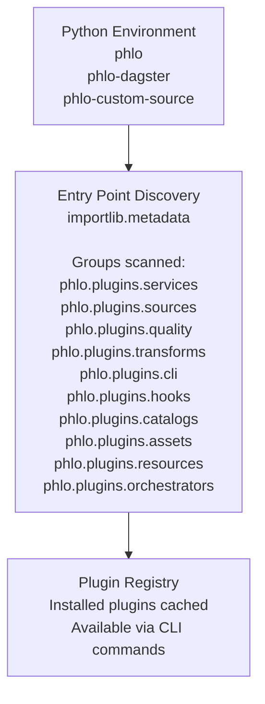

# Plugin Development Guide

Complete guide to developing custom Phlo plugins.

## Overview

Phlo's plugin system allows you to extend the platform with custom functionality:

- **Service Plugins**: Add infrastructure services (databases, query engines, etc.)
- **Source Connectors**: Fetch data from external systems
- **Quality Checks**: Implement custom validation rules
- **Transformations**: Create reusable data transformation logic
- **Dagster Extensions**: Add custom resources, sensors, or schedules
- **CLI Extensions**: Add custom CLI commands
- **Hook Plugins**: Subscribe to pipeline events without direct dependencies
- **Asset Providers**: Publish orchestrator-agnostic asset specs
- **Resource Providers**: Publish orchestrator-agnostic resource specs
- **Orchestrator Adapters**: Translate capability specs into orchestrator definitions

This guide walks through creating each type of plugin.

For the orchestrator-agnostic spec model, read
[Capability Primitives](capability-primitives.md) first.

## Plugin System Basics

### How Plugin Discovery Works

Phlo uses Python entry points to automatically discover plugins:



Benefits:
- No manual registration required
- Install a package, restart Phlo, plugin is available
- Plugins can be distributed independently
- Failed plugins don't crash the system

### Declare Capability Requirements

Plugins can declare runtime capability requirements in `PluginMetadata`:

```python
PluginMetadata(
    name="my-plugin",
    version="0.1.0",
    requires_capabilities=["query_engine:trino", "table_store"],
    optional_capabilities=["metadata_catalog"],
)
```

Guidelines:
- Use `capability_type:name` for strict provider requirements.
- Use `capability_type` when any provider of that type is acceptable.
- Keep only true hard requirements in `requires_capabilities`.
- Put integrations and enhancements in `optional_capabilities`.

When your asset should bind to a specific provider for a generic capability type, set
`AssetSpec.capability_overrides`, for example `&#123;"table_store": "iceberg"&#125;`. Runtime/workflow tags
can also override capability selection with `phlo/capability/&lt;capability_type>=&lt;provider>`, and
project-wide defaults belong in `phlo.yaml` under `capabilities.defaults`.

### Quick Start: Create a Plugin Scaffold

```bash
# Create source connector plugin
phlo plugin create my-api-source --type source

# Create quality check plugin
phlo plugin create my-validation --type quality

# Create transformation plugin
phlo plugin create my-transform --type transform

# Create service plugin
phlo plugin create my-database --type service

# Create hook plugin
phlo plugin create my-hooks --type hook
```

This creates a complete package structure ready for development.

## Developing a Hook Plugin

Hook plugins subscribe to the Hook Bus and react to pipeline events without importing other
capability packages directly.

### Hook Bus Events

- `service.pre_start` / `service.post_start` / `service.pre_stop` / `service.post_stop`
- `ingestion.start` / `ingestion.end`
- `transform.start` / `transform.end`
- `publish.start` / `publish.end`
- `quality.result`
- `lineage.edges`
- `telemetry.metric` / `telemetry.log`

### Example Hook Plugin

```python
from phlo.hooks import QualityResultEvent
from phlo.plugins import HookFilter, HookPlugin, PluginMetadata
from phlo.plugins.hooks import HookRegistration


class MyHookPlugin(HookPlugin):
    @property
    def metadata(self) -> PluginMetadata:
        return PluginMetadata(
            name="my-hooks",
            version="0.1.0",
            description="Custom hook handlers",
        )

    def get_hooks(self):
        return [
            HookRegistration(
                hook_name="quality_alerts",
                handler=self.handle_quality,
                filters=HookFilter(event_types={"quality.result"}),
            )
        ]

    def handle_quality(self, event: QualityResultEvent) -> None:
        if not event.passed:
            # Handle failures here
            pass
```

### Notes

- Hooks execute synchronously in-process; keep handlers fast and offload heavy work.
- Use `HookFilter` to scope by event types, asset keys, and tags.
- Use `failure_policy` on `HookRegistration` to control error behavior.

## Semantic Layer Providers

Semantic layer providers expose standardized models for downstream tooling.

```python
from phlo.plugins import SemanticLayerProvider, SemanticModel


class MySemanticLayer(SemanticLayerProvider):
    def list_models(self):
        return [
            SemanticModel(
                name="revenue_daily",
                description="Daily revenue rollup",
                sql="SELECT ...",
            )
        ]

    def get_model(self, name: str) -> SemanticModel | None:
        return next((m for m in self.list_models() if m.name == name), None)
```

Recommended: subscribe to `publish.end` events to refresh semantic models when marts update.

## Asset Provider Plugins

Asset providers publish orchestrator-agnostic asset specs that adapters translate into runtime
definitions.

```python
from phlo.capabilities import AssetSpec, PartitionSpec, RunSpec
from phlo.plugins import AssetProviderPlugin, PluginMetadata


class MyAssetProvider(AssetProviderPlugin):
    @property
    def metadata(self) -> PluginMetadata:
        return PluginMetadata(
            name="my-assets",
            version="0.1.0",
            description="Asset specs for my domain",
        )

    def get_assets(self):
        return [
            AssetSpec(
                key="my_asset",
                group="demo",
                description="Demo asset",
                partitions=PartitionSpec(kind="daily"),
                run=RunSpec(fn=self.run_asset),
            )
        ]

    def run_asset(self, context):
        return []
```

Register in `pyproject.toml`:

```toml
[project.entry-points."phlo.plugins.assets"]
my_assets = "my_pkg.plugin:MyAssetProvider"
```

## Orchestrator Adapter Plugins

Adapters translate capability specs into orchestrator-native definitions.

```python
from phlo.plugins import OrchestratorAdapterPlugin, PluginMetadata


class MyOrchestrator(OrchestratorAdapterPlugin):
    @property
    def metadata(self) -> PluginMetadata:
        return PluginMetadata(
            name="my-orchestrator",
            version="0.1.0",
            description="Adapter for My Orchestrator",
        )

    def build_definitions(self, *, assets, checks, resources):
        return MyDefinitions(...)
```

Register in `pyproject.toml`:

```toml
[project.entry-points."phlo.plugins.orchestrators"]
my_orchestrator = "my_pkg.adapter:MyOrchestrator"
```

## Developing a Source Connector Plugin

Source connector plugins fetch data from external systems.

### Base Class

All source connectors inherit from `SourceConnectorPlugin`:

```python
from phlo.plugins.base import SourceConnectorPlugin, PluginMetadata
from typing import Any, Iterator

class MyAPISource(SourceConnectorPlugin):
    """Custom API data source."""

    @property
    def metadata(self) -> PluginMetadata:
        """Return plugin metadata for discovery."""
        return PluginMetadata(
            name="my_api",
            version="1.0.0",
            description="Fetch data from My API",
            author="Your Name",
            homepage="https://github.com/yourorg/phlo-plugin-my-api",
            tags=["api", "custom"],
            license="MIT",
        )

    def fetch_data(self, config: dict[str, Any]) -> Iterator[dict[str, Any]]:
        """
        Fetch data from the source.

        Args:
            config: Configuration dictionary with source-specific settings

        Yields:
            Records as dictionaries
        """
        # Implementation here
        pass

    def get_schema(self, config: dict[str, Any]) -> dict[str, str] | None:
        """
        Get expected schema for the data.

        Returns:
            Dictionary mapping column names to types, or None if schema is dynamic
        """
        return {
            "id": "int",
            "name": "string",
            "created_at": "timestamp",
        }

    def test_connection(self, config: dict[str, Any]) -> bool:
        """Test if connection to source is successful."""
        try:
            # Test connection logic
            return True
        except Exception:
            return False

    def validate_config(self, config: dict[str, Any]) -> bool:
        """Validate configuration dictionary."""
        required_keys = ["api_key", "base_url"]
        return all(k in config for k in required_keys)
```

### Complete Example: REST API Source

```python
"""REST API source connector plugin."""


from typing import Any, Iterator
from phlo.plugins.base import SourceConnectorPlugin, PluginMetadata


class RESTAPISource(SourceConnectorPlugin):
    """
    Generic REST API source connector.

    Supports pagination, authentication, and custom headers.
    """

    @property
    def metadata(self) -> PluginMetadata:
        return PluginMetadata(
            name="rest_api_advanced",
            version="1.0.0",
            description="Advanced REST API connector with pagination support",
            author="Data Team",
            tags=["api", "rest", "http"],
            license="MIT",
        )

    def fetch_data(self, config: dict[str, Any]) -> Iterator[dict[str, Any]]:
        """
        Fetch data from REST API with pagination.

        Config keys:
            - base_url: API base URL
            - endpoint: API endpoint path
            - headers: Optional headers dict
            - auth_token: Optional bearer token
            - pagination: Optional pagination config
        """
        if not self.validate_config(config):
            raise ValueError("Invalid configuration")

        base_url = config["base_url"].rstrip("/")
        endpoint = config["endpoint"].lstrip("/")
        url = f"{base_url}/{endpoint}"

        # Prepare headers
        headers = config.get("headers", {})
        if auth_token := config.get("auth_token"):
            headers["Authorization"] = f"Bearer {auth_token}"

        # Handle pagination
        pagination = config.get("pagination", {})
        page = pagination.get("start_page", 1)
        page_size = pagination.get("page_size", 100)
        max_pages = pagination.get("max_pages", 0)  # 0 = unlimited

        pages_fetched = 0
        while True:
            # Build request params
            params = {
                pagination.get("page_param", "page"): page,
                pagination.get("size_param", "limit"): page_size,
            }

            # Add custom params
            params.update(config.get("params", {}))

            try:
                response = requests.get(url, headers=headers, params=params, timeout=30)
                response.raise_for_status()

                data = response.json()

                # Handle different response structures
                results_key = pagination.get("results_key", "results")
                items = data.get(results_key, data if isinstance(data, list) else [])

                if not items:
                    break  # No more data

                for item in items:
                    yield item

                pages_fetched += 1

                # Check if we should continue
                if max_pages > 0 and pages_fetched >= max_pages:
                    break

                # Check if there are more pages
                has_next = data.get(pagination.get("has_next_key", "has_next"), False)
                if not has_next and results_key in data:
                    break

                page += 1

            except requests.RequestException as e:
                raise RuntimeError(f"Failed to fetch from {url}: {e}")

    def get_schema(self, config: dict[str, Any]) -> dict[str, str] | None:
        """Schema is dynamic based on API response."""
        return None

    def test_connection(self, config: dict[str, Any]) -> bool:
        """Test API connectivity."""
        try:
            base_url = config["base_url"].rstrip("/")
            endpoint = config["endpoint"].lstrip("/")
            url = f"{base_url}/{endpoint}"

            headers = config.get("headers", {})
            if auth_token := config.get("auth_token"):
                headers["Authorization"] = f"Bearer {auth_token}"

            response = requests.get(url, headers=headers, timeout=10)
            return response.status_code == 200
        except Exception:
            return False

    def validate_config(self, config: dict[str, Any]) -> bool:
        """Validate required configuration."""
        return "base_url" in config and "endpoint" in config
```

### Register the Plugin

In `pyproject.toml`:

```toml
[project.entry-points."phlo.plugins.sources"]
rest_api_advanced = "phlo_rest_api.plugin:RESTAPISource"
```

### Use the Plugin

```python
from phlo.plugins import get_source_connector

# Get the plugin
source = get_source_connector("rest_api_advanced")

# Configure and fetch data
config = {
    "base_url": "https://api.example.com",
    "endpoint": "/v1/users",
    "auth_token": "your-token-here",
    "pagination": {
        "page_param": "page",
        "size_param": "per_page",
        "page_size": 100,
        "results_key": "data",
    },
}

for record in source.fetch_data(config):
    print(record)
```

## Developing a Quality Check Plugin

Quality check plugins implement custom validation logic.

### Base Class

```python
from phlo.plugins.base import QualityCheckPlugin, PluginMetadata
from typing import Any


class MyQualityCheck(QualityCheckPlugin):
    """Custom quality check plugin."""

    @property
    def metadata(self) -> PluginMetadata:
        return PluginMetadata(
            name="my_check",
            version="1.0.0",
            description="Custom quality validation",
            author="Your Name",
        )

    def create_check(self, **kwargs) -> "CheckInstance":
        """
        Create a check instance with specific parameters.

        Returns:
            Check instance that can execute validation
        """
        return CheckInstance(**kwargs)


class CheckInstance:
    """Instance of the quality check with specific parameters."""

    def __init__(self, **kwargs):
        # Store check parameters
        self.params = kwargs

    def execute(self, df: pd.DataFrame, context: Any = None) -> dict:
        """
        Execute the quality check.

        Returns:
            Dictionary with check results:
            {
                "passed": bool,
                "violations": int,
                "total": int,
                "violation_rate": float,
                "details": Any,  # Optional additional info
            }
        """
        # Implement validation logic
        pass

    @property
    def name(self) -> str:
        """Return descriptive check name."""
        return "my_check"
```

### Complete Example: Business Rule Check

```python
"""Business rule validation plugin."""


from typing import Any, Callable
from phlo.plugins.base import QualityCheckPlugin, PluginMetadata


class BusinessRuleCheckPlugin(QualityCheckPlugin):
    """
    Quality check for custom business rules.

    Allows arbitrary Python functions as validation rules.
    """

    @property
    def metadata(self) -> PluginMetadata:
        return PluginMetadata(
            name="business_rule",
            version="1.0.0",
            description="Validate custom business rules",
            author="Data Team",
            tags=["validation", "business-logic"],
        )

    def create_check(self, **kwargs) -> "BusinessRuleCheck":
        return BusinessRuleCheck(**kwargs)


class BusinessRuleCheck:
    """Business rule validation check."""

    def __init__(
        self,
        rule: Callable[[pd.Series], pd.Series],
        columns: list[str],
        name: str,
        description: str = "",
        tolerance: float = 0.0,
    ):
        """
        Initialize business rule check.

        Args:
            rule: Function that takes row data and returns True if valid
            columns: Columns required by the rule
            name: Name of the rule
            description: Human-readable description
            tolerance: Fraction of rows allowed to fail (0.0-1.0)
        """
        self.rule = rule
        self.columns = columns
        self.rule_name = name
        self.description = description
        self.tolerance = max(0.0, min(1.0, tolerance))

    def execute(self, df: pd.DataFrame, context: Any = None) -> dict:
        """Execute the business rule validation."""
        # Validate required columns exist
        missing_columns = set(self.columns) - set(df.columns)
        if missing_columns:
            return {
                "passed": False,
                "violations": len(df),
                "total": len(df),
                "violation_rate": 1.0,
                "error": f"Missing columns: {missing_columns}",
            }

        # Apply rule to each row
        try:
            valid_mask = df[self.columns].apply(self.rule, axis=1)
            violations = (~valid_mask).sum()
            total = len(df)
            violation_rate = violations / total if total > 0 else 0.0

            passed = violation_rate <= self.tolerance

            return {
                "passed": passed,
                "violations": int(violations),
                "total": total,
                "violation_rate": violation_rate,
                "details": {
                    "rule": self.rule_name,
                    "description": self.description,
                    "failed_rows": df[~valid_mask].index.tolist()[:100],  # First 100
                },
            }
        except Exception as e:
            return {
                "passed": False,
                "violations": len(df),
                "total": len(df),
                "violation_rate": 1.0,
                "error": f"Rule execution failed: {e}",
            }

    @property
    def name(self) -> str:
        return f"business_rule({self.rule_name})"
```

### Use the Plugin

```python
from phlo.plugins import get_quality_check


# Get the plugin
plugin = get_quality_check("business_rule")

# Define a business rule
def revenue_exceeds_cost(row):
    """Revenue must be greater than cost."""
    return row["revenue"] > row["cost"]

# Create check
check = plugin.create_check(
    rule=revenue_exceeds_cost,
    columns=["revenue", "cost"],
    name="revenue_exceeds_cost",
    description="Revenue must exceed cost",
    tolerance=0.05,  # Allow 5% violations
)

# Execute
df = pd.DataFrame({
    "revenue": [100, 200, 50],
    "cost": [80, 150, 60],
})

result = check.execute(df)
print(f"Passed: {result['passed']}")
print(f"Violations: {result['violations']}/{result['total']}")
```

## Developing a Service Plugin

Service plugins package infrastructure services (databases, query engines, etc.) as installable Python packages.

### Structure

```
phlo-mydb/
├── pyproject.toml
├── src/
│   └── phlo_mydb/
│       ├── __init__.py
│       ├── plugin.py
│       └── service.yaml       # Docker Compose service definition
└── tests/
    └── test_plugin.py
```

### Service Plugin Class

```python
"""MyDB service plugin."""

from phlo.plugins.base import ServicePlugin, PluginMetadata


class MyDBServicePlugin(ServicePlugin):
    """Service plugin for MyDB."""

    @property
    def metadata(self) -> PluginMetadata:
        return PluginMetadata(
            name="mydb",
            version="1.0.0",
            description="MyDB distributed database",
            author="Data Team",
            tags=["database", "distributed"],
        )

    def get_service_definition(self) -> dict:
        """Load service.yaml definition."""
        import yaml

        # Load bundled service.yaml
        yaml_content = importlib.resources.read_text(
            "phlo_mydb", "service.yaml"
        )
        return yaml.safe_load(yaml_content)
```

### service.yaml

```yaml
name: mydb
description: MyDB distributed database
container_name: phlo-mydb
image: mydb/mydb:latest
ports:
  - "9000:9000"
environment:
  MYDB_ROOT_PASSWORD: ${MYDB_ROOT_PASSWORD:-mydb}
  MYDB_LOG_LEVEL: ${MYDB_LOG_LEVEL:-INFO}
volumes:
  - mydb-data:/var/lib/mydb
depends_on:
  - postgres
healthcheck:
  test: ["CMD", "mydb-health-check"]
  interval: 10s
  timeout: 5s
  retries: 5
profiles:
  - core
```

### Register the Plugin

```toml
[project.entry-points."phlo.plugins.services"]
mydb = "phlo_mydb.plugin:MyDBServicePlugin"
```

### Usage

Once installed, the service is automatically available:

```bash
# Install the plugin
pip install phlo-mydb

# List services (mydb will appear)
phlo services list

# Start services (includes mydb)
phlo services start
```

## Best Practices

### 1. Comprehensive Metadata

```python
@property
def metadata(self) -> PluginMetadata:
    return PluginMetadata(
        name="my_plugin",
        version="2.1.0",
        description="Detailed description of what this plugin does",
        author="Data Platform Team",
        homepage="https://github.com/yourorg/phlo-plugin-my-plugin",
        documentation_url="https://docs.yourorg.com/plugins/my-plugin",
        tags=["api", "external", "production"],
        license="MIT",
    )
```

### 2. Robust Error Handling

```python
def fetch_data(self, config: dict) -> Iterator[dict]:
    try:
        response = self.client.get(url)
        response.raise_for_status()
        yield from response.json()
    except httpx.HTTPStatusError as e:
        raise PluginError(
            f"API returned {e.response.status_code}: {e.response.text}"
        )
    except httpx.RequestError as e:
        raise PluginError(f"Network error: {e}")
    except Exception as e:
        raise PluginError(f"Unexpected error: {e}")
```

### 3. Configuration Validation

```python
def validate_config(self, config: dict[str, Any]) -> bool:
    """Validate configuration with clear error messages."""
    required_keys = ["api_key", "base_url", "endpoint"]

    for key in required_keys:
        if key not in config:
            raise ValueError(f"Missing required config key: {key}")

    if not isinstance(config["api_key"], str):
        raise TypeError("api_key must be a string")

    if not config["base_url"].startswith("https://"):
        raise ValueError("base_url must use HTTPS")

    return True
```

### 4. Comprehensive Testing

```python
"""Test suite for source connector."""


from phlo_my_api.plugin import MyAPISource


def test_metadata():
    """Test plugin metadata is correct."""
    source = MyAPISource()
    assert source.metadata.name == "my_api"
    assert source.metadata.version == "1.0.0"


def test_fetch_data_returns_records():
    """Test data fetching."""
    source = MyAPISource()
    config = {
        "base_url": "https://api.example.com",
        "api_key": "test-key",
    }

    records = list(source.fetch_data(config))

    assert len(records) > 0
    assert all("id" in r for r in records)


def test_connection_check():
    """Test connection validation."""
    source = MyAPISource()
    assert source.test_connection({"api_key": "valid"}) is True
    assert source.test_connection({}) is False


def test_invalid_config_raises():
    """Test invalid config is rejected."""
    source = MyAPISource()
    with pytest.raises(ValueError):
        source.validate_config({})
```

### 5. Semantic Versioning

```toml
[project]
version = "2.0.0"  # Breaking change: changed config schema
version = "1.1.0"  # Feature: added new resource type
version = "1.0.1"  # Fix: handled edge case
```

### 6. Documentation

Include comprehensive README.md:

```markdown
# phlo-plugin-my-api

Custom API source connector for Phlo.

## Installation

```bash
pip install phlo-plugin-my-api
```

## Usage

```python
from phlo.plugins import get_source_connector

source = get_source_connector("my_api")
config = &#123;
    "base_url": "https://api.example.com",
    "api_key": "your-key",
&#125;

for record in source.fetch_data(config):
    print(record)
```

## Configuration

- `base_url` (required): API base URL
- `api_key` (required): API authentication key
- `timeout` (optional): Request timeout in seconds (default: 30)

## License

MIT
```

## Publishing Plugins

### To PyPI

```bash
# Build distribution
python -m build

# Upload to PyPI
twine upload dist/*
```

### To Internal Registry

```bash
# Configure internal PyPI server
pip config set global.index-url https://pypi.yourcompany.com/simple

# Publish
twine upload --repository-url https://pypi.yourcompany.com dist/*
```

## Plugin Security

### For Plugin Users

- Only install plugins from trusted sources
- Review plugin source code before installation
- Use `plugins_whitelist` to restrict allowed plugins

### For Plugin Developers

- Never include secrets in code
- Validate all user inputs
- Use parameterized queries (avoid SQL injection)
- Follow security best practices

## Next Steps

- Review [Data Engineering Fundamentals Part 12](../blog/data-engineering-fundamentals/12-extending-phlo-with-plugins-and-observatory.md) for examples
- Check the [Plugin API](../reference/plugin-api.md)
- Explore existing plugins in `packages/phlo-core-plugins/`
- Join the community to share your plugins

## Support

- GitHub Issues: https://github.com/iamgp/phlo/issues
- Documentation: https://docs.phlo.io
- Community Discord: https://discord.gg/phlo
