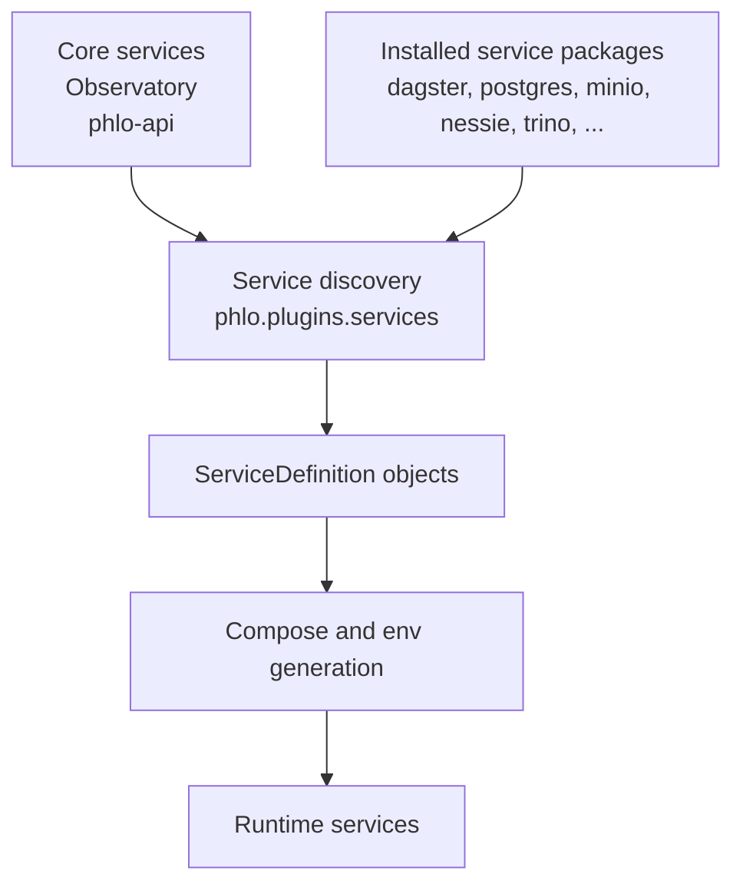

# Service Packages

Phlo services are distributed as Python packages. Each service package ships its own `service.yaml`
definition and registers a `phlo.plugins.services` entry point for CLI discovery.

## Architecture

Phlo services are organized into **core** and **package** services:



### Core Services

Core services are bundled with `pip install phlo` and cannot be removed:

- **Observatory** - Data platform UI for visibility and lineage
- **phlo-api** - Backend API exposing phlo internals to Observatory

### Package Services

Package services are installed separately and can be swapped for alternatives:

```bash
# Install default services (recommended)
pip install phlo[defaults]

# Or install individually
pip install phlo-dagster phlo-postgres phlo-trino
```

Default package services:

- `phlo-dagster` - Data orchestration platform
- `phlo-postgres` - PostgreSQL for Dagster metadata
- `phlo-minio` - S3-compatible object storage
- `phlo-nessie` - Git-like catalog for Iceberg
- `phlo-trino` - Distributed SQL query engine

Optional packages:

- `phlo-superset` - Business intelligence
- `phlo-pgweb` - PostgreSQL web admin
- `phlo-postgrest` - Auto-generated REST API
- `phlo-hasura` - GraphQL API
- `phlo-clickstack` - All-in-one observability backend [observability]
- `phlo-prometheus` - Metrics [observability]
- `phlo-grafana` - Dashboards [observability]
- `phlo-loki` - Log aggregation [observability]
- `phlo-alloy` - Log shipping [observability]

## Customizing Services

Override service settings in your `phlo.yaml`:

```yaml
name: my-lakehouse

services:
  # Override a package service
  observatory:
    ports:
      - "8080:3000"
    environment:
      DEBUG: "true"

  # Disable a default service
  superset:
    enabled: false

  # Add a custom inline service
  custom-api:
    type: inline
    image: my-registry/api:latest
    ports:
      - "4000:4000"
    depends_on:
      - trino
```

### Override Behavior

| Setting          | Behavior                      |
| ---------------- | ----------------------------- |
| `ports`          | Replaces package defaults     |
| `environment`    | Merges (user values override) |
| `volumes`        | Appends to package defaults   |
| `depends_on`     | Replaces package defaults     |
| `command`        | Replaces package defaults     |
| `enabled: false` | Excludes service entirely     |

## Discovering Services

```bash
# List installed services with runtime status
phlo services list

# Show all including optional profiles
phlo services list --all

# JSON output with status details
phlo services list --json
```

Example output:

```
Package Services (installed):
  ✓ dagster            Running    :3000   Data orchestration platform for workflows and pipelines
  ✓ postgres           Running    :5432   PostgreSQL database for metadata and operational storage
  ✓ trino              Running    :8080   Distributed SQL query engine for the data lake
  ✓ minio              Running    :9001   S3-compatible object storage for data lake
  ✓ nessie             Running    :19120  Git-like catalog for Iceberg tables
  ✗ superset           Disabled           Business intelligence platform (disabled in phlo.yaml)

Custom Services (phlo.yaml):
  ✓ custom-api         Running    :4000   Custom API backend (inline)
```

The enhanced output shows:

- **Status marker**: ✓ (running/enabled), ✗ (disabled), or blank (stopped)
- **Running state**: Running, Stopped, or Disabled
- **Exposed ports**: First exposed external port (e.g., :3000)
- **Service description**: From package or phlo.yaml
- **Configuration notes**: (disabled in phlo.yaml), (inline), etc.

## Development Mode

Mount local package sources into containers for live development:

```bash
phlo services init --dev --phlo-source /path/to/phlo
phlo services start
```

Dev mode uses the `dev` section in each service's `service.yaml` to override commands, volumes, and environment.
