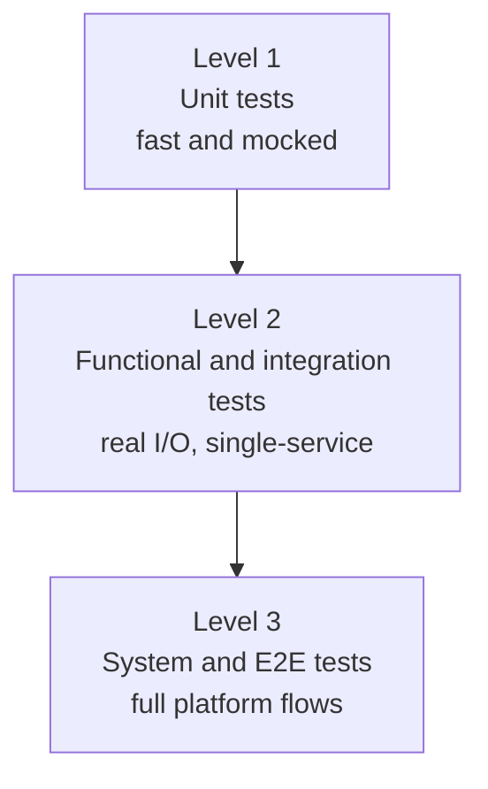
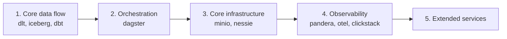

# Phlo Comprehensive Test Strategy Matrix

This document outlines the testing requirements for all components in the Phlo ecosystem. It defines **where** tests should live and **what** they should verify at each level of the test pyramid.

## Test Levels Definition
1.  **Level 1: Unit Tests** (Mocked, Fast, Logic-focused)
2.  **Level 2: Functional/Integration Tests** (Real I/O, Containerized Single-Service)
3.  **Level 3: System/E2E Tests** (Full Platform, Cross-Service flows)

---

## 1. Core Framework
**Location**: `tests/` domain folders for root package behavior; package-owned behavior stays in `packages/&lt;package>/tests/`.

| Integration | Location | Scope |
| :--- | :--- | :--- |
| **System E2E** | `tests/runtime/test_system_e2e.py` | **Golden Path**: Ingest (DLT) -> Store (Iceberg/Nessie) -> Transform (DBT) -> Monitor (Quality/Metrics).&lt;br>**Goal**: Verify the entire platform works as a cohesive unit. |
| **Workflow Discovery** | `tests/runtime/test_framework_integration.py` | **Project Loading**: Verify user project structures/files are correctly parsed and loaded into Dagster definitions. |
| **Configuration** | `tests/runtime/test_config.py` | **Resolution**: Verify environment variable overrides, `.phlo/.env(.local)` loading, and default value merging. |
| **Plugin System** | `tests/plugins/test_plugin_system.py` | **Lifecycle**: Verify plugin discovery, registration, conflict resolution, and metadata validation. |
| **Hook Bus** | `tests/observability/test_hook_bus.py` | **Event Propagation**: Verify events (Ingestion, Quality, Lineage) are correctly routed to all listeners with priority/ordering. |
| **Services** | `tests/runtime/test_services_discovery.py` | **Dependency Injection**: Verify core services (Trino, MinIO) are correctly initialized and injected into asset contexts. |
| **Publishing** | `packages/phlo-trino/tests/test_publishing.py` | **Data Sync**: Verify logic for syncing Trino tables to Postgres for serving (incremental/full refresh). |

---

## 2. Ingestion & Transformation Packages
**Focus**: Data movement and logic application.

| Package | Test Location | Level 1 (Unit) | Level 2 (Functional) |
| :--- | :--- | :--- | :--- |
| **phlo-dlt** | `packages/phlo-dlt/tests/` | Decorator logic, configuration parsing. | **Real Ingestion**: Run a pipeline writing to a local/minio Iceberg table. Verify rows in storage. |
| **phlo-dbt** | `packages/phlo-dbt/tests/` | Manifest parsing, lineage generation logic, translator adapters. | **Real Transformation**: generate a `dbt_project`, run `dbt build` against DuckDB/Postgres. Verify tables exist. |
| **phlo-iceberg** | `packages/phlo-iceberg/tests/` | Schema conversion (Pandera&lt;->Iceberg), Partition spec generation. | **Catalog Operations**: Create/Drop tables in a real Catalog (File/Rest). Verify metadata files. |

---

## 3. Storage & Catalog Packages
**Focus**: Infrastructure orchestration and connectivity.

| Package | Test Location | Level 1 (Unit) | Level 2 (Functional) |
| :--- | :--- | :--- | :--- |
| **phlo-nessie** | `packages/phlo-nessie/tests/` | Configuration validation. | **Branching**: Create branches, commit changes, merge branches via Nessie API. |
| **phlo-minio** | `packages/phlo-minio/tests/` | Bucket policy generation. | **Storage**: Create buckets, upload/download files, verify policy enforcement. |
| **phlo-trino** | `packages/phlo-trino/tests/` | Query generation helpers. | **Query Execution**: Execute simple SQL (`SELECT 1`) against a Trino container. |
| **phlo-postgres**| `packages/phlo-postgres/tests/`| Connection string building. | **DB Ops**: Create user, create DB, verify connectivity. |

---

## 4. Orchestration & API
**Focus**: Job control and external access.

| Package | Test Location | Level 1 (Unit) | Level 2 (Functional) |
| :--- | :--- | :--- | :--- |
| **phlo-dagster** | `packages/phlo-dagster/tests/` | Resource definition helpers. | **Job Execution**: Load a `Definitions` object, execute a dummy job, check Run status. |
| **phlo-api** | `packages/phlo-api/tests/` | Route definitions, Pydantic models. | **API Endpoints**: Spin up FastAPI test client, hit endpoints, verify 200 OK. |
| **phlo-core-plugins**| `packages/phlo-core-plugins/tests/`| Plugin loading mechanism. | **Plugin Load**: Install a dummy plugin and verify it appears in the registry. |

---

## 5. Observability & Quality
**Focus**: Metadata, metrics, and contracts.

| Package | Test Location | Level 1 (Unit) | Level 2 (Functional) |
| :--- | :--- | :--- | :--- |
| **phlo-pandera** | `packages/phlo-pandera/tests/` | Check generation logic. | **Check Execution**: Run a check against a real dataset (Pandas/DuckDB). Verify pass/fail. |
| **phlo-alerting**| `packages/phlo-alerting/tests/`| Alert template rendering. | **Notification**: "Send" an alert to a mock sink/webhook receiver. |
| **phlo-lineage** | `packages/phlo-lineage/tests/` | Graph construction. | **Store/Retrieve**: Write lineage events to DB, query graph back. |
| **phlo-observatory**| `packages/phlo-observatory/tests/`| UI component rendering logic (if applicable). | **Integration**: Verify it can connect to Trino/Postgres and fetch summary stats. |

---

## 6. Infrastructure Services
**Focus**: Third-party tool management/provisioning.

| Package | Test Location | Level 1 (Unit) | Level 2 (Functional) |
| :--- | :--- | :--- | :--- |
| **phlo-superset** | `packages/phlo-superset/tests/` | Config generation. | **Provisioning**: Verify container spin-up (if applicable) or API health check. |
| **phlo-openmetadata**| `packages/phlo-openmetadata/tests/`| Metadata mapping logic. | **Sync**: Push sample metadata to OM server (mock or container). |
| **phlo-grafana** | `packages/phlo-grafana/tests/` | Dashboard JSON generation. | **Datasource Config**: Verify datasource provisioning via API. |
| **phlo-loki** | `packages/phlo-loki/tests/` | Config validation. | **Health**: Verify service reachable. |
| **phlo-prometheus**| `packages/phlo-prometheus/tests/`| Config validation. | **Health**: Verify service reachable. |
| **phlo-hasura** | `packages/phlo-hasura/tests/` | GraphQL generation. | **Metadata Apply**: Push metadata to Hasura container. |
| **phlo-postgrest**| `packages/phlo-postgrest/tests/`| Config validation. | **Health**: Verify service reachable. |
| **phlo-pgweb** | `packages/phlo-pgweb/tests/` | Config validation. | **Health**: Verify service reachable. |
| **phlo-alloy** | `packages/phlo-alloy/tests/` | Config validation. | **Health**: Verify service reachable. |

---

## Implementation Priority

1.  **Core Data Flow**: `phlo-dlt` (Ingest), `phlo-iceberg` (Store), `phlo-dbt` (Transform).
2.  **Orchestration**: `phlo-dagster` (Run).
3.  **Core Infrastructure**: `phlo-minio`, `phlo-nessie` (if used in Golden Path).
4.  **Observability**: `phlo-pandera`, `phlo-otel`, `phlo-clickstack`.
5.  **Extended Services**: Everything else.

---

## 7. Shared Test Infrastructure
**Location**: `conftest.py` (root) & `tests/fixtures/`

To avoid code duplication and ensure consistent test environments, the following shared fixtures are available to all tests:

### storage & Compute
| Fixture | Scope | Description |
| :--- | :--- | :--- |
| **`minio_service`** | Session | Spins up an ephemeral MinIO container (mock S3). Skips if Docker is unavailable. |
| **`iceberg_catalog`** | Function | Provides a `pyiceberg` catalog client pre-configured to talk to the shared MinIO service with a fresh namespace. |
| **`duckdb_connection`**| Function | Provides an in-memory DuckDB connection with `httpfs` and `iceberg` extensions pre-installed/configured for the MinIO service. |
| **`trino_service`** | Session | (Optional) Spins up a Trino container for heavy SQL validation. Used primarily in E2E tests. |
| **`nessie_service`** | Session | (Optional) Spins up a Nessie catalog for testing branching/versioning workflows. |

### Orchestration & Context
| Fixture | Scope | Description |
| :--- | :--- | :--- |
| **`dagster_instance`** | Function | Provides an isolated `DagsterInstance` for executing runs in-process without side effects. |
| **`mock_hook_bus`** | Function | A pre-configured `MockHookBus` for verifying plugin event emission (Unit/Integration level). |
| **`sample_project`** | Session | Generates a standard Phlo project structure in a temp dir for verifying loading/CLI commands. |
| **`reset_test_env`** | Autouse | Automatically resets environment variables (`PHLO_ENV`, `PHLO_LOG_LEVEL`) before every test to prevent pollution. |

### Implementation Guide
1.  **Level 1 (Unit)**: Use `mock_hook_bus` and `reset_test_env`. Avoid containers.
2.  **Level 2 (Functional)**: Use `iceberg_catalog` and `duckdb_connection` for fast data verification.
3.  **Level 3 (E2E)**: Use `minio_service`, `trino_service`, `dagster_instance` for full system emulation.
