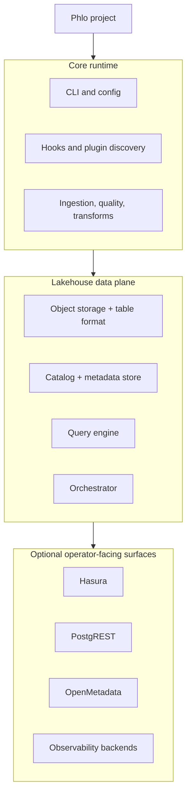

# Phlo Documentation

Phlo is a modular lakehouse platform for ingestion, quality, transformation, orchestration, and data access.

## Platform Map

## Documentation Map

- [Getting Started](getting-started/installation.md): install, run, first pipeline.
- [Guides](guides/developer-guide.md): workflows, patterns, and cross-package how-to material.
- [Architecture](architecture/index.md): public system shape, topology, and platform boundaries.
- [Packages](packages/index.md): what each installable package contributes to the platform.
- [Setup](setup/index.md): operator runbooks for optional external surfaces that need extra configuration after install.
- [Reference](reference/index.md): canonical contracts, commands, configuration, and API surfaces.
- Python Reference: generated symbol-level API and docstring reference for the core runtime in the pymdx site.
- [Operations](operations/operations-guide.md): production operation, troubleshooting, and maintenance.

## Recommended Paths

### Data engineer

1. [Getting Started](getting-started/index.md)
2. [Developer Workflow](guides/developer-workflow.md)
3. [Data Lifecycle](guides/data-lifecycle.md)
4. [Workflow Development](guides/workflow-development.md)
5. [Testing Strategy](guides/testing-strategy.md)

### Platform engineer

1. [Platform Topology](reference/platform-topology.md)
2. [Public System Design](architecture/public-system-design.md)
3. [Choosing Components](guides/choosing-components.md)
4. [Deployment Profiles](guides/deployment-profiles.md)
5. [Setup](setup/index.md)
6. [Production Readiness](operations/production-readiness.md)

### Plugin or package author

1. [Extension Model](guides/extension-model.md)
2. [Plugin Development](guides/plugin-development.md)
3. [Plugin API](reference/plugin-api.md)
4. [Packages](packages/index.md)
5. Python Reference in the pymdx site

## Setup Surfaces

Phlo can expose optional surfaces around the core data plane and runtime stack.

- [Hasura](setup/hasura.md) and [PostgREST](setup/postgrest.md) for external API exposure
- [OpenMetadata](setup/openmetadata.md) for catalog and metadata workflows
- [Observability](setup/observability.md) for logs, traces, and metrics routing
- [Security](setup/security.md) for authentication, secrets, and hardening
- [Service Credentials](setup/service-credentials.md) for regulated per-service backend identity

Use [Packages](packages/index.md) for component detail and [Reference](reference/index.md) for commands, config, and contracts.

## Start Here

- New project: [Installation Guide](getting-started/installation.md), then [Quickstart Guide](getting-started/quickstart.md)
- Building workflows: [Developer Guide](guides/developer-guide.md)
- Understanding the platform model: [Core Concepts](getting-started/core-concepts.md)
- Running the stack: [Operations Guide](operations/operations-guide.md)
- Looking for a specific package: [Packages](packages/index.md)
- Looking for commands and settings: [Reference](reference/index.md)

## Common Paths

### First Pipeline

1. [Installation Guide](getting-started/installation.md)
2. [Core Concepts](getting-started/core-concepts.md)
3. [Quickstart Guide](getting-started/quickstart.md)
4. [Developer Guide](guides/developer-guide.md)

### Platform Setup

1. [Installation Guide](getting-started/installation.md)
2. [Service Packages](guides/service-packages.md)
3. [Packages](packages/index.md)
4. [Setup](setup/index.md)
5. [Operations Guide](operations/operations-guide.md)

### Command and Contract Lookup

1. [CLI Reference](reference/cli-reference.md)
2. [Configuration Reference](reference/configuration-reference.md)
3. [Plugin API](reference/plugin-api.md)
4. [Common Errors](reference/common-errors.md)

## Key Reference Pages

- [Architecture](reference/architecture.md)
- [CLI Reference](reference/cli-reference.md)
- [Configuration Reference](reference/configuration-reference.md)
- [Plugin API](reference/plugin-api.md)
- [phlo-api](reference/phlo-api.md)
- Python Reference in the pymdx site
- [Error Codes](errors/README.md)
