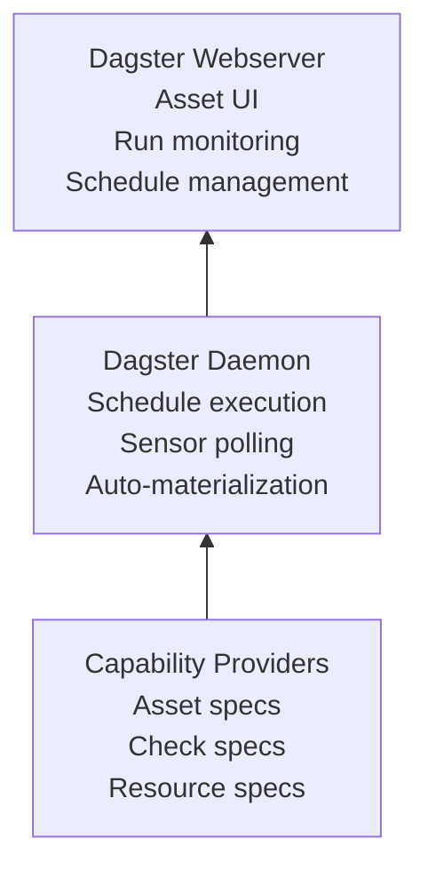

# phlo-dagster

Data orchestration platform for Phlo.

## Overview

`phlo-dagster` provides the core data orchestration platform for scheduling, monitoring, and managing data pipelines. It translates capability specs into Dagster assets, checks, and resources.

## Installation

```bash
pip install phlo-dagster
# or
phlo plugin install dagster
```

## Configuration

| Variable         | Default     | Description            |
| ---------------- | ----------- | ---------------------- |
| `DAGSTER_PORT`   | `3000`      | Dagster webserver port |
| `WORKFLOWS_PATH` | `workflows` | Path to workflow files |
| `PHLO_WAP_BRANCH_CREATION_INTERVAL_SECONDS` | `30`   | WAP branch creation sensor interval |
| `PHLO_WAP_PROMOTION_INTERVAL_SECONDS`       | `60`   | WAP promotion sensor interval       |
| `PHLO_WAP_CLEANUP_INTERVAL_SECONDS`         | `3600` | WAP cleanup sensor interval         |

## Features

### Auto-Configuration

This package is **fully auto-configured**:

| Feature                | How It Works                                                              |
| ---------------------- | ------------------------------------------------------------------------- |
| **Adapter Discovery**  | Loads `phlo.plugins.orchestrators` and builds Dagster definitions         |
| **dbt Compilation**    | Auto-compiles dbt on startup via post_start hook                          |
| **Workflow Discovery** | Auto-discovers workflows in `workflows/` directory                        |
| **Fail-Closed Setup**  | Re-raises required capability setup failures during definitions loading   |
| **Metrics Labels**     | Exposes Dagster metrics for Prometheus                                    |

### Post-Start Hook

The Dagster service automatically runs dbt compilation on startup:

```yaml
hooks:
  post_start:
    - name: dbt-compile
      command: dbt compile
```

### Capability Discovery

Capability providers are auto-loaded through the plugin system:

- Asset specs from `phlo.plugins.assets` (for example phlo-dlt, phlo-dbt)
- Resource specs from `phlo.plugins.resources` (for example phlo-iceberg, phlo-trino)
- Check specs from `@phlo_quality` and other packages

### Versioned catalogs and WAP

Dagster enables WAP lifecycle sensors only when a `VersionedCatalog` capability
is available. That keeps the orchestration layer capability-driven instead of
hard-wiring Dagster to a specific catalog implementation.

In the bundled stack, Nessie is the versioned catalog provider. In profiles
without versioning, the same Dagster adapter still works, but WAP branch
creation/promotion/cleanup is not enabled.

## Usage

### Starting the Service

```bash
# Start Dagster
phlo services start --service dagster

# Start with dev mode (editable install from source)
phlo services init --dev --phlo-source /path/to/phlo
phlo services start
```

### Development Server

For local development without Docker:

```bash
phlo dev                    # Start on localhost:3000
phlo dev --port 8080        # Use custom port
```

### Materializing Assets

```bash
# Via Dagster CLI
dagster asset materialize --select my_asset

# Via Phlo CLI
phlo materialize my_asset
```

## Endpoints (Docker Mode)

| Endpoint    | URL                              |
| ----------- | -------------------------------- |
| **Web UI**  | `http://localhost:10006`         |
| **GraphQL** | `http://localhost:10006/graphql` |
| **Metrics** | `http://localhost:10006/metrics` |

> **Note:** When using `phlo dev` for local development, these are available at port 3000 instead.

## Architecture



## Entry Points

| Entry Point                  | Plugin                                               |
| ---------------------------- | ---------------------------------------------------- |
| `phlo.plugins.services`      | `DagsterServicePlugin`, `DagsterDaemonServicePlugin` |
| `phlo.plugins.orchestrators` | `DagsterOrchestratorAdapter`                         |
| `phlo.plugins.cli`           | Dagster CLI commands                                 |

## Related Packages

- [phlo-dlt](phlo-dlt.md) - Data ingestion
- [phlo-dbt](phlo-dbt.md) - SQL transformations
- [phlo-pandera](phlo-pandera.md) - Data quality checks
- [phlo-iceberg](phlo-iceberg.md) - Iceberg table access

## Next Steps

- [Workflow Development Guide](../guides/workflow-development.md) - Build data pipelines
- [Dagster Assets Guide](../guides/dagster-assets.md) - Asset patterns
- [Developer Guide](../guides/developer-guide.md) - Decorator usage
