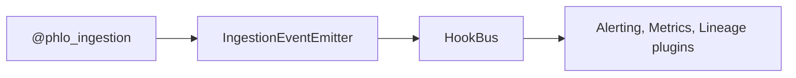

# phlo-dlt

DLT (Data Load Tool) ingestion engine for Phlo.

## Overview

`phlo-dlt` provides the `@phlo_ingestion` decorator for defining data ingestion pipelines using DLT. It materializes data into the active `table_store` with schema evolution and full lineage tracking.
Schema validation is supplied by installed quality-provider capabilities such as `phlo-pandera`;
`phlo-dlt` does not depend on a specific quality provider.

When multiple `table_store` providers are installed, selection is deterministic:

- workflow/runtime tag via `phlo/capability/table_store=...`
- asset override via `capabilities=&#123;"table_store": "..."&#125;`
- global default via `phlo.yaml` `capabilities.defaults` or `PHLO_DEFAULT_CAPABILITIES`

## Installation

```bash
pip install phlo-dlt
# or
phlo plugin install dlt
```

## Configuration

| Variable                    | Default | Description                              |
| --------------------------- | ------- | ---------------------------------------- |
| `PHLO_DLT_DEFAULT_NAMESPACE`| `raw`   | Default namespace/schema for table names |

Note: Additional configuration for table storage comes from the active table_store provider (e.g., `phlo-iceberg` or `phlo-delta`).

## Features

### Auto-Configuration

| Feature                | How It Works                                                         |
| ---------------------- | -------------------------------------------------------------------- |
| **Asset Registration** | Ingestion assets published as capability specs via asset provider entry points |
| **Lineage Events**     | Emits `ingestion.start`, `ingestion.end` events for lineage tracking |
| **Schema Evolution**   | Automatically handles schema changes during ingestion                |
| **Hook Integration**   | Events captured by alerting, metrics, and OpenMetadata plugins       |

### Event Flow



## Usage

### Basic Ingestion

```python
from phlo import ingestion
from workflows.schemas.events import EventSchema

@ingestion.phlo_ingestion(
    table_name="events",
    unique_key="id",
    validation_schema=EventSchema,
    group="api",
    cron="0 */1 * * *",
    freshness_hours=(1, 24),
    owner="platform-ingestion",
    consumers=[
        Consumer(name="analytics", usage="daily_reporting"),
        "fraud_team",
    ],
    sla=SLA(freshness_hours=2, quality_threshold=0.99),
)
def api_events(partition_date: str):
    """Ingest events from REST API."""
    from dlt.sources.rest_api import rest_api

    return rest_api(
        client={"base_url": "https://api.example.com"},
        resources=[{"name": "events", "endpoint": {"path": "events"}}],
    )
```

Or import directly from the package:

```python
from phlo_dlt import phlo_ingestion
from phlo.contracts import Consumer, SLA
```

### Decorator Options

| Option              | Type              | Description                                         |
| ------------------- | ----------------- | --------------------------------------------------- |
| `table_name`        | `str`             | Target table-store table name                       |
| `unique_key`        | `str`             | Column for deduplication                            |
| `validation_schema` | `type`            | Provider-owned schema for validation                |
| `table_schema`      | `Any`             | Explicit table-store schema (optional)              |
| `group`             | `str`             | Asset group name                                    |
| `cron`              | `str`             | Schedule expression                                 |
| `freshness_hours`   | `tuple[int, int]` | (warn, fail) freshness thresholds                   |
| `merge_strategy`    | `str`             | `merge` (default) or `append`                       |
| `merge_config`      | `dict`            | Advanced merge configuration                        |
| `owner`             | `str`             | Optional owner/team metadata for contracts          |
| `consumers`         | `list[Consumer \| str]` | Optional downstream consumer metadata         |
| `sla`               | `SLA`             | Optional freshness/quality contract metadata        |
| `capabilities`      | `dict[str, str]`  | Optional capability provider overrides for the asset |
| `validate`          | `bool`            | Run configured provider validation using `validation_schema` (default: True) |
| `strict_validation` | `bool`            | Fail on validation errors (default: True)           |
| `max_runtime_seconds`| `int`            | Maximum runtime before timeout (default: 300)       |
| `max_retries`       | `int`             | Maximum retry attempts (default: 3)                 |
| `retry_delay_seconds`| `int`            | Delay between retries (default: 30)                 |
| `add_metadata_columns`| `bool`          | Inject Phlo metadata columns (default: True)        |

### Merge Strategies

```python
# Default merge with deduplication
@phlo_ingestion(
    table_name="events",
    unique_key="id",
    merge_strategy="merge",
    merge_config={"deduplication_method": "last"}  # or "first", "hash"
)

# Append-only (no deduplication)
@phlo_ingestion(
    table_name="events",
    merge_strategy="append"
)
```

When `table_schema` is omitted, the active `table_store` provider must implement
schema derivation from `validation_schema` (for example Iceberg provider conversion).

### Selecting a Table Store

```python
@ingestion.phlo_ingestion(
    table_name="events",
    unique_key="id",
    validation_schema=EventSchema,
    group="api",
    capabilities={"table_store": "delta"},
)
def api_events(partition_date: str):
    ...
```

For workflow-wide selection, set the Dagster run tag
`phlo/capability/table_store=&lt;provider>`.

### Running Ingestion

Ingestion assets are materialized via the orchestrator (e.g., Dagster). The asset key is
`dlt_&#123;table_name&#125;` (for example, `dlt_events` for table_name="events").

Use the orchestrator's UI or API to trigger materialization:

```bash
# Example with Dagster (when configured)
dagster asset materialize --select dlt_events
```

## Data Flow

```
External API
     ↓
DLT Pipeline (extract + normalize)
     ↓
Parquet Staging (S3)
     ↓
Pandera Validation
     ↓
Table Store Merge
     ↓
Physical Table (for active store)
```

## Entry Points

| Entry Point                   | Plugin                                  |
| ----------------------------- | --------------------------------------- |
| `phlo.plugins.assets`         | `DltAssetProvider` for ingestion specs  |
| `phlo.plugins.ingestion_providers` | `DLTIngestionProvider` for decorator |
| `phlo.plugins.cli`            | `DltCliPlugin` for workflow scaffolding |

## Related Packages

- [phlo-dagster](phlo-dagster.md) - Dagster adapter for capability specs
- [phlo-iceberg](phlo-iceberg.md) - Iceberg table format
- [phlo-pandera](phlo-pandera.md) - Data validation
- [phlo-nessie](phlo-nessie.md) - Branch management

## Next Steps

- [Developer Guide](../guides/developer-guide.md) - Master decorators
- [Workflow Development](../guides/workflow-development.md) - Build pipelines
- [Core Concepts](../getting-started/core-concepts.md) - Understand patterns
