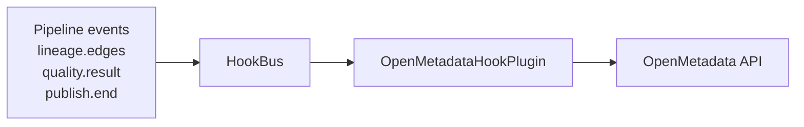

# phlo-openmetadata

OpenMetadata integration for Phlo.

## Overview

`phlo-openmetadata` syncs table metadata, lineage, and quality check results to OpenMetadata for data governance and discovery.

## Installation

```bash
pip install phlo-openmetadata
# or
phlo plugin install openmetadata
```

## Configuration

| Variable                             | Default               | Description                |
| ------------------------------------ | --------------------- | -------------------------- |
| `OPENMETADATA_HOST`                  | `openmetadata-server` | OpenMetadata server host   |
| `OPENMETADATA_PORT`                  | `8585`                | OpenMetadata API port      |
| `OPENMETADATA_HEAP_OPTS`             | `-Xmx384m -Xms384m`   | OpenMetadata server heap for the bundled profile |
| `OPENMETADATA_ES_JAVA_OPTS`          | `-Xms256m -Xmx256m`   | Elasticsearch heap for the bundled OpenMetadata profile |
| `OPENMETADATA_USERNAME`              | `admin`               | Admin username             |
| `OPENMETADATA_PASSWORD`              | `admin`               | Admin password             |
| `OPENMETADATA_VERIFY_SSL`            | `false`               | Verify SSL certificates    |
| `OPENMETADATA_SERVICE_TYPE`          | unset                 | Explicit OpenMetadata database service type; required unless a `query_engine` capability declares `service_type` metadata |
| `OPENMETADATA_CATALOG_SCANNER`       | unset                 | Optional `catalog_scanner` capability name for sync |
| `OPENMETADATA_QUERY_ENGINE`          | unset                 | Optional `query_engine` capability name for database/service inference; required unless both `OPENMETADATA_DATABASE_NAME` and `OPENMETADATA_SERVICE_TYPE` are set |
| `OPENMETADATA_DATABASE_NAME`         | unset                 | Explicit OpenMetadata database name when not deriving it from a query engine capability |
| `OPENMETADATA_DBT_MANIFEST_PATH`     | `workflows/transforms/dbt/target/manifest.json` | dbt manifest path |
| `OPENMETADATA_DBT_CATALOG_PATH`      | `workflows/transforms/dbt/target/catalog.json` | dbt catalog path |
| `OPENMETADATA_SYNC_ENABLED`          | `true`                | Enable automatic sync      |
| `OPENMETADATA_SYNC_INTERVAL_SECONDS` | `300`                 | Min interval between syncs |

## Features

### Auto-Configuration

| Feature               | How It Works                                                     |
| --------------------- | ---------------------------------------------------------------- |
| **Hook Registration** | Receives `lineage.edges`, `quality.result`, `publish.end` events |
| **Lineage Sync**      | Automatically syncs lineage edges to OpenMetadata                |
| **Quality Results**   | Syncs quality check results as test cases                        |
| **Table Metadata**    | Syncs published tables with documentation                        |

### Event Flow



### Synced Data

| Data Type   | Description                             |
| ----------- | --------------------------------------- |
| **Tables**  | Schema, columns, descriptions           |
| **Lineage** | Table-to-table and column-level lineage |
| **Quality** | Test case results and scores            |
| **Tags**    | Domain and classification tags          |

## Usage

### CLI Commands

```bash
# Manually sync all tables using the resolved catalog_scanner capability
# Requires either OPENMETADATA_DATABASE_NAME and OPENMETADATA_SERVICE_TYPE,
# or a query_engine capability with catalog + service_type metadata.
phlo openmetadata sync
```

### Programmatic

```python
from phlo_openmetadata.openmetadata import OpenMetadataClient

client = OpenMetadataClient()

# Sync table metadata
client.sync_table_metadata("bronze.users")

# Sync lineage
client.sync_lineage_edge("bronze.raw_events", "silver.events")

# Add quality result
client.add_quality_result(
    table="bronze.users",
    check_name="null_check",
    passed=True
)
```

### Accessing OpenMetadata UI

Open `http://localhost:8585` in your browser:

- Username: `admin`
- Password: `admin`

## Entry Points

| Entry Point          | Plugin                            |
| -------------------- | --------------------------------- |
| `phlo.plugins.cli`   | `openmetadata` CLI commands       |
| `phlo.plugins.hooks` | `OpenMetadataHookPlugin` for sync |

## Related Packages

- [phlo-lineage](phlo-lineage.md) - Lineage tracking
- [phlo-pandera](phlo-pandera.md) - Quality checks
- [phlo-dagster](phlo-dagster.md) - Asset metadata

## Next Steps

- [OpenMetadata Setup](../setup/openmetadata.md) - Complete configuration
- [Architecture Reference](../reference/architecture.md) - System design
