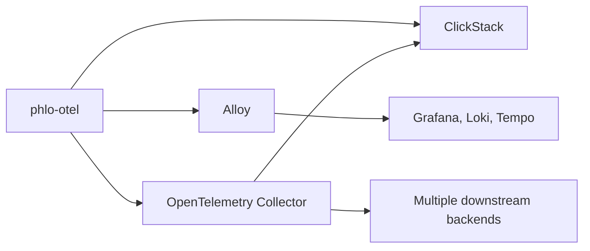

# phlo-otel

`phlo-otel` translates Phlo hook events into OpenTelemetry traces, metrics, and
optionally OTLP log records.

## What It Does

- Creates spans for ingestion, transform, quality, lineage, publish, service lifecycle, and migration events
- Emits standard workflow metrics such as runs, rows, durations, lineage edges, and errors
- Promotes Iceberg maintenance telemetry into standard `phlo.maintenance.*` instruments
- Exports routed `LogEvent` records to OTLP logs when log export is enabled
- Reuses shared hook correlation so traces and logs can link by `run_id`, `asset_key`, `partition_key`, `job_name`, and trace/span IDs

## Configuration

`phlo-otel` uses standard `OTEL_*` environment variables and falls back to Phlo
settings when those variables are unset.

Relevant Phlo settings:

- `PHLO_LOG_SERVICE_NAME`
- `PHLO_SERVICE_NAMESPACE`
- `PHLO_SERVICE_VERSION`
- `PHLO_SERVICE_INSTANCE_ID`
- `PHLO_PROJECT`
- `PHLO_ENVIRONMENT`

Resource attributes emitted by default include:

- `service.name`
- `service.namespace`
- `service.version`
- `service.instance.id`
- `deployment.environment`
- `phlo.package`
- `phlo.runtime`
- `phlo.project`

## Backend Routing

`phlo-otel` is intentionally backend-neutral. It emits OTLP and expects collector infrastructure to handle routing.

Recommended topologies:

- `phlo-otel -> ClickStack`
- `phlo-otel -> Alloy -> Grafana / Loki / Tempo`
- `phlo-otel -> OpenTelemetry Collector -> multiple downstream backends`
- `phlo-otel -> Collector -> ClickStack`

Phlo's preferred default is direct OTLP into ClickStack. More complex routing
still belongs in Alloy or OpenTelemetry Collector rather than a dedicated Phlo
exporter fork.

## Semantic Attributes

`phlo-otel` applies a stable semantic envelope across spans and OTLP log records.

| Attribute | Meaning | Example |
|---|---|---|
| `phlo.event_type` | Original hook event type | `publish.end` |
| `phlo.stage` | Workflow stage family | `ingestion`, `publish`, `migration` |
| `phlo.system` | Primary system/tool involved | `dbt`, `clickhouse`, `schema` |
| `phlo.operation` | Low-cardinality operation name when available | `publish`, `post_start`, `expire_snapshots` |
| `phlo.status` | Outcome status when present | `success`, `failure` |

High-cardinality identifiers such as `run_id`, `asset_key`, and `partition_key`
remain on traces and logs through correlation attributes rather than metric labels.

## Metric Labels

Metric labels stay intentionally low-cardinality. Labels such as `status`,
`tool`, `service`, `target_system`, and `source_type` are allowed. High-cardinality
identifiers like `run_id`, `asset_key`, and `partition_key` stay in traces and logs.

## Maintenance Metrics

Maintenance telemetry emitted by `phlo-dagster` is promoted into bounded workflow
instruments instead of only generic `phlo.telemetry.*` series.

- `iceberg.maintenance.run` -> `phlo.maintenance.runs`
- `iceberg.maintenance.duration_seconds` -> `phlo.maintenance.duration`
- `iceberg.maintenance.tables_processed` -> `phlo.maintenance.tables_processed`
- `iceberg.maintenance.errors` -> `phlo.maintenance.errors`
- `iceberg.maintenance.snapshots_deleted` -> `phlo.maintenance.snapshots_deleted`
- `iceberg.maintenance.orphan_files` -> `phlo.maintenance.orphan_files`
- `iceberg.maintenance.total_records` -> `phlo.maintenance.records_processed`
- `iceberg.maintenance.total_size_mb` -> `phlo.maintenance.size_mb`

## Related Docs

- [Configuration Reference](../reference/configuration-reference.md)
- [Observability Setup](../setup/observability.md)
- [phlo-clickstack](phlo-clickstack.md)
- [phlo-alloy](phlo-alloy.md)
- [Packages Index](index.md)
