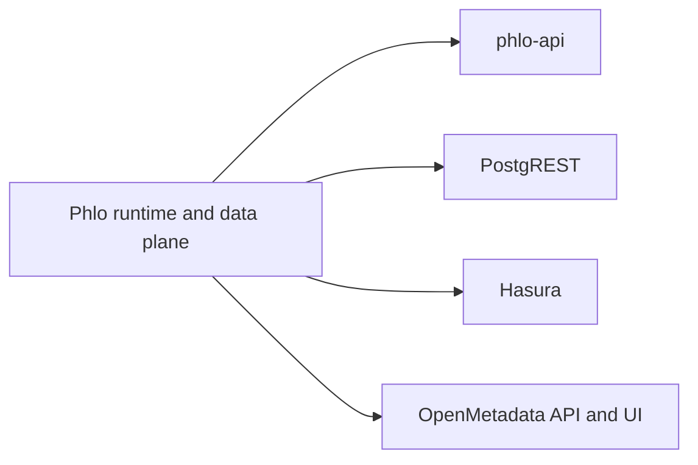

# API Surfaces

Phlo exposes more than one API surface. They solve different problems.

## Executive summary

In current Phlo, regulated mode does **not** apply one enforcement mechanism to
every surface.

Instead, each surface falls into one of four categories:

- **Control-plane enforced**: Phlo evaluates canonical actions with
  `enforce()` at the surface boundary
- **Autonomous execution**: work runs under a Phlo platform identity with audit
  correlation
- **Ingress-gated optional**: Phlo permits the surface in regulated deployments,
  but ingress authentication and the surface's own permission model remain the
  operator's responsibility
- **Blocked**: unsupported in regulated mode

Use this page to decide which surface you are exposing and what security model
actually applies to it.

## Surface Map

## Surface Roles

### `phlo-api`

- Phlo-native service
- capability-aware
- best fit for Observatory and Phlo-specific operational endpoints
- **Regulated surface**: fully integrated with Phlo canonical RBAC

### `PostgREST`

- database-native REST
- best fit for exposing relational read/write surfaces with minimal app code
- **Ingress-gated optional surface** in regulated mode
- **Write-restricted by default** in regulated mode
- Uses PostgreSQL GRANT-based permissions, not Phlo canonical RBAC
- Must be protected at ingress; Phlo validates deployment configuration only

### `Hasura`

- metadata-driven GraphQL
- best fit for GraphQL clients, subscriptions, and schema-driven exposure
- **Ingress-gated optional surface** in regulated mode
- **Write-restricted by default** in regulated mode
- Uses Hasura role-based permissions, not Phlo canonical RBAC
- Must be protected at ingress; Phlo validates deployment configuration only

### `OpenMetadata`

- metadata and governance surface
- not a serving API for marts, but a catalog and discovery surface for data users
- **Blocked** in regulated mode (no Phlo adapter or ingress-gating story)

## Regulated Mode Classification

Surfaces are classified into enforcement layers for regulated deployments:

| Layer | Surfaces | Behavior in regulated mode |
|-------|----------|---------------------------|
| Control-plane enforced | `phlo-api`, `dagster-webserver`, `cli` | Phlo `enforce()` at the request boundary |
| Autonomous execution | `dagster-daemon` | `platform:dagster-daemon` principal plus run-level audit |
| Data-plane governed | `trino`, `postgresql`, `minio`, `nessie` | Backend-native grants and service credentials |
| Ingress-gated read surfaces | `postgrest`, `hasura`, `superset` | Allowed behind ingress; writes blocked by default for Hasura/PostgREST |

## Surface-by-surface expectations

| Surface | Classification | Auth path | Enforcement point | Writes |
|--------|----------------|-----------|-------------------|--------|
| `phlo-api` | Control-plane enforced | proxy, JWT, static, service token | route guards + regulated surface adapter | Phlo-controlled |
| `dagster-webserver` | Control-plane enforced | bearer/service auth into GraphQL middleware | top-level mutation authorization | Phlo-controlled |
| `cli` | Control-plane enforced | local operator identity / configured auth backend | command authorization layer | Phlo-controlled for mutation commands |
| `dagster-daemon` | Autonomous execution | platform identity | queued-run submission + audit attribution | allowed as platform automation |
| `postgrest` | Ingress-gated optional | ingress auth + Postgres/JWT model | PostgREST and PostgreSQL | blocked by default; opt in explicitly |
| `hasura` | Ingress-gated optional | ingress auth + Hasura role model | Hasura and PostgreSQL | blocked by default; opt in explicitly |
| `superset` | Ingress-gated optional | ingress auth + Superset auth | Superset role model | operator-managed |
| `openmetadata` | Blocked | not applicable | not applicable | not applicable |
| `pgweb` | Blocked | not applicable | not applicable | not applicable |

The practical distinction is simple:

- if a surface is **control-plane enforced**, Phlo understands the action and
  resource directly
- if a surface is **ingress-gated optional**, Phlo only validates the deployment
  posture around it
- if a surface is **blocked**, do not expose it in regulated mode

### What "ingress-gated optional" means

Ingress-gated optional surfaces are allowed in regulated deployments but **must be protected at ingress** (e.g., by an API gateway or reverse proxy that enforces authentication). Phlo does not enforce request-level policy on these surfaces. They rely on their own permission models:

- **PostgREST**: PostgreSQL GRANT statements and JWT claims
- **Hasura**: Hasura role permissions synced from config

If you expose either surface in a regulated deployment, you must ensure:
1. Ingress proxy requires authentication before forwarding requests
2. The surface's own permission model is configured correctly
3. Audit logs from the surface are collected separately
4. Mutations stay disabled unless you explicitly opt in with `surfaces.&lt;service>.allow_writes: true`

## PostgREST and Hasura in Regulated Deployments

**Decision:** Both are classified as **ingress-gated optional surfaces**.

- They are NOT blocked in regulated mode
- They are NOT first-class regulated surfaces with their own `regulated_surface` adapter
- They ARE allowed only when protected by ingress authentication (Traefik + oauth2-proxy)
- A warning is logged when they are started in regulated mode
- Writes are blocked by default. Opt in explicitly if you are prepared to own equivalent write-path audit and authorization integration.

### When to use PostgREST/Hasura in regulated mode

- All requests must pass through Traefik with forward-auth enabled
- Direct port access must be restricted to the Docker network
- phlo-api is the primary regulated API surface; PostgREST/Hasura serve read-heavy or GraphQL convenience paths that inherit protection from ingress
- Writes require an explicit operator decision through `surfaces.&lt;service>.allow_writes: true`
- You own equivalent audit and permission review for every write path you enable

### When NOT to use PostgREST/Hasura in regulated mode

- If they are directly exposed to users without ingress protection
- If they accept writes that bypass phlo-api authorization

## Selection Guidance

- Phlo-native control-plane behavior: start with `phlo-api`
- self-service relational REST: add `PostgREST` (with ingress auth)
- GraphQL and subscriptions: add `Hasura` (with ingress auth)
- discovery, lineage, and governance: add `OpenMetadata` (non-regulated only)

## Related Pages

- [Choosing Components](../guides/choosing-components.md)
- [Hasura Setup](../setup/hasura.md)
- [PostgREST Setup](../setup/postgrest.md)
- [OpenMetadata Setup](../setup/openmetadata.md)
- [phlo-api](phlo-api.md)
- [Security Setup](../setup/security.md)
