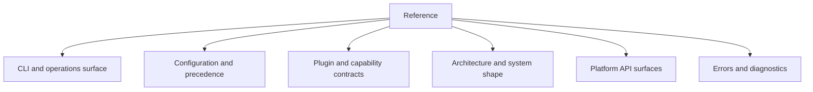

# Reference

Use this section when you need commands, configuration, contracts, APIs, or other canonical details.

## What Lives Here

Reference pages answer stable questions:

- which command or flag does this?
- which setting wins when multiple sources define it?
- what is the supported plugin or capability contract?
- what is the architecture and where does a component sit?
- which API surface is considered part of the platform?

## Reference Map

## Current Reference Pages

- [CLI Reference](cli-reference.md): commands, flags, and examples.
- [Canonical RBAC](canonical-rbac.md): source-of-truth RBAC config, authz workflow, and backend support.
- [Configuration Reference](configuration-reference.md): env vars, defaults, and precedence.
- [Architecture](architecture.md): system model and component boundaries.
- [Observatory v2 Contracts](observatory-v2-contracts.md): provider-neutral UI and capability contribution contracts.
- [Plugin API](plugin-api.md): extension contracts and base types.
- [phlo-api](phlo-api.md): Phlo's Python API service surface.
- [Quality Checks Catalog](quality-checks-catalog.md): built-in quality checks.
- [DuckDB Queries](duckdb-queries.md): local query reference.
- [Common Errors](common-errors.md): frequent failures and fixes.

## Related Sections

- Use [Guides](../guides/developer-guide.md) for how-to workflows.
- Use [Packages](../packages/index.md) for installable package responsibilities.
- Use [Setup](../setup/index.md) for external surfaces and environment-specific wiring.

## Code And Docblock Reference

The generated Python Reference in the pymdx site covers symbols, signatures, and docstrings for the core runtime and workspace packages. It complements the hand-written reference pages:

- generated pages: symbols, signatures, docstrings, and source-level detail
- hand-written pages: platform behavior, contracts, commands, and architecture
