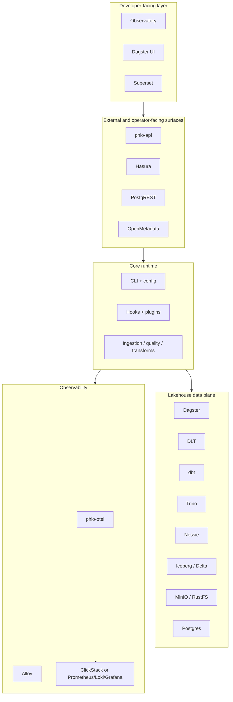

# Platform Topology

This page shows the major Phlo layers and where optional systems fit.

## Topology

## Reading This Topology

- core runtime: mandatory logic and workflow abstractions
- data plane: storage, catalogs, orchestration, transforms, and query
- external surfaces: optional serving, API, and metadata entry points
- observability: separate but cross-cutting layer

## Related Pages

- [Choosing Components](../guides/choosing-components.md)
- [Deployment Profiles](../guides/deployment-profiles.md)
- [API Surfaces](api-surfaces.md)
