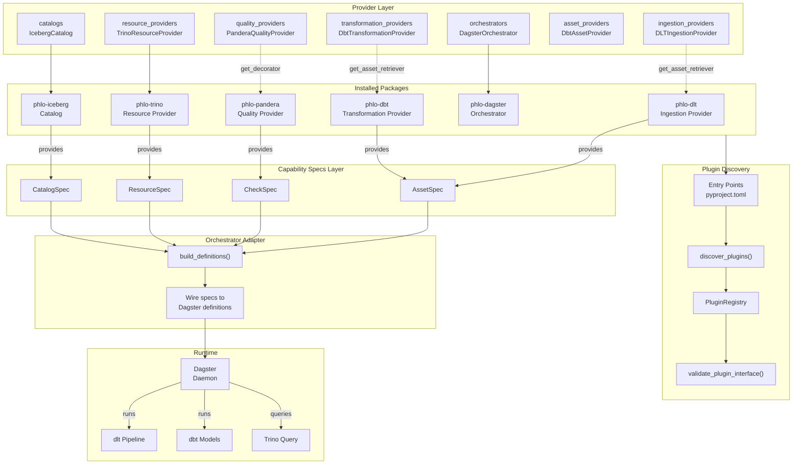
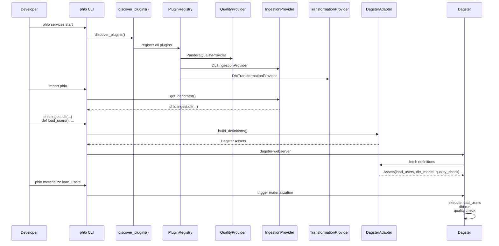

# Plugin System Architecture

This document describes Phlo's plugin system, all plugin types, which packages provide them, and how they connect.

## Overview

Phlo uses Python entry points for plugin discovery. Packages declare plugins in their `pyproject.toml`, and Phlo discovers and registers them at runtime.

## Plugin Types

### Provider Plugins (Core Primitives)

Provider plugins supply the core primitives that other packages depend on:

| Plugin Type | Entry Point | Purpose | Package |
|-------------|-------------|---------|---------|
| `orchestrators` | `phlo.plugins.orchestrators` | Orchestration runtime (Dagster) | phlo-dagster |
| `quality_providers` | `phlo.plugins.quality_providers` | Quality primitives (phlo.quality.pandera(...), checks) | phlo-pandera |
| `ingestion_providers` | `phlo.plugins.ingestion_providers` | Ingestion primitives (phlo.ingest.dlt(...)) | phlo-dlt |
| `transformation_providers` | `phlo.plugins.transformation_providers` | Transformation primitives (dbt assets) | phlo-dbt |
| `resource_providers` | `phlo.plugins.resources` | Infrastructure resources (DB, storage) | phlo-trino, phlo-postgres, phlo-iceberg, phlo-delta |
| `asset_providers` | `phlo.plugins.assets` | Asset spec generation | phlo-dbt, phlo-dlt |
| `catalogs` | `phlo.plugins.catalogs` | Table catalog (Iceberg, Nessie) | phlo-iceberg |

### Implementation Plugins (Individual Implementations)

These provide individual implementations of specific capabilities:

| Plugin Type | Entry Point | Purpose | Package |
|-------------|-------------|---------|---------|
| `quality_checks` | `phlo.plugins.quality` | Individual quality checks | phlo-core-plugins |
| `source_connectors` | `phlo.plugins.sources` | Data source connectors | phlo-core-plugins |
| `transformations` | `phlo.plugins.transforms` | Data transformations | phlo-core-plugins |
| `services` | `phlo.plugins.services` | Runtime services | Various |
| `cli_commands` | `phlo.plugins.cli` | CLI commands | Various |
| `hooks` | `phlo.plugins.hooks` | Event hooks | Various |

## How Discovery Works

1. Package declares entry points in `pyproject.toml`:

```toml
[project.entry-points."phlo.plugins.quality_providers"]
pandera = "phlo_pandera.plugin:PanderaQualityProvider"
```

2. On `import phlo` or `discover_plugins()`, Phlo scans entry points

3. Plugins are validated and registered in `PluginRegistry`

4. Packages access plugins via getters:
   - `get_quality_provider("pandera")`
   - `get_ingestion_provider("dlt")`
   - `get_transformation_provider("dbt")`

## Data Flow



## End-to-End Example

A complete flow from code to execution:



## Provider Pattern

The "provider" plugins (`quality_providers`, `ingestion_providers`, `transformation_providers`) follow a consistent pattern:

```python
class QualityProviderPlugin(Plugin, ABC):
    @property
    @abstractmethod
    def metadata(self) -> PluginMetadata:
        """Plugin name, version, description."""

    @abstractmethod
    def get_decorator(self) -> Callable:
        """Returns phlo.quality.pandera(...) or equivalent."""

    @abstractmethod
    def get_check_classes(self) -> dict[str, type]:
        """Returns {name: CheckClass} mapping."""

    def get_schema_extractor(self) -> Any | None:
        """Optional: schema extraction."""

    def get_reconciliation_checks(self) -> dict[str, type] | None:
        """Optional: reconciliation checks."""
```

This allows `phlo.quality` to work without hardcoded imports:

```python
# phlo/quality.py
from phlo.plugins.discovery import discover_plugins, get_quality_provider

discover_plugins()
provider = get_quality_provider("pandera")
pandera = provider.get_decorator()
```

## Related Documentation

- [Capability Primitives](../guides/capability-primitives.md) - Spec types and interfaces
- [Plugin API](plugin-api.md) - Base classes for building plugins
- [Package Documentation](../packages/index.md) - Individual package docs
