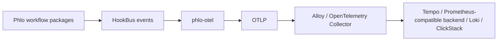
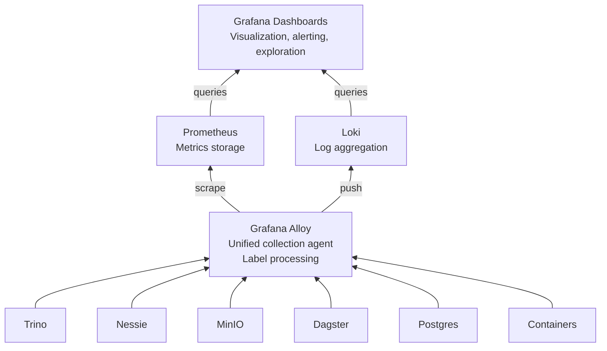

# Observability Guide

Complete guide to monitoring, logging, and observability in the Phlo lakehouse platform.

## Overview

Phlo includes a production-ready observability stack based on industry-standard tools:

- **ClickStack** - Preferred all-in-one observability backend
- **Prometheus** - Metrics collection and storage
- **Loki** - Log aggregation and querying
- **Grafana Alloy** - Unified telemetry collection agent
- **Grafana** - Visualization and dashboarding
- **Postgres Exporter** - Database metrics

All observability services are optional and run under the `observability` docker-compose profile.

## OTLP-First Model

Phlo's OpenTelemetry path is OTLP-first:



This keeps backend routing outside workflow code:

- `phlo-otel` emits backend-agnostic OTLP traces, metrics, and optional OTLP logs
- Alloy or OpenTelemetry Collector handles fan-out, enrichment, batching, and backend routing
- ClickStack is the preferred default destination for Phlo OTLP telemetry

Typical Phlo OTLP environment:

```bash


```

## Quick Start

```bash
# Start core services
phlo services start --profile core

# Start observability stack
phlo services start --profile observability

# Check health
phlo services status --profile observability

# Open Grafana
# http://localhost:10016
```

Default credentials:

- **Grafana**: admin / admin123 (change in `.phlo/.env.local`)
- **Prometheus**: No authentication (localhost only)

**Service Ports:**

- Prometheus: 10013
- Loki: 10014
- Grafana Alloy: 10015
- Grafana: 10016
- Postgres Exporter: 10017

## Architecture



### Component Details

#### Prometheus (Port 10013)

- Scrapes metrics from all services every 15 seconds
- 30-day retention period
- Collects:
  - Trino JMX metrics (query performance, memory, workers)
  - Nessie Quarkus metrics (HTTP requests, catalog operations)
  - MinIO S3 metrics (storage, bandwidth, operations)
  - Postgres metrics (connections, transactions, database size)
  - Container metrics (CPU, memory, network)

#### Loki (Port 10014)

- Aggregates logs from all Docker containers
- 30-day retention period
- Automatically extracts log levels (ERROR, WARN, INFO, DEBUG)
- Supports LogQL for powerful log queries
- Integrated with Grafana for log exploration

#### Grafana Alloy (Port 10015)

- Modern replacement for Prometheus exporters + Promtail
- Discovers Docker containers automatically
- Adds phlo-specific labels (component, service, job)
- Parses JSON logs and extracts fields
- Can also receive OTLP telemetry and forward traces, metrics, and logs onward
- Forwards metrics to Prometheus, logs to Loki, and can route OTLP signals to other backends

#### Grafana (Port 10016)

- Pre-configured datasources (Prometheus + Loki)
- Pre-built dashboards:
  - **Phlo Overview** - Service health, errors, key metrics
  - **Infrastructure** - Detailed per-service metrics and logs
- Custom dashboards stored in `.phlo/grafana/dashboards/`

**Note:** Grafana is available at port 10016 by default. Access at http://localhost:10016.

## Metrics

### Available Metrics

#### Trino

```promql
# Query execution rate
rate(trino_execution_QueuedQueries[5m])

# Active workers
trino_cluster_ActiveWorkers

# Memory usage
trino_memory_ClusterMemoryPool_general_ReservedBytes
```

#### Nessie

```promql
# HTTP request rate by endpoint
rate(http_server_requests_seconds_count{job="nessie"}[5m])

# Request duration (p95)
histogram_quantile(0.95, rate(http_server_requests_seconds_bucket[5m]))

# Catalog operations
nessie_catalog_operations_total
```

#### MinIO

```promql
# Bucket usage
minio_bucket_usage_total_bytes

# S3 traffic
rate(minio_s3_requests_incoming_bytes[5m])
rate(minio_s3_requests_outgoing_bytes[5m])

# Object count
minio_bucket_usage_object_total
```

#### Postgres

```promql
# Active connections
pg_stat_database_numbackends{datname="lakehouse"}

# Transaction rate
rate(pg_stat_database_xact_commit{datname="lakehouse"}[5m])

# Database size
pg_database_size_bytes{datname="lakehouse"}

# Cache hit ratio
pg_stat_database_blks_hit / (pg_stat_database_blks_hit + pg_stat_database_blks_read)
```

### Creating Alerts

Add alert rules to `.phlo/prometheus/alerts/` (create directory):

```yaml
# .phlo/prometheus/alerts/phlo.yml
groups:
  - name: cascade_lakehouse
    interval: 30s
    rules:
      - alert: TrinoDown
        expr: up{service="trino"} == 0
        for: 1m
        labels:
          severity: critical
        annotations:
          summary: "Trino query engine is down"
          description: "Trino has been unreachable for 1 minute"

      - alert: HighErrorRate
        expr: rate(http_server_requests_seconds_count{status=~"5.."}[5m]) > 0.1
        for: 5m
        labels:
          severity: warning
        annotations:
          summary: "High HTTP error rate detected"
```

Then update `.phlo/prometheus/prometheus.yml`:

```yaml
rule_files:
  - "alerts/*.yml"
```

## Logs

### Viewing Logs in Grafana

1. Open Grafana: http://localhost:10016
2. Navigate to **Explore** (compass icon)
3. Select **Loki** datasource
4. Use LogQL queries:

```logql
# All errors across services
{cascade_component=~"trino|nessie|dagster-.*"} |~ "(?i)(error|exception|fatal)"

# Dagster pipeline logs
{cascade_component=~"dagster-.*"}

# Nessie catalog operations
{cascade_component="nessie"} |= "catalog"

# Trino query logs
{cascade_component="trino"} |~ "query.*completed"

# Filter by log level
{job="dagster-webserver"} | json | level="ERROR"
```

### Structured Logging

Dagster sensors emit structured logs that Loki automatically indexes:

```python
# From workflows/sensors/failure_monitoring.py
context.log.error(
    "Pipeline failure detected",
    extra={
        "event_type": "pipeline_failure",
        "run_id": run_id,
        "job_name": job_name,
        "failure_message": failure_message,
    }
)
```

Query in LogQL:

```logql
{cascade_component=~"dagster-.*"} | json | event_type="pipeline_failure"
```

## Dashboards

### Pre-built Dashboards

#### Phlo Overview

- Service status indicators (up/down)
- Recent errors from all services
- MinIO bucket usage
- Postgres connection count

#### Infrastructure

Organized by service layer:

- **Service Health**: All service status in one view
- **Trino**: Query logs and JMX metrics
- **Nessie**: HTTP request rate, catalog operations, logs
- **MinIO**: S3 traffic, object counts, bucket usage
- **Postgres**: Transaction rate, database size, connection pool
- **Dagster**: Pipeline logs and execution history

### Creating Custom Dashboards

1. Open Grafana (http://localhost:10016)
2. Create Dashboard → Add Visualization
3. Select datasource (Prometheus or Loki)
4. Build query using visual builder or code
5. Save dashboard to `.phlo/grafana/dashboards/my-dashboard.json`

Example query panel (Prometheus):

```json
{
  "targets": [
    {
      "expr": "rate(minio_s3_requests_total[5m])",
      "legendFormat": "{{api}} - {{bucket}}"
    }
  ]
}
```

## Dagster Integration

### Failure Sensors

Phlo includes three monitoring sensors:

#### pipeline_failure_sensor

- Triggers on any pipeline failure
- Logs structured error information
- Picked up by Loki for alerting
- Extensible for Slack/PagerDuty integration

```python
# Future: Add Slack alerting
@dg.run_failure_sensor(...)
def pipeline_failure_sensor(context):
    # ... existing logging ...
    slack_client.send_alert(
        channel="#data-alerts",
        text=f"Pipeline {job_name} failed: {failure_message}"
    )
```

#### pipeline_success_sensor

- Logs successful completions
- Provides SLO tracking data
- Useful for measuring pipeline duration

#### iceberg_freshness_sensor

- Monitors critical Iceberg table updates
- Complements Dagster FreshnessPolicy
- Asset-level monitoring for data quality

### Viewing Sensor Events

```logql
# All sensor events
{cascade_component=~"dagster-.*"} | json | event_type=~"pipeline_.*|iceberg_.*"

# Pipeline failures only
{cascade_component=~"dagster-.*"} | json | event_type="pipeline_failure"

# Iceberg table updates
{cascade_component=~"dagster-.*"} | json | event_type="iceberg_table_updated"
```

## Troubleshooting

### Service Won't Start

Check logs:

```bash
phlo services logs -f prometheus
phlo services logs -f loki
phlo services logs -f alloy
phlo services logs -f grafana
```

Common issues:

- **Permission errors**: Check volume permissions in `volumes/`
- **Port conflicts**: Ensure ports 9090, 3100, 3003, 12345 are free
- **Config errors**: Validate YAML syntax in `.phlo/prometheus/`, `.phlo/loki/`, `.phlo/alloy/`

### No Metrics Appearing

1. Check Prometheus targets: http://localhost:10013/targets
   - All targets should show "UP"
   - If "DOWN", check service health: `phlo services status`

2. Check Alloy status: http://localhost:10015
   - Verify components are running
   - Check for collection errors

3. Verify Grafana datasources:
   - Navigate to Configuration → Data Sources
   - Click "Test" on Prometheus and Loki
   - Both should return "Data source is working"

### No Logs in Loki

1. Check Alloy is running: `docker ps | grep alloy`
2. Verify Docker socket mount: `docker inspect alloy | grep docker.sock`
3. Check Alloy logs: `phlo services logs -f alloy`
4. Test Loki endpoint: `curl http://localhost:10014/ready`

### High Resource Usage

Observability stack resource profile (typical):

- Prometheus: ~200-500 MB RAM
- Loki: ~100-300 MB RAM
- Alloy: ~50-100 MB RAM
- Grafana: ~100-200 MB RAM

Total: ~450 MB - 1.1 GB additional overhead

To reduce:

- Decrease scrape intervals in `prometheus.yml`
- Reduce retention periods (30d → 7d)
- Limit log volume via Alloy filters

## Production Hardening

### Security

```bash
# Change default passwords in .phlo/.env.local
GRAFANA_ADMIN_PASSWORD=<strong-password>

# Enable authentication in prometheus.yml (add later)
# Enable TLS for Grafana (production only)
# Restrict network access (firewall rules)
```

### Retention Tuning

```yaml
# .phlo/prometheus/prometheus.yml
global:
  # Reduce for less storage
  scrape_interval: 30s

# Add storage retention flags
command:
  - "--storage.tsdb.retention.time=7d" # Reduce from 30d
```

```yaml
# .phlo/loki/loki-config.yml
limits_config:
  retention_period: 168h # 7 days instead of 30
```

### Alerting

For production, add Alertmanager:

```yaml
# docker-compose.yml (add to observability profile)
alertmanager:
  image: prom/alertmanager:v0.27.0
  ports:
    - "9093:9093"
  volumes:
    - ./.phlo/alertmanager:/etc/alertmanager
```

Configure routes for Slack, PagerDuty, email, etc.

## Performance Monitoring

### Key Metrics to Watch

| Metric                   | Threshold    | Action                   |
| ------------------------ | ------------ | ------------------------ |
| Trino query duration p95 | > 30s        | Investigate slow queries |
| MinIO S3 operations/sec  | Sudden spike | Check ingestion jobs     |
| Postgres connections     | > 80% max    | Scale or pool tuning     |
| Nessie HTTP 5xx rate     | > 1%         | Check catalog health     |
| Dagster failure rate     | > 5%         | Review pipeline logs     |

### Creating SLOs

Example: 99% of queries complete in &lt; 10s

```promql
# Query success rate
sum(rate(trino_execution_CompletedQueries[5m]))
/
sum(rate(trino_execution_TotalQueries[5m]))

# Query duration SLI
histogram_quantile(0.99, rate(trino_execution_ExecutionTime_bucket[5m])) < 10
```

## Advanced Configuration

### Custom Metrics

Expose custom metrics from Python code:

```python
from prometheus_client import Counter, Histogram

pipeline_runs = Counter('cascade_pipeline_runs_total', 'Total pipeline runs')
pipeline_duration = Histogram('cascade_pipeline_duration_seconds', 'Pipeline duration')

@asset
def my_asset(context):
    with pipeline_duration.time():
        # ... work ...
        pass
    pipeline_runs.inc()
```

Then scrape via Dagster's metrics endpoint (if exposed).

### Distributed Tracing

`phlo-otel` emits distributed traces via OTLP. Route them to ClickStack (default)
or Grafana Tempo for end-to-end trace visibility across Dagster, dbt, and Trino
workflows.

See [phlo-otel](../packages/phlo-otel.md) for trace instrumentation details and
[phlo-clickstack](../packages/phlo-clickstack.md) for the recommended trace backend.

## References

- [Prometheus Documentation](https://prometheus.io/docs/)
- [Loki Documentation](https://grafana.com/docs/loki/latest/)
- [Grafana Alloy Documentation](https://grafana.com/docs/alloy/latest/)
- [Grafana Dashboards](https://grafana.com/docs/grafana/latest/)
- [LogQL Syntax](https://grafana.com/docs/loki/latest/query/)
- [PromQL Syntax](https://prometheus.io/docs/prometheus/latest/querying/basics/)

## Support

For issues specific to Phlo observability:

1. Check logs: `phlo services logs -f &lt;service>`
2. Verify health: `phlo services status --profile observability`
3. Review configurations in `.phlo/prometheus/`, `.phlo/loki/`, `.phlo/alloy/`
4. Consult upstream documentation for Prometheus, Loki, Grafana
