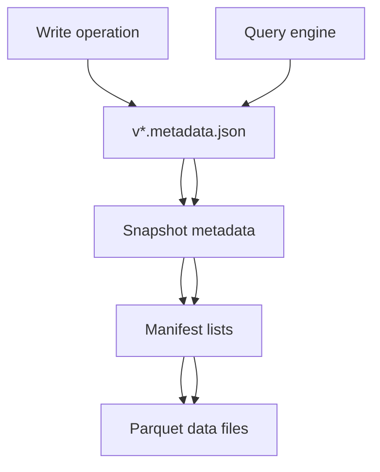

# Part 3: Apache Iceberg—The Table Format That Changed Everything

> Prerequisite: Read [Part 1: What is a Data Lakehouse?](01-intro-data-lakehouse.md) for lakehouse context.

## What You'll Learn

- Why Iceberg fixes Parquet table management pain
- How snapshots, manifests, and metadata enable time travel
- How Iceberg enables partition evolution and schema changes
- Where Iceberg fits in the Phlo stack

## Prerequisites

- [Part 1: What is a Data Lakehouse?](01-intro-data-lakehouse.md)
- Optional: [Part 2: Getting Started—Setup Guide](02-setup-guide.md) to run the examples locally.

In Part 1, we mentioned Iceberg as the magic ingredient. Let's understand _why_ it's such a game-changer.
For Git-like versioning on top of Iceberg, see [Part 4: Project Nessie Versioning](04-project-nessie-versioning.md).

## The Problem With Traditional Parquet

Before Iceberg, storing data in S3 looked like this:

```
s3://lake/glucose-data/
├── 2024-10-01_001.parquet  (100 rows)
├── 2024-10-01_002.parquet  (100 rows)
├── 2024-10-02_001.parquet  (100 rows)
│   └── DELETED: superseded by version from 10:30 UTC
├── 2024-10-02_001_v2.parquet (102 rows) ← Confusion!
├── 2024-10-02_002.parquet  (100 rows)
└── _old_backup_v1/          (Don't delete!)
```

**Problems**:

- 🤔 Which files are "current"? You have to track metadata yourself
- Schema changes require rewriting all files
- Queries must scan ALL files (no partition pruning)
- Concurrent writes = conflicting files
- No time travel—data is gone when you delete it

## What Iceberg Provides

Iceberg is a **table format specification** that layers atomic metadata on top of data files:

```
s3://lake/glucose-data/
├── metadata/
│   ├── v1.metadata.json       ← "CURRENT VERSION"
│   ├── snap-1234.avro         ← Snapshot 1 schema
│   ├── snap-5678.avro         ← Snapshot 2 schema
│   └── manifest-99.avro        ← "These files belong to snapshot 5678"
└── data/
    ├── year=2024/month=10/day=01/
    │   ├── 00001-a1b2c.parquet (rows 1-100)
    │   └── 00002-d3e4f.parquet (rows 101-200)
    └── year=2024/month=10/day=02/
        ├── 00003-g5h6i.parquet (rows 1-100, v2)
        └── 00004-j7k8l.parquet (rows 101-200, v2)
```

The metadata files answer:

- "What's the current version?" → v1.metadata.json
- "What files make up snapshot 5678?" → manifest-99.avro
- "What schema is this data?" → snap-5678.avro
- "Are these writes in conflict?" → atomic metadata updates

### Iceberg Metadata Flow (Diagram)



## Core Iceberg Concepts

### 1. Snapshots (Immutable Versions)

Each write creates a new **snapshot**—a complete, immutable view of the table at that moment:

```python
# In Python, using PyIceberg
from phlo_iceberg.catalog import get_catalog

catalog = get_catalog()
table = catalog.load_table("raw.glucose_entries")

# View all snapshots
for snapshot in table.snapshots():
    print(f"Snapshot {snapshot.snapshot_id}:")
    print(f"  Created: {snapshot.timestamp_ms}")
    print(f"  Files: {len(snapshot.manifest_list)}")

# Output:
# Snapshot 1234567890:
#   Created: 2024-10-15 10:30:00
#   Files: 3
# Snapshot 1234567891:
#   Created: 2024-10-15 10:35:00
#   Files: 4 (one new file added)
# Snapshot 1234567892:
#   Created: 2024-10-15 10:40:00
#   Files: 4 (one file deleted, one added)
```

Each snapshot points to:

- **Data files**: Actual parquet/avro/orc files with rows
- **Manifest files**: Which data files are in this snapshot
- **Schema**: Table structure at that moment

### 2. Manifests (File Tracking)

A manifest is a list: "These files make up this snapshot"

```
Snapshot 1234567892:
├── manifest-001.avro
│   ├── data/year=2024/month=10/day=01/00001.parquet → rows 1-100
│   ├── data/year=2024/month=10/day=01/00002.parquet → rows 101-200
│   └── data/year=2024/month=10/day=02/00003.parquet → rows 1-100
└── manifest-002.avro
    └── data/year=2024/month=10/day=02/00004.parquet → rows 101-200
```

Why manifests? Query optimization:

- Scanner reads manifest, not S3 listing
- Knows exact file count before scanning
- Filters files by partition before opening

### 3. Hidden Partitioning

Traditional table partitioning:

```sql
-- You explicitly filter by partition
SELECT * FROM glucose_data
WHERE year=2024 AND month=10 AND day=15;
```

Iceberg partitioning:

```sql
-- Iceberg does this automatically!
SELECT * FROM glucose_data
WHERE reading_timestamp = '2024-10-15';

-- Iceberg transforms to:
-- WHERE year=2024 AND month=10 AND day=15
-- (you don't need to know the partition scheme)
```

In Phlo's code, this is handled automatically:

```python
# In iceberg/tables.py
# No need to specify partition columns in queries
table = catalog.load_table("raw.glucose_entries")

# Iceberg automatically prunes partitions based on WHERE clause
# Query engine skips files that don't match the predicate
```

### 4. Schema Evolution (Adding Columns Without Rewriting)

**Before Iceberg** (bad):

```sql
-- Want to add a field? Must rewrite all files
ALTER TABLE glucose_entries ADD COLUMN a1c_level FLOAT;
-- ^ Takes hours, costs money
```

**With Iceberg** (good):

```sql
-- Add a column with a default
ALTER TABLE iceberg.raw.glucose_entries
ADD COLUMN a1c_level FLOAT DEFAULT 0.0;

-- Old files don't have this column?
-- Iceberg fills in the default when reading
-- Query still works, no rewrite needed
```

In dbt, this happens automatically when you add a column to a model.

## Time Travel: Query the Past

The killer feature of Iceberg: **travel back in time**.

```sql
-- Current state (latest snapshot)
SELECT COUNT(*) FROM iceberg.raw.glucose_entries;
-- Result: 5,000 rows

-- As it was 1 hour ago
SELECT COUNT(*) FROM iceberg.raw.glucose_entries
FOR VERSION AS OF 1728992400000;  -- Unix milliseconds
-- Result: 4,500 rows (before recent ingestion)

-- As it was yesterday
SELECT COUNT(*) FROM iceberg.raw.glucose_entries
FOR TIMESTAMP AS OF '2024-10-14 10:00:00';
-- Result: 4,200 rows

-- Show me what was added in the last hour
SELECT DISTINCT sgv, device, date_string
FROM iceberg.raw.glucose_entries
FOR VERSION AS OF 1728992400000
MINUS
SELECT DISTINCT sgv, device, date_string
FROM iceberg.raw.glucose_entries;  -- Current
```

**Why time travel matters**:

- 🐛 Data quality issue today? Check what you ingested yesterday
- Audit trail: see exactly what changed and when
- Reproducibility: re-run yesterday's analysis with yesterday's data
- ↩️ No "undo" button needed—just query the previous snapshot

## ACID Transactions

Iceberg ensures **Atomicity, Consistency, Isolation, Durability**.

**Atomicity**: Either all changes or none

```
Write to iceberg.raw.glucose_entries:
  ✓ Write 500 new rows
  ✓ Update 10 existing rows (deduplication)
  ✓ Update metadata.json to point to new snapshot
  → All or nothing (no partial writes)
```

**Isolation**: Readers see consistent snapshots

```
Writer is updating glucose_entries (slow, 1 minute)
Reader queries same table (right now)
  → Reader sees previous complete snapshot
  → Reader doesn't see partial writes
  → Writer completes, new readers see new snapshot
```

**In Phlo's Code**:

```python
# From workflows/ingestion/dlt_assets.py
# Merge with idempotent deduplication

merge_metrics = iceberg.merge_parquet(
    table_name="raw.glucose_entries",
    data_path="s3://lake/stage/entries/2024-10-15/data.parquet",
    unique_key="_id",  # Nightscout's unique key
)

# Iceberg ensures:
# 1. New rows are inserted
# 2. Duplicates (same _id) are replaced atomically
# 3. If write fails, table unchanged
# Result: Safe to run multiple times (idempotent)
```

## Iceberg in Phlo

Let's see how Phlo uses Iceberg in practice.

### Reading Data (in dbt)

```sql
-- File: phlo-examples/nightscout/workflows/transforms/dbt/models/bronze/stg_glucose_entries.sql
{{ config(
    materialized='view',
) }}

WITH raw_data AS (
    SELECT * FROM {{ source('dagster_assets', 'glucose_entries') }}
)
SELECT
    _id as entry_id,
    sgv as glucose_mg_dl,
    date_string as timestamp_iso,
    ...
FROM raw_data
WHERE sgv IS NOT NULL
  AND sgv BETWEEN 20 AND 600  -- Data quality filter
```

This dbt model:

- Reads from Iceberg table `glucose_entries` (created by @phlo_ingestion)
- Applies transformations
- Writes to Iceberg table `bronze.stg_glucose_entries`
- **All tracked as a snapshot**

### Writing Data (with @phlo_ingestion)

The `@phlo_ingestion` decorator handles Iceberg writes automatically:

```python
# From phlo-examples/nightscout/workflows/ingestion/nightscout/readings.py

import phlo

@phlo_ingestion(
    table_name="glucose_entries",
    unique_key="_id",  # Deduplicate on this column
    validation_schema=RawGlucoseEntries,
    group="nightscout",
)
def glucose_entries(partition_date: str):
    """Ingest glucose entries with automatic Iceberg merge."""
    # Return DLT source
    return rest_api(...)

# The decorator automatically:
# 1. Ensures Iceberg table exists
# 2. Stages data to parquet via DLT
# 3. Merges to Iceberg with deduplication on "_id"
# 4. Creates new snapshot
# 5. Tracks metadata in Dagster
```

### Querying with Time Travel

```bash
# Query current version
docker exec trino trino \
  --catalog iceberg \
  --schema raw \
  --execute "SELECT COUNT(*) FROM glucose_entries;"

# Query specific snapshot ID (from Iceberg metadata)
docker exec trino trino \
  --catalog iceberg \
  --schema raw \
  --execute "
  SELECT COUNT(*) FROM glucose_entries
  FOR VERSION AS OF 1728992400000;
  "
```


## Comparison: Before vs After Iceberg

| Aspect                | Without Iceberg (S3 Files)    | With Iceberg              |
| --------------------- | ----------------------------- | ------------------------- |
| **Current version**   | Manual tracking (fragile)     | Metadata files (reliable) |
| **Schema changes**    | Rewrite all files             | Add columns instantly     |
| **Time travel**       | Impossible                    | `FOR VERSION AS OF`       |
| **Concurrent writes** | Risk of conflicts             | Atomic snapshots          |
| **Partition pruning** | Manual WHERE clauses          | Automatic                 |
| **Data quality**      | Corrupted files? Undetectable | Checksums in metadata     |
| **Query cost**        | Scan ALL files                | Scan only necessary files |

## How Phlo Stores Data

Here's Phlo's actual storage structure in MinIO:

```
s3://lake/
├── stage/                      ← DLT staging area (temporary)
│   └── entries/2024-10-15/
│       └── data.parquet        ← Parquet from API
│
└── warehouse/                  ← Iceberg tables
    ├── raw/
    │   └── glucose_entries/
    │       ├── metadata/
    │       │   ├── v1.metadata.json
    │       │   ├── snap-1234.avro
    │       │   └── manifest-99.avro
    │       └── data/
    │           └── year=2024/month=10/day=15/
    │               ├── 00001.parquet
    │               └── 00002.parquet
    │
    ├── bronze/
    │   └── stg_glucose_entries/
    │       ├── metadata/
    │       │   ├── v1.metadata.json
    │       │   └── ...
    │       └── data/
    │           └── year=2024/month=10/day=15/
    │
    └── silver/
        └── fct_glucose_readings/
            ├── metadata/
            │   ├── v1.metadata.json
            │   └── ...
            └── data/
                └── year=2024/month=10/day=15/
```

Note: Staging is temporary (cleaned up after merge). Only warehouse tables persist.

## Hands-On Exercise: Explore Snapshots

```bash
# Use Python to explore snapshots
python3 << 'EOF'
from phlo_iceberg.catalog import get_catalog

catalog = get_catalog()
table = catalog.load_table("glucose_entries")

print(f"Table: {table.name()}")
print(f"Total snapshots: {len(table.snapshots())}")

# Show recent snapshots
for snapshot in sorted(table.snapshots(),
                       key=lambda s: s.timestamp_ms,
                       reverse=True)[:3]:
    print(f"\nSnapshot {snapshot.snapshot_id}:")
    print(f"  Time: {snapshot.timestamp_ms}")
    print(f"  Manifests: {len(snapshot.manifest_list)}")

    # Show files in this snapshot
    for manifest_entry in snapshot.manifest_list:
        print(f"    File: {manifest_entry.manifest_path}")
EOF
```


## Next: Project Nessie (Git for Data)

Iceberg gives us time travel. Nessie adds **branching** on top.

We'll explore that in the next post.

## Common Issues

- **Iceberg catalog missing in Trino**

```bash
docker exec -i "$(docker ps --filter name=trino --format '{{.Names}}' | head -n1)" trino --execute "SHOW CATALOGS;"
```


Fix: restart Trino and confirm the `iceberg` catalog is configured.

- **Schema or table not found**

```bash
docker exec -i "$(docker ps --filter name=trino --format '{{.Names}}' | head -n1)" trino --execute "SHOW SCHEMAS FROM iceberg;"
```


Fix: verify the schema names and run ingestion before querying.

- **Nessie branch not applied in SQL session**

```bash
docker exec -i "$(docker ps --filter name=trino --format '{{.Names}}' | head -n1)" trino --execute "SHOW SESSION LIKE 'iceberg.nessie_reference_name';"
```


Fix: set `SET SESSION iceberg.nessie_reference_name = 'main';` before queries.

See [Troubleshooting Guide](../operations/troubleshooting.md) for deeper diagnostics.

## See Also

See also: [Part 1: What is a Data Lakehouse?](01-intro-data-lakehouse.md), [Part 4: Project Nessie Versioning](04-project-nessie-versioning.md), [Part 6: dbt Transformations](06-dbt-transformations.md). Reference: [Architecture Overview](../reference/architecture.md).


## Summary

Apache Iceberg:

- Tracks table versions with metadata (snapshots)
- Enables time travel (query any historical version)
- ACID transactions (safe concurrent access)
- Schema evolution (add columns instantly)
- Hidden partitioning (automatic pruning)
- Works with any S3-compatible storage

Phlo uses Iceberg to ensure:

- Safe ingestion (idempotent merges)
- Reliable transformations (atomic snapshots)
- Data governance (audit trail via time travel)

## Next Steps

- Continue with [Part 4: Project Nessie—Git-Like Versioning for Data](04-project-nessie-versioning.md).
- See how Iceberg powers dbt models in [Part 6: dbt Transformations](06-dbt-transformations.md).
