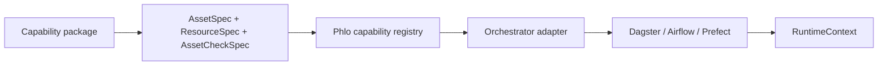

# Part 13: Capability Primitives and Orchestrator Adapters

> Prerequisite: Review [Part 5: Data Ingestion](05-data-ingestion.md) and [Part 7: Orchestration](07-orchestration-dagster.md) for asset naming and scheduling context.

Phlo uses capability primitives - portable asset definitions that run on any orchestrator.
This post explains the core specs, runtime context, and how adapters translate specs into orchestrator definitions. For plugin integration, see [Part 14: Plugin System](14-plugin-system.md).

## What You'll Learn

- The purpose of capability primitives and why they replace orchestrator-specific assets
- How AssetSpec, RunSpec, PartitionSpec, and AssetCheckSpec fit together
- How RuntimeContext provides logging, resources, and partition metadata
- How orchestrator adapters translate specs into execution definitions
- How to migrate from Dagster assets to capability specs

## Prerequisites

- Review Part 5: Data Ingestion for asset naming and layer conventions
- Review Part 7: Orchestration for how runtime scheduling fits into the pipeline
- Read ADR 0041: Capability Primitives and Orchestrator Adapters

## Why Capability Primitives

Capability primitives solve a core coupling problem. When packages build Dagster assets directly,
they cannot be reused in other orchestrators. The new model is:

- Packages emit orchestrator-agnostic specs
- Core discovers and composes those specs
- Adapters translate specs to a specific orchestrator at runtime

### Capability Spec Flow (Diagram)



## The Core Spec Types

Capability specs live in `src/phlo/capabilities/specs.py`. Each spec captures a small, explicit
piece of behaviour.

### AssetSpec and RunSpec

AssetSpec describes an asset. RunSpec describes how to execute it.

```python
from collections.abc import Iterable

from phlo.capabilities.runtime import RuntimeContext
from phlo.capabilities.specs import AssetSpec, MaterializeResult, RunSpec, RunResult


def extract_users(context: RuntimeContext) -> Iterable[RunResult]:
    context.logger.info("starting extraction", extra={"source": "users"})
    yield MaterializeResult(metadata={"rows": 128}, status="success")


users_asset = AssetSpec(
    key="raw_users",
    group="bronze",
    description="Raw users data from the CRM API",
    kinds={"ingestion"},
    tags={"source": "crm"},
    resources={"crm_api"},
    run=RunSpec(
        fn=extract_users,
        max_runtime_seconds=300,
        max_retries=2,
        retry_delay_seconds=60,
        cron="0 * * * *",
        freshness_hours=(0, 24),
    ),
)
```

### PartitionSpec

PartitionSpec captures partitioning metadata without any orchestrator dependency.

```python
from datetime import date

from phlo.capabilities.specs import AssetSpec, PartitionSpec

daily_partitions = PartitionSpec(
    kind="daily",
    start_date=date(2024, 1, 1),
    timezone="UTC",
)

partitioned_asset = AssetSpec(
    key="raw_events",
    group="bronze",
    description="Daily event stream",
    partitions=daily_partitions,
)
```

### AssetCheckSpec

Checks can run alongside assets or independently. Each check can block downstream assets when
it fails.

```python
from phlo.capabilities.runtime import RuntimeContext
from phlo.capabilities.specs import AssetCheckSpec, CheckResult


def row_count_check(context: RuntimeContext) -> CheckResult:
    return CheckResult(
        check_name="row_count_minimum",
        asset_key="raw_users",
        passed=True,
        severity="high",
        metadata={"min_rows": 1_000},
    )


asset_check = AssetCheckSpec(
    name="row_count_minimum",
    asset_key="raw_users",
    fn=row_count_check,
    blocking=True,
    description="Ensure ingestion produced a meaningful row count",
    severity="high",
)
```

### RuntimeContext

RuntimeContext is a protocol. Orchestrator adapters provide a concrete implementation and expose
resources, logging, and partition metadata.

```python
from collections.abc import Iterable

from phlo.capabilities.runtime import RuntimeContext
from phlo.capabilities.specs import MaterializeResult, RunResult


def extract_orders(context: RuntimeContext) -> Iterable[RunResult]:
    api_client = context.get_resource("orders_api")
    partition = context.partition_key or "unpartitioned"
    context.logger.info("fetching orders", extra={"partition": partition})
    rows = api_client.fetch_orders(partition=partition)
    yield MaterializeResult(metadata={"rows": len(rows)}, status="success")
```

## Orchestrator Adapters

Adapters translate specs into orchestrator definitions. This keeps core and capability packages
free of orchestrator imports while still allowing execution in Dagster, Airflow, or Prefect.

Typical adapter responsibilities:

- Convert AssetSpec into orchestrator assets
- Register resources and configuration
- Map PartitionSpec to the orchestrator partition model
- Translate AssetCheckSpec into orchestrator check primitives

## Migration: Dagster Assets to Capability Specs

Old pattern (orchestrator-specific):

```python
from dagster import asset


@asset(name="raw_users")
def raw_users():
    return [{"id": 1, "email": "user@example.com"}]
```

New pattern (orchestrator-agnostic):

```python
from collections.abc import Iterable

from phlo.capabilities.runtime import RuntimeContext
from phlo.capabilities.specs import AssetSpec, MaterializeResult, RunResult, RunSpec


def raw_users_run(context: RuntimeContext) -> Iterable[RunResult]:
    yield MaterializeResult(metadata={"rows": 1}, status="success")


raw_users_spec = AssetSpec(
    key="raw_users",
    group="bronze",
    description="Raw users data",
    run=RunSpec(fn=raw_users_run),
)
```

The adapter will wrap `raw_users_spec` into the orchestrator-specific asset definition.

## Hands-On Exercise

1. Create a new asset spec in your project (for example, `workflows/assets/users.py`).
2. Add a RunSpec that returns a MaterializeResult with row counts.
3. Define a simple AssetCheckSpec that validates a minimum row count.
4. Ensure your adapter sees the new spec when you run your orchestrator.

## Common Issues

- RuntimeContext mismatch: run functions must accept a single RuntimeContext argument.
- Missing resources: add resource names to AssetSpec.resources and configure them in your adapter.
- Adapter coupling: avoid importing Dagster, Airflow, or Prefect in capability packages.

See [Troubleshooting Guide](../operations/troubleshooting.md) for deeper diagnostics.

## See Also

See also: [Part 14: Plugin System](14-plugin-system.md), [Part 16: Building Custom Packages](16-building-custom-packages.md), [Part 7: Orchestration with Dagster](07-orchestration-dagster.md). Reference: [Phlo API Reference](../reference/phlo-api.md).

## Summary

Capability primitives let Phlo package authors describe assets and checks without picking an
orchestrator. Adapters translate those specs into runtime definitions and keep the core clean.

## Next Steps

- Part 14: Plugin System with capability primitives
- Review `src/phlo/capabilities/specs.py` for the full API surface
