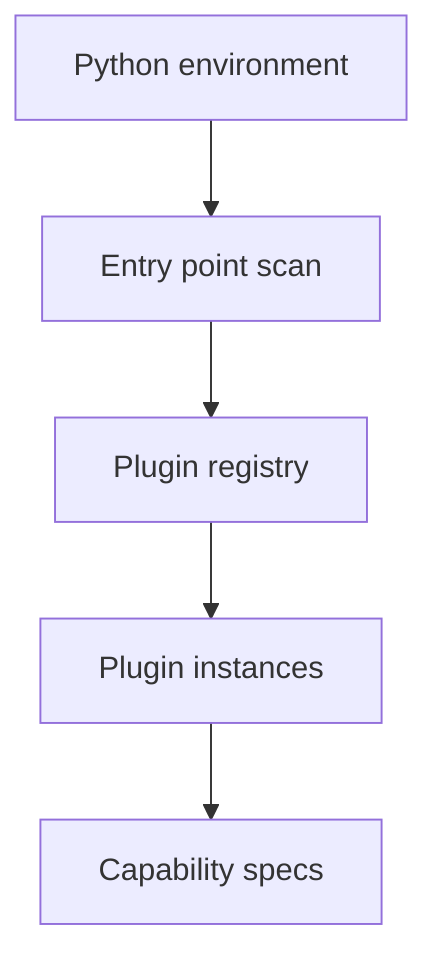

# Part 14: Extending Phlo with Plugins

> Prerequisite: Review [Part 13: Capability Primitives](13-capability-primitives.md) to understand AssetSpec and ResourceSpec.

## What You'll Learn

- How Phlo discovers plugins via entry points
- Which plugin types map to capability providers
- How to register assets, resources, and checks
- How plugins integrate with orchestrators

## Prerequisites

- [Part 13: Capability Primitives](13-capability-primitives.md)
- Optional: [Part 16: Building Custom Packages](16-building-custom-packages.md) for scaffolding.

You've built pipelines, added quality checks, and set up monitoring. But what happens when you need something Phlo doesn't provide out of the box? A custom data source, a specialised validation rule, or a domain-specific transformation?
For full package scaffolding, see [Part 16: Building Custom Packages](16-building-custom-packages.md).

That's where the plugin system comes in.

## Why Plugins?

Every data platform eventually hits limitations:

```
Week 1:  "Phlo is great! It has everything we need."
Week 4:  "Can we add a Salesforce source?"
Week 8:  "We need a custom quality check for our business rules."
Week 12: "The finance team wants a specific transformation pattern."
```

Without plugins, you'd fork the codebase or hack around limitations. With plugins, you extend Phlo cleanly.

## Plugin Types at a Glance

Phlo supports a core set of plugin types, plus capability-focused providers:

| Type                         | Purpose                                                  | Example                               |
| ---------------------------- | -------------------------------------------------------- | ------------------------------------- |
| **Source Connectors**        | Fetch data from external systems                         | Salesforce, HubSpot, custom APIs      |
| **Quality Checks**           | Custom validation rules                                  | Business logic, compliance rules      |
| **Transforms**               | Data transformation helpers                              | Domain-specific calculations          |
| **Services**                 | Docker-based infrastructure components                   | Custom metadata service               |
| **Catalogs**                 | Engine-agnostic catalog configuration                    | Iceberg catalog config                |
| **Asset Providers**          | Emit AssetSpec and AssetCheckSpec capability primitives  | Domain asset packages                 |
| **Resource Providers**       | Emit ResourceSpec capability primitives                  | Shared clients and IO managers        |
| **Orchestrator Adapters**    | Translate specs into orchestrator definitions            | Dagster adapter                       |
| **Observatory Extensions**   | Extend the UI with manifests and scripts                 | Custom dashboards                     |
| **Hooks**                    | Event-based hooks for runtime instrumentation            | Alerting, logging, metrics            |
| **CLI Command Plugins**      | Add CLI commands/groups                                  | Domain-specific CLI tooling           |
| **Dagster Extensions**       | Contribute Dagster definitions directly                  | Custom sensors or schedules           |

Each type has a base class you inherit from, and Phlo discovers your plugins automatically via Python entry points.

## How Plugin Discovery Works

When Phlo starts, it scans for installed packages that declare entry points:

```
┌─────────────────────────────────────────────────────────────┐
│                     Python Environment                       │
├─────────────────────────────────────────────────────────────┤
│  phlo (core)                                                │
│  phlo-plugin-salesforce (installed via pip)                 │
│  phlo-plugin-custom-checks (your internal package)          │
└─────────────────────────────────────────────────────────────┘
                              │
                              ▼
┌─────────────────────────────────────────────────────────────┐
│              Entry Point Discovery                           │
│  importlib.metadata.entry_points()                          │
│                                                             │
│  Groups scanned:                                            │
│    • phlo.plugins.sources                                   │
│    • phlo.plugins.quality                                   │
│    • phlo.plugins.transforms                                │
│    • phlo.plugins.services                                  │
│    • phlo.plugins.catalogs                                  │
│    • phlo.plugins.assets                                    │
│    • phlo.plugins.resources                                 │
│    • phlo.plugins.orchestrators                             │
│    • phlo.plugins.hooks                                     │
│    • phlo.plugins.observatory                               │
│    • phlo.plugins.cli                                       │
│    • phlo.plugins.dagster                                   │
└─────────────────────────────────────────────────────────────┘
                              │
                              ▼
┌─────────────────────────────────────────────────────────────┐
│              Plugin Registry                                 │
│                                                             │
│  Sources:     [rest_api, salesforce, hubspot]               │
│  Quality:     [null_check, range_check, threshold_check]    │
│  Transforms:  [uppercase, currency_convert]                 │
│  Assets:      [marketing_assets, sales_assets]              │
│  Resources:   [warehouse_clients]                           │
│  Orchestrators: [dagster_adapter]                           │
└─────────────────────────────────────────────────────────────┘
```

### Plugin Discovery Flow (Diagram)



This means:

- No manual registration required
- Install a package, restart Phlo, plugin is available
- Bad plugins don't crash the system (logged and skipped)

## Capability Primitives in Plugins

Capability packages now use plugins to emit orchestrator-agnostic specs.
Instead of returning Dagster assets directly, plugins return `AssetSpec`,
`AssetCheckSpec`, and `ResourceSpec`, then an orchestrator adapter translates
them into runtime definitions.

### Example: Asset Provider Plugin

```python
from collections.abc import Iterable

from phlo.capabilities.runtime import RuntimeContext
from phlo.capabilities.specs import (
    AssetCheckSpec,
    AssetSpec,
    CheckResult,
    MaterializeResult,
    RunSpec,
)
from phlo.plugins import AssetProviderPlugin, PluginMetadata


def ingest_campaigns(context: RuntimeContext) -> Iterable[MaterializeResult]:
    context.logger.info("Ingesting campaigns")
    yield MaterializeResult(metadata={"rows": 1200})


def check_row_count(context: RuntimeContext) -> CheckResult:
    return CheckResult(
        check_name="row_count_positive",
        asset_key="marketing.campaigns",
        passed=True,
    )


class MarketingAssets(AssetProviderPlugin):
    @property
    def metadata(self) -> PluginMetadata:
        return PluginMetadata(
            name="marketing_assets",
            version="1.0.0",
            description="Marketing asset specs",
        )

    def get_assets(self) -> Iterable[AssetSpec]:
        return [
            AssetSpec(
                key="marketing.campaigns",
                group="bronze",
                description="Raw campaign data",
                run=RunSpec(fn=ingest_campaigns),
                checks=[
                    AssetCheckSpec(
                        name="row_count_positive",
                        asset_key="marketing.campaigns",
                        fn=check_row_count,
                    )
                ],
            )
        ]
```

### Example: Resource Provider Plugin

```python
from collections.abc import Iterable

from phlo.capabilities.specs import ResourceSpec
from phlo.plugins import PluginMetadata, ResourceProviderPlugin


def build_warehouse_client():
    return {"type": "warehouse", "dsn": "postgresql://..."}


class WarehouseResources(ResourceProviderPlugin):
    @property
    def metadata(self) -> PluginMetadata:
        return PluginMetadata(
            name="warehouse_resources",
            version="1.0.0",
            description="Shared warehouse clients",
        )

    def get_resources(self) -> Iterable[ResourceSpec]:
        return [ResourceSpec(name="warehouse", resource=build_warehouse_client())]
```

Orchestrator adapters (for example, `phlo-dagster`) load these specs and
emit orchestrator-native definitions at runtime.

## Creating a Source Connector Plugin

Let's walk through a concrete example.

### Step 1: Project Structure

Example structure:

```
my-plugin/
├── pyproject.toml
├── README.md
├── MANIFEST.in
├── src/
│   └── phlo_example/
│       ├── __init__.py
│       ├── source.py       # JSONPlaceholderSource
│       ├── quality.py      # ThresholdCheckPlugin
│       └── transform.py    # UppercaseTransformPlugin
└── tests/
    ├── test_source.py
    ├── test_quality.py
    └── test_transform.py
```

### Step 2: Source Plugin Implementation

Example implementation:

```python
"""Example source connector plugin using JSONPlaceholder API."""

from typing import Any, Iterator
import requests
from phlo.plugins import PluginMetadata, SourceConnectorPlugin


class JSONPlaceholderSource(SourceConnectorPlugin):
    """
    Source connector for JSONPlaceholder API.

    Fetches posts, comments, or other data from the free JSONPlaceholder API.
    """

    @property
    def metadata(self) -> PluginMetadata:
        """Return plugin metadata."""
        return PluginMetadata(
            name="jsonplaceholder",
            version="1.0.0",
            description="Fetch data from JSONPlaceholder API",
            author="Phlo Team",
            homepage="https://github.com/iamgp/phlo",
            tags=["api", "example", "public"],
            license="MIT",
        )

    def fetch_data(self, config: dict[str, Any]) -> Iterator[dict[str, Any]]:
        """
        Fetch data from JSONPlaceholder API.

        Args:
            config: Configuration dictionary with:
                - base_url: API base URL (default: https://jsonplaceholder.typicode.com)
                - resource: Resource to fetch (default: posts)
                - limit: Max items to fetch (default: 0 = all)

        Yields:
            Dictionary representing each item from the API
        """
        # Validate configuration
        if not self.validate_config(config):
            raise ValueError("Invalid configuration")

        base_url = config.get("base_url", "https://jsonplaceholder.typicode.com")
        resource = config.get("resource", "posts")
        limit = config.get("limit", 0)

        url = f"{base_url}/{resource}"

        try:
            response = requests.get(url, timeout=10)
            response.raise_for_status()

            items = response.json()
            if not isinstance(items, list):
                items = [items]

            # Apply limit if specified
            if limit > 0:
                items = items[:limit]

            for item in items:
                yield item

        except requests.RequestException as e:
            raise RuntimeError(f"Failed to fetch from {url}: {e}")

    def get_schema(self, config: dict[str, Any]) -> dict[str, str] | None:
        """Get expected schema for the resource."""
        resource = config.get("resource", "posts")

        schemas = {
            "posts": {
                "userId": "int",
                "id": "int",
                "title": "string",
                "body": "string",
            },
            "comments": {
                "postId": "int",
                "id": "int",
                "name": "string",
                "email": "string",
                "body": "string",
            },
            "users": {
                "id": "int",
                "name": "string",
                "username": "string",
                "email": "string",
                "address": "object",
                "phone": "string",
                "website": "string",
            },
        }

        return schemas.get(resource, None)

    def test_connection(self, config: dict[str, Any]) -> bool:
        """Test if the API is accessible."""
        try:
            base_url = config.get("base_url", "https://jsonplaceholder.typicode.com")
            resource = config.get("resource", "posts")
            url = f"{base_url}/{resource}"

            response = requests.get(url, timeout=5)
            return response.status_code == 200

        except Exception:
            return False

    def validate_config(self, config: dict[str, Any]) -> bool:
        """Validate configuration."""
        if not isinstance(config, dict):
            return False

        # Validate base_url if provided
        base_url = config.get("base_url")
        if base_url and not isinstance(base_url, str):
            return False

        # Validate resource if provided
        resource = config.get("resource")
        if resource and not isinstance(resource, str):
            return False

        # Validate limit if provided
        limit = config.get("limit", 0)
        if not isinstance(limit, int) or limit < 0:
            return False

        return True
```

### Step 3: Entry Points Registration

Example entry points from `pyproject.toml`:

```toml
[project]
name = "phlo-plugin-example"
version = "1.0.0"
description = "Example Phlo plugin package demonstrating all plugin types"
requires-python = ">=3.11"
dependencies = [
    "pandas>=1.5.0",
    "requests>=2.28.0",
]

[project.entry-points."phlo.plugins.sources"]
jsonplaceholder = "phlo_example.source:JSONPlaceholderSource"

[project.entry-points."phlo.plugins.quality"]
threshold_check = "phlo_example.quality:ThresholdCheckPlugin"

[project.entry-points."phlo.plugins.transforms"]
uppercase = "phlo_example.transform:UppercaseTransformPlugin"

[project.entry-points."phlo.plugins.assets"]
marketing_assets = "phlo_example.assets:MarketingAssets"

[project.entry-points."phlo.plugins.resources"]
warehouse_resources = "phlo_example.resources:WarehouseResources"

[project.entry-points."phlo.plugins.orchestrators"]
dagster_adapter = "phlo_example.orchestrators:DagsterAdapter"

[project.entry-points."phlo.plugins.catalogs"]
iceberg_catalog = "phlo_example.catalogs:IcebergCatalog"

[project.entry-points."phlo.plugins.hooks"]
alerts = "phlo_example.hooks:AlertHookPlugin"

[project.entry-points."phlo.plugins.observatory"]
ui_extension = "phlo_example.observatory:OpsUIExtension"

[project.entry-points."phlo.plugins.cli"]
ops_cli = "phlo_example.cli:OpsCliPlugin"
```

### Step 4: Install and Use

```bash
# Install the example plugin
cd my-plugin
pip install -e .

# Verify it's discovered
phlo plugin list
```


Now use it in your pipeline:

```python
from phlo.plugins import get_source_connector

# Get the plugin
source = get_source_connector("jsonplaceholder")

# Fetch data
config = {
    "resource": "posts",
    "limit": 10,
}

for post in source.fetch_data(config):
    print(post)
```

## Creating a Quality Check Plugin

Example threshold check plugin:

### Example: Threshold Check Plugin

Example quality plugin implementation:

```python
"""Example quality check plugin."""

from typing import Any
import pandas as pd
from phlo.plugins import PluginMetadata, QualityCheckPlugin
from phlo_quality.checks import QualityCheck, QualityCheckResult


class ThresholdCheckPlugin(QualityCheckPlugin):
    """
    Quality check plugin for threshold validation.

    Creates checks that verify numeric values fall within specified thresholds.
    """

    @property
    def metadata(self) -> PluginMetadata:
        """Return plugin metadata."""
        return PluginMetadata(
            name="threshold_check",
            version="1.0.0",
            description="Validate numeric values within thresholds",
            author="Phlo Team",
            homepage="https://github.com/iamgp/phlo",
            tags=["validation", "numeric", "example"],
            license="MIT",
        )

    def create_check(self, **kwargs) -> "ThresholdCheck":
        """
        Create a threshold check instance.

        Args:
            column: Column name to validate
            min: Minimum value (inclusive)
            max: Maximum value (inclusive)
            tolerance: Fraction of rows allowed to fail (0.0 = strict, 1.0 = allow all)
        """
        return ThresholdCheck(
            column=kwargs.get("column"),
            min_value=kwargs.get("min"),
            max_value=kwargs.get("max"),
            tolerance=kwargs.get("tolerance", 0.0),
        )


class ThresholdCheck(QualityCheck):
    """Threshold-based quality check."""

    def __init__(
        self,
        column: str,
        min_value: float | None = None,
        max_value: float | None = None,
        tolerance: float = 0.0,
    ):
        """
        Initialise threshold check.

        Args:
            column: Column to validate
            min_value: Minimum allowed value
            max_value: Maximum allowed value
            tolerance: Fraction of rows allowed to fail (0.0-1.0)
        """
        self.column = column
        self.min_value = min_value
        self.max_value = max_value
        self.tolerance = max(0.0, min(1.0, tolerance))  # Clamp to 0.0-1.0

    def execute(self, df: pd.DataFrame, context: Any = None) -> QualityCheckResult:
        """Execute the quality check."""
        if self.column not in df.columns:
            return QualityCheckResult(
                passed=False,
                metric_name="threshold_check",
                metric_value={"error": f"Column '{self.column}' not found"},
                failure_message=f"Column '{self.column}' not found",
            )

        # Count violations
        violations = 0
        for value in df[self.column]:
            if pd.isna(value):
                violations += 1
                continue

            if self.min_value is not None and value < self.min_value:
                violations += 1
                continue

            if self.max_value is not None and value > self.max_value:
                violations += 1

        total = len(df)
        violation_rate = violations / total if total > 0 else 0.0

        # Check if within tolerance
        passed = violation_rate <= self.tolerance

        return QualityCheckResult(
            passed=passed,
            metric_name="threshold_check",
            metric_value={
                "violations": violations,
                "total": total,
                "violation_rate": violation_rate,
            },
        )

    @property
    def name(self) -> str:
        """Return check name."""
        bounds = []
        if self.min_value is not None:
            bounds.append(f"min={self.min_value}")
        if self.max_value is not None:
            bounds.append(f"max={self.max_value}")

        bound_str = ",".join(bounds) if bounds else "unbounded"
        return f"threshold_check({self.column},{bound_str})"
```

Usage:

```python
from phlo.plugins import get_quality_check

# Get the plugin
plugin = get_quality_check("threshold_check")

# Create a check instance
check = plugin.create_check(
    column="temperature",
    min=0,
    max=100,
    tolerance=0.05,  # Allow 5% of rows to fail
)

# Execute the check
result = check.execute(df)
print(f"Passed: {result.passed}")
print(f"Violations: {result.metric_value['violations']} / {result.metric_value['total']}")
```

## Creating a Transform Plugin

Example transform plugin:

### Example: Uppercase Transform

Example transform plugin implementation:

```python
"""Example transformation plugin."""

from typing import Any
import pandas as pd
from phlo.plugins import PluginMetadata, TransformationPlugin


class UppercaseTransformPlugin(TransformationPlugin):
    """
    Transformation plugin for uppercase conversion.

    Converts specified string columns to uppercase.
    """

    @property
    def metadata(self) -> PluginMetadata:
        """Return plugin metadata."""
        return PluginMetadata(
            name="uppercase",
            version="1.0.0",
            description="Convert string columns to uppercase",
            author="Phlo Team",
            homepage="https://github.com/iamgp/phlo",
            tags=["string", "transform", "example"],
            license="MIT",
        )

    def transform(self, df: pd.DataFrame, config: dict[str, Any]) -> pd.DataFrame:
        """
        Transform DataFrame by converting columns to uppercase.

        Args:
            df: Input DataFrame
            config: Configuration with:
                - columns: List of column names to transform
                - skip_na: Skip null values (default: True)

        Returns:
            Transformed DataFrame with uppercase values
        """
        if not self.validate_config(config):
            raise ValueError("Invalid configuration")

        # Copy to avoid modifying original
        result = df.copy()

        columns = config.get("columns", [])
        skip_na = config.get("skip_na", True)

        # Transform each column
        for column in columns:
            if column not in result.columns:
                raise ValueError(f"Column '{column}' not found in DataFrame")

            # Apply uppercase transformation
            if skip_na:
                result[column] = result[column].apply(
                    lambda x: x.upper() if pd.notna(x) else x
                )
            else:
                result[column] = result[column].str.upper()

        return result

    def get_output_schema(
        self, input_schema: dict[str, str], config: dict[str, Any]
    ) -> dict[str, str] | None:
        """
        Get the schema of transformed data.

        Uppercase transformation doesn't change types.
        """
        return input_schema

    def validate_config(self, config: dict[str, Any]) -> bool:
        """Validate transformation configuration."""
        if not isinstance(config, dict):
            return False

        # Columns must be a list
        columns = config.get("columns", [])
        if not isinstance(columns, (list, tuple)):
            return False

        # Each column must be a string
        for column in columns:
            if not isinstance(column, str):
                return False

        # skip_na must be a boolean if provided
        skip_na = config.get("skip_na", True)
        if not isinstance(skip_na, bool):
            return False

        return True
```

Usage:

```python
from phlo.plugins import get_transformation
import pandas as pd

# Get the plugin
plugin = get_transformation("uppercase")

# Create sample data
df = pd.DataFrame({
    "title": ["hello world", "foo bar"],
    "body": ["test data", "more test"],
})

# Transform
result = plugin.transform(df, config={
    "columns": ["title", "body"],
    "skip_na": True,
})

print(result)
# Output:
#         title       body
# 0  HELLO WORLD  TEST DATA
# 1     FOO BAR  MORE TEST
```

## Managing Plugins via CLI

The actual CLI implementation provides these commands:

### List Installed Plugins

```bash
$ phlo plugin list

Sources:
  NAME              VERSION  AUTHOR
  jsonplaceholder   1.0.0    Phlo Team

Quality Checks:
  NAME              VERSION  AUTHOR
  threshold_check   1.0.0    Phlo Team

Transforms:
  NAME              VERSION  AUTHOR
  uppercase         1.0.0    Phlo Team

# Filter by type
$ phlo plugin list --type sources
$ phlo plugin list --type assets

# Output as JSON
$ phlo plugin list --json
```


### Get Plugin Details

```bash
$ phlo plugin info jsonplaceholder

jsonplaceholder
Type: sources
Version: 1.0.0
Author: Phlo Team
Description: Fetch data from JSONPlaceholder API
License: MIT
Homepage: https://github.com/iamgp/phlo
Tags: api, example, public

# Auto-detect plugin type
$ phlo plugin info threshold_check

# Specify type explicitly
$ phlo plugin info uppercase --type transforms

# JSON output
$ phlo plugin info jsonplaceholder --json
```


### Validate Plugins

```bash
$ phlo plugin check

Validating plugins...

✓ Valid Plugins: 3
  ✓ source_connectors:jsonplaceholder
  ✓ quality_checks:threshold_check
  ✓ transformations:uppercase

All plugins are valid!

# JSON output
$ phlo plugin check --json
```


### Create New Plugin Scaffold

The actual CLI implementation scaffolds complete plugin packages:

```bash
$ phlo plugin create my-api-source --type source

✓ Plugin created successfully!

Next steps:
  1. cd phlo-plugin-my-api-source
  2. Edit the plugin in src/phlo_my_api_source/
  3. Run tests: pytest tests/
  4. Install: pip install -e .

# Create quality check plugin
$ phlo plugin create my-validation --type quality

# Create transform plugin
$ phlo plugin create my-transform --type transform

# Specify custom path
$ phlo plugin create my-plugin --type source --path ./plugins/my-plugin
```


The scaffold creates a complete package structure:

```
phlo-plugin-my-api-source/
├── pyproject.toml           # Package config with entry points
├── README.md                # Documentation
├── MANIFEST.in              # Package manifest
├── src/
│   └── phlo_my_api_source/
│       ├── __init__.py
│       └── plugin.py        # Plugin implementation
└── tests/
    ├── __init__.py
    └── test_plugin.py       # Test suite
```

## Best Practices

### 1. Keep Plugins Focused

One plugin = one responsibility. Don't create a "kitchen sink" plugin.

```python
# Good: focused plugins
class SalesforceSource(SourceConnectorPlugin): ...
class HubSpotSource(SourceConnectorPlugin): ...

# Bad: monolithic plugin
class CRMSource(SourceConnectorPlugin):
    def fetch_salesforce(self): ...
    def fetch_hubspot(self): ...
    def fetch_dynamics(self): ...
```

### 2. Handle Errors Gracefully

Plugins should never crash Phlo. Catch exceptions and return meaningful errors.

```python
def fetch_data(self, config: dict) -> Iterator[dict]:
    try:
        response = self.client.get(url)
        response.raise_for_status()
        yield from response.json()
    except httpx.HTTPStatusError as e:
        raise PluginError(f"API returned {e.response.status_code}: {e.response.text}")
    except httpx.RequestError as e:
        raise PluginError(f"Network error: {e}")
```

### 3. Include Metadata

Good metadata makes plugins discoverable:

```python
@property
def metadata(self) -> PluginMetadata:
    return PluginMetadata(
        name="salesforce",
        version="2.1.0",
        description="Ingest Salesforce objects (Accounts, Contacts, Opportunities)",
        author="Data Platform Team",
        documentation_url="https://docs.yourcompany.com/plugins/salesforce",
    )
```

### 4. Write Tests

```python
# tests/test_source.py
def test_fetch_data_returns_records():
    source = JSONPlaceholderSource()
    records = list(source.fetch_data({"resource": "posts", "limit": 5}))

    assert len(records) == 5
    assert all("id" in r for r in records)
    assert all("title" in r for r in records)

def test_connection_check():
    source = JSONPlaceholderSource()
    assert source.test_connection({}) is True

def test_invalid_resource_handled():
    source = JSONPlaceholderSource()
    with pytest.raises(PluginError):
        list(source.fetch_data({"resource": "invalid"}))
```

### 5. Version Your Plugins

Use semantic versioning. Breaking changes = major version bump.

```toml
[project]
version = "2.0.0"  # Breaking: changed config schema
version = "1.1.0"  # Feature: added new resource type
version = "1.0.1"  # Fix: handled edge case
```

## Plugin Security

Plugins run with full access to your environment. Only install trusted plugins.

For organisations:

- Maintain an internal plugin registry
- Review plugin code before deployment
- Use `plugins_whitelist` in config to restrict allowed plugins:

```python
# config.py
class PhloConfig:
    plugins_whitelist: list[str] = [
        "rest_api",
        "salesforce",
        "internal_*",  # Allow all internal plugins
    ]
```

## Hands-On Exercise: Register a Plugin

1. Add an entry point for a sample plugin in `pyproject.toml`.
2. Run `phlo plugin list` to confirm discovery.
3. Enable the plugin and re-run `phlo plugin list`.
4. Verify assets or resources are registered in Dagster.

## Common Issues

- **Plugins not discovered**

```bash
phlo plugin list --type assets
```


Fix: confirm the package is installed and entry points are registered.

- **Entry point group is incorrect**

```bash
uv run python -c "import importlib.metadata as m; print(m.entry_points(group='phlo.plugins.assets'))"
```


Fix: update `pyproject.toml` to use the correct group names.

- **Plugin import errors at startup**

```bash
uv run python -c "import phlo_plugins"
```


Fix: fix missing dependencies or module paths, and reinstall the plugin package.

See [Troubleshooting Guide](../operations/troubleshooting.md) for deeper diagnostics.

## See Also

See also: [Part 13: Capability Primitives](13-capability-primitives.md), [Part 15: Observatory Extensions](15-observatory-extensions.md), [Part 16: Building Custom Packages](16-building-custom-packages.md). Reference: [Phlo API Reference](../reference/phlo-api.md).


## Summary

The plugin system lets you extend Phlo without modifying core code:

- **Source Connectors**: Fetch data from any system
- **Quality Checks**: Encode custom business rules
- **Transforms**: Reusable transformation logic

Plugins are discovered through Python entry points, managed via CLI, and used alongside Phlo decorators and assets.

When to use plugins:

- You need a data source Phlo doesn't support
- You have organisation-specific quality rules
- You want to share reusable logic across teams

When NOT to use plugins:

- One-off transformations (just write Python)
- Simple quality checks (use built-in checks)
- Anything that could be a dbt model

---

## Try the Example Plugin

A complete working example layout:

```bash
# Install the example plugin
cd my-plugin
pip install -e .

# List discovered plugins
phlo plugin list

# Get plugin info
phlo plugin info jsonplaceholder
phlo plugin info threshold_check
phlo plugin info uppercase

# Test the source connector
python -c "
from phlo.plugins import get_source_connector
source = get_source_connector('jsonplaceholder')
for post in source.fetch_data({'resource': 'posts', 'limit': 3}):
    print(post['title'])
"
```


Actual Files to Study:

- Source plugin: `src/phlo_example/source.py`
- Quality check plugin: `src/phlo_example/quality.py`
- Transform plugin: `src/phlo_example/transform.py`
- Entry points: `pyproject.toml`
- Tests: `tests/`

Base Classes:

- `phlo.plugins.SourceConnectorPlugin` - Inherit for source connectors
- `phlo.plugins.QualityCheckPlugin` - Inherit for quality checks
- `phlo.plugins.TransformationPlugin` - Inherit for transforms
- `phlo.plugins.ServicePlugin` - Inherit for Docker-based services
- `phlo.plugins.CatalogPlugin` - Inherit for catalog definitions
- `phlo.plugins.AssetProviderPlugin` - Inherit to emit AssetSpec and checks
- `phlo.plugins.ResourceProviderPlugin` - Inherit to emit ResourceSpec
- `phlo.plugins.OrchestratorAdapterPlugin` - Inherit to translate specs to runtime
- `phlo.plugins.ObservatoryExtensionPlugin` - Inherit for UI extensions

Discovery Functions:

- `phlo.plugins.discover_plugins()` - Discover all plugins
- `phlo.plugins.get_source_connector(name)` - Get source plugin
- `phlo.plugins.get_quality_check(name)` - Get quality plugin
- `phlo.plugins.get_transformation(name)` - Get transform plugin
- `phlo.plugins.get_service(name)` - Get service plugin
- `phlo.plugins.get_asset_provider(name)` - Get asset provider plugin
- `phlo.plugins.get_resource_provider(name)` - Get resource provider plugin
- `phlo.plugins.get_orchestrator(name)` - Get orchestrator adapter plugin

---

**Previous**: [Part 13 - Capability Primitives](13-capability-primitives.md)

**Series**:

1. Data Lakehouse concepts
2. Getting started
3. Apache Iceberg
4. Project Nessie
5. Data ingestion
6. dbt transformations
7. Dagster orchestration
8. Real-world example
9. Data quality with Pandera
10. Metadata and governance
11. Observability and monitoring
12. Production deployment
13. Capability primitives and orchestrator adapters
14. **Plugin system** ← You are here

Happy plugin development!

## Next Steps

- Build observability integrations in [Part 15: Observatory Extensions](15-observatory-extensions.md).
- Scaffold full packages in [Part 16: Building Custom Packages](16-building-custom-packages.md).
