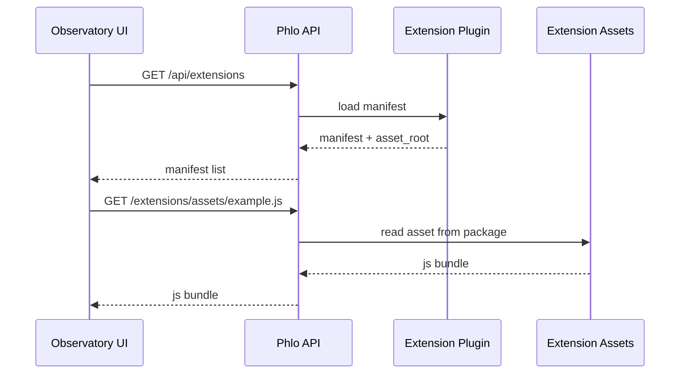

# Part 15: Observatory Extensions and UI Plugins

> Prerequisite: Review [Part 11: Observability & Monitoring](11-observability-monitoring.md) and [Part 14: Extending Phlo with Plugins](14-plugin-system.md).

Observatory ships with core views, but every team needs something custom: a domain dashboard,
service health panels, or a tailored workflow. Observatory extensions let packages add UI
routes, navigation items, slots, and settings without rebuilding the core UI.

This post covers the extension manifest, plugin class, UI hooks, and a complete example.
For packaging details, see [Part 16: Building Custom Packages](16-building-custom-packages.md).

## What You'll Learn

- How Observatory discovers extension plugins
- How to define a manifest with routes, nav, slots, and settings
- How extension assets are served and loaded at runtime
- How to build a complete extension package with assets
- How to test extension discovery and loading

## Prerequisites

- Review Part 14: Extending Phlo with Plugins for entry point basics
- Review ADR 0042: Observatory Extension Manifests and Native UI Plugins
- Familiarity with Python packaging and static asset bundles

## Why Extensions Exist

Observatory runs as a web app with static routes at build time. Extensions solve this by
loading UI modules at runtime. A plugin publishes a manifest that tells Observatory the
locations from which to load routes, navigation, and optional settings panels. The assets live inside the
package and are served by the API.

Key ideas:

- Extensions are discovered via entry points (`phlo.plugins.observatory`).
- The manifest is the contract; Observatory loads routes and slots dynamically.
- Assets are served from the package via `asset_root`.
- Settings are stored server-side via the API, not local storage.

### Extension Load Sequence (Diagram)



## Extension Manifest Model

Manifest models live in `src/phlo/plugins/observatory.py`.

```python
from phlo.plugins.observatory import (
    ObservatoryExtensionCompatibility,
    ObservatoryExtensionManifest,
    ObservatoryExtensionNavItem,
    ObservatoryExtensionRoute,
    ObservatoryExtensionSettings,
    ObservatoryExtensionSettingsPanel,
    ObservatoryExtensionSlot,
    ObservatoryExtensionUI,
)

manifest = ObservatoryExtensionManifest(
    name="example",
    version="0.1.0",
    compat=ObservatoryExtensionCompatibility(observatory_min="0.1.0"),
    settings=ObservatoryExtensionSettings(
        settings_schema={"type": "object", "properties": {"enabled": {"type": "boolean"}}},
        defaults={"enabled": True},
        scope="extension",
    ),
    ui=ObservatoryExtensionUI(
        routes=[
            ObservatoryExtensionRoute(
                path="/extensions/example",
                module="/example.js",
                export="registerRoutes",
            )
        ],
        nav=[ObservatoryExtensionNavItem(title="Example", to="/extensions/example")],
        slots=[
            ObservatoryExtensionSlot(
                slot_id="dashboard.after-cards",
                module="/example.js",
                export="registerDashboardSlot",
            )
        ],
        settings=[
            ObservatoryExtensionSettingsPanel(
                module="/example.js",
                export="registerSettings",
            )
        ],
    ),
)
```

### Field Notes

- `compat.observatory_min` gates extension loading by Observatory version.
- `settings.scope` controls whether settings are global or extension-only.
- `module` paths are resolved from the extension asset root.
- `export` names must match the functions your JS module exports.

## Plugin Class Pattern

Extensions inherit from `ObservatoryExtensionPlugin` and expose `metadata`, `manifest`,
and `asset_root`.

```python
from importlib import resources
from importlib.abc import Traversable

from phlo.plugins import PluginMetadata
from phlo.plugins.base import ObservatoryExtensionPlugin
from phlo.plugins.observatory import (
    ObservatoryExtensionCompatibility,
    ObservatoryExtensionManifest,
    ObservatoryExtensionNavItem,
    ObservatoryExtensionRoute,
    ObservatoryExtensionSettings,
    ObservatoryExtensionSettingsPanel,
    ObservatoryExtensionSlot,
    ObservatoryExtensionUI,
)


class ExampleObservatoryExtension(ObservatoryExtensionPlugin):
    @property
    def metadata(self) -> PluginMetadata:
        return PluginMetadata(
            name="example",
            version="0.1.0",
            description="Example Observatory UI extension",
        )

    @property
    def manifest(self) -> ObservatoryExtensionManifest:
        return ObservatoryExtensionManifest(
            name="example",
            version="0.1.0",
            compat=ObservatoryExtensionCompatibility(observatory_min="0.1.0"),
            settings=ObservatoryExtensionSettings(
                settings_schema={
                    "type": "object",
                    "properties": {
                        "enabled": {"type": "boolean"},
                        "message": {"type": "string"},
                    },
                },
                defaults={"enabled": True, "message": "Hello from settings."},
                scope="extension",
            ),
            ui=ObservatoryExtensionUI(
                routes=[
                    ObservatoryExtensionRoute(
                        path="/extensions/example",
                        module="/example.js",
                        export="registerRoutes",
                    )
                ],
                nav=[ObservatoryExtensionNavItem(title="Example", to="/extensions/example")],
                slots=[
                    ObservatoryExtensionSlot(
                        slot_id="dashboard.after-cards",
                        module="/example.js",
                        export="registerDashboardSlot",
                    )
                ],
                settings=[
                    ObservatoryExtensionSettingsPanel(
                        module="/example.js",
                        export="registerSettings",
                    )
                ],
            ),
        )

    @property
    def asset_root(self) -> Traversable:
        return resources.files("phlo_observatory_example").joinpath("observatory_assets")
```

This matches the live example in
`packages/phlo-observatory-example/src/phlo_observatory_example/observatory_plugin.py`.

## Asset Layout and JS Module Exports

Your package must ship static assets. A common layout:

```
my-extension/
├── pyproject.toml
├── src/
│   └── phlo_my_extension/
│       ├── __init__.py
│       ├── observatory_plugin.py
│       └── observatory_assets/
│           └── example.js
```

Minimal module exports that match the manifest:

```javascript
export function registerRoutes(router) {
  router.add({
    path: "/extensions/example",
    component: () => "Example extension page",
  })
}

export function registerDashboardSlot(registry) {
  registry.register("dashboard.after-cards", () => "Example slot content")
}

export function registerSettings(formRegistry) {
  formRegistry.register({
    id: "example.settings",
    title: "Example Settings",
    fields: [
      { name: "enabled", type: "boolean", label: "Enabled" },
      { name: "message", type: "string", label: "Message" },
    ],
  })
}
```

## Settings Lifecycle

Settings are stored server-side and exposed via the Observatory API:

- `GET /api/observatory/extensions` lists available extensions and manifests
- `GET /api/observatory/extensions/{name}` returns a single manifest
- `GET/PUT /api/observatory/settings` reads and updates settings

Extensions should treat settings as shared instance configuration, not per-user state.

## Hands-On Exercise: Create a Minimal Extension

1. Create a package with `observatory_plugin.py` and `observatory_assets/`.
2. Add an entry point in `pyproject.toml` under `phlo.plugins.observatory`.
3. Implement a manifest with one route and one nav item.
4. Add a JS module exporting `registerRoutes`.
5. Install the package and run `phlo plugin list --type observatory`.

## Common Issues

- **Extension not listed:** check the entry point group is `phlo.plugins.observatory`.
- **Assets 404:** ensure `asset_root` points at the package asset directory.
- **Routes not loading:** module path in the manifest must exist in assets.
- **Nav item missing:** verify `ui.nav` is populated and route exists.
- **Settings not saved:** confirm API endpoints are reachable and schema is valid JSONSchema.

## See Also

See also: [Part 11: Observability & Monitoring](11-observability-monitoring.md), [Part 14: Extending Phlo with Plugins](14-plugin-system.md), [Part 16: Building Custom Packages](16-building-custom-packages.md). Reference: [Phlo API Reference](../reference/phlo-api.md).

## Summary

Observatory extensions let packages contribute UI pages, navigation, slots, and settings
without rebuilding the core UI. The manifest defines the contract, and `asset_root` makes
assets available to the API for runtime loading.

## Next Steps

- Review Part 14 for broader plugin patterns and entry points
- Skim Part 11 for Observatory monitoring context
- Prepare for Part 16 if you want to package multiple capability providers together
